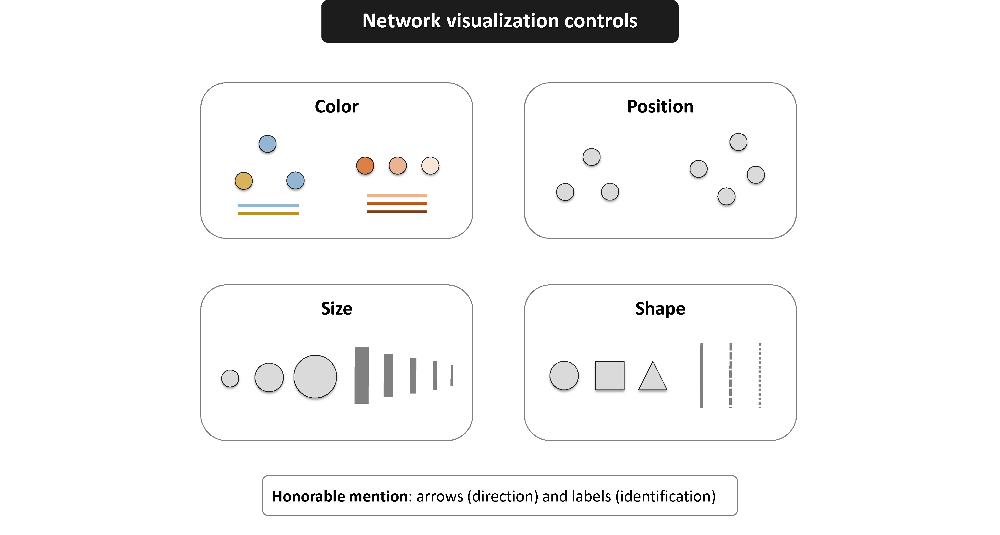
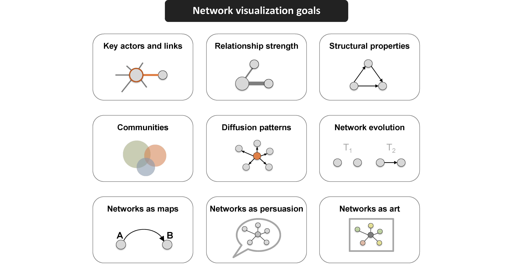
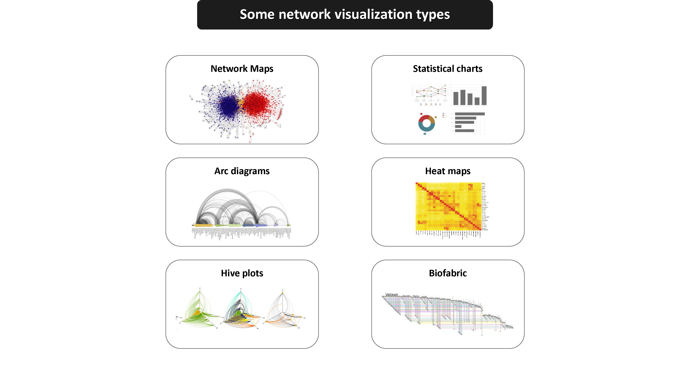
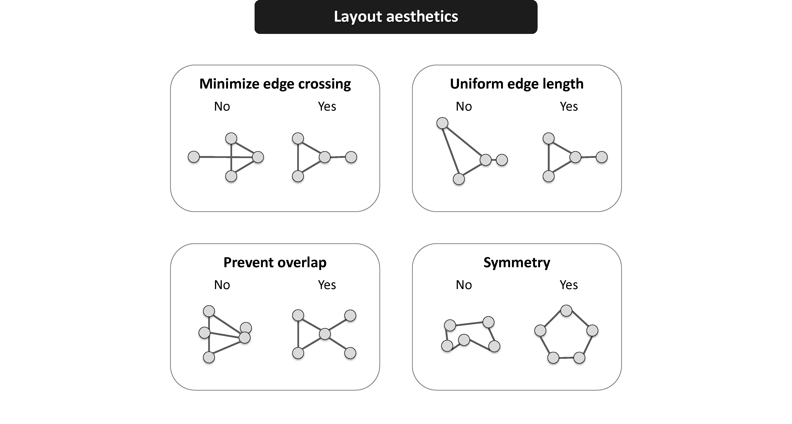

```{r setup, include=FALSE}
knitr::opts_chunk$set(echo = TRUE)
```

# Introducción

La visualización de redes incorpora aspectos **algorítmicos** junto con **elementos estéticos**.

La visualización de un grafo \(G=(V,E)\) consiste en **construir una representación geométrica** en la que los vértices $v \in V$ se representan mediante **símbolos** y las aristas $e \in E$ mediante **segmentos** o **curvas** que reflejan las relaciones entre ellos.

El objetivo consiste en **comunicar adecuadamente la información relacional** siguiendo los principios fundamentales de una visualización:

- Propósito.
- Claridad.
- Simplicidad.
- Escalas.
- Títulos.
- Etiquetas.
- Colores.
- Tamaños.
- Formas.

```{r, eval = TRUE, echo=FALSE, out.width="100%", fig.pos = 'H', fig.align = 'center', fig.cap = " Tomado de https://kateto.net/network-visualization ."}

```

## Codificación visual de atributos

Además de la posición de los vértices, una visualización de redes puede incorporar información adicional mediante diferentes **atributos visuales**. 

La elección de estos atributos debe corresponder al tipo de información que se desea representar y facilitar su interpretación.

| Información                       | Codificación visual recomendada |
| --------------------------------- | ------------------------------- |
| Grupo o categoría del vértice     | Color o forma                   |
| Variable cuantitativa del vértice | Tamaño                          |
| Grado o medida de centralidad     | Tamaño                          |
| Peso de la arista                 | Grosor                          |
| Tipo de relación                  | Color o tipo de línea           |
| Dirección de la relación          | Flechas                         |
| Alta densidad de aristas          | Transparencia                   |

Estas codificaciones deben utilizarse de manera consistente y moderada. 

Incorporar simultáneamente demasiados atributos visuales puede dificultar la interpretación y reducir la claridad de la representación.


# Fundamentos de visualización de redes

¿Cuál es el **propósito** que debe cumplir la visualización? 
     
¿Cuáles son las **propiedades** que se quieren resaltar? 

```{r, eval = TRUE, echo=FALSE, out.width="100%", fig.pos = 'H', fig.align = 'center', fig.cap = " Tomado de https://kateto.net/network-visualization ."}

```


# Tipos de visualización de redes

Hay disponibles **diferentes** tipos de visualización.

```{r, eval = TRUE, echo=FALSE, out.width="100%", fig.pos = 'H', fig.align = 'center', fig.cap = " Tomado de https://kateto.net/network-visualization ."}

```


# Diseños

Uno de los temas centrales de la visualización de grafos es el **diseño del grafo** (*graph layout*), esto es, la **ubicación** de los **vértices** y las **aristas** en el **espacio bidimensional**.

Los grafos de tamaño no trivial deben dibujarse utilizando **métodos automatizados**.

Se usan algoritmos que solucionan los **problemas de optimización** derivados del propósito de la **representación automática**.

Los algoritmos de diseño determinan las **coordenadas de los vértices** utilizando diferentes **criterios geométricos o de optimización**. 

Dependiendo del algoritmo, estos criterios pueden favorecer la separación de vértices, reducir cruces de aristas, controlar las longitudes de las aristas o preservar determinadas propiedades estructurales del grafo.

La posición de un vértice en una visualización no constituye una característica observada de la red. Es el resultado de un algoritmo de diseño.

## Observaciones

La visualización de una red es una **representación gráfica** de su estructura y debe interpretarse con precaución:

* La orientación de la visualización suele ser arbitraria.
* Las coordenadas de los vértices generalmente no tienen unidades ni una interpretación sustantiva directa.
* Dos vértices visualmente cercanos no necesariamente son similares ni están directamente conectados.
* Los patrones y agrupaciones aparentes pueden depender del algoritmo de diseño y de la semilla utilizada.
* La presencia de grupos visualmente definidos no constituye, por sí sola, evidencia estadística de la existencia de comunidades.


```{r, eval = TRUE, echo=FALSE, out.width="100%", fig.pos = 'H', fig.align = 'center', fig.cap = " Tomado de https://kateto.net/network-visualization ."}

```

Hay disponibles varios diseños en `igraph`, entre ellos:

- `layout_as_bipartite()`.
- `layout_as_star()`.
- `layout_as_tree()`. 
- `layout_in_circle()`.
- `layout_nicely()`.
- `layout_on_grid()`.
- `layout_on_sphere()`. 
- `layout_randomly()`.
- `layout_with_dh()`.
- `layout_with_fr()`.
- `layout_with_gem()`.
- `layout_with_graphopt()`.
- `layout_with_kk()`.
- `layout_with_lgl()`.
- `layout_with_mds()`.
- `layout_with_sugiyama()`.

Estos diseños producen un arreglo de $n \times 2$, con $n = \lvert V \rvert$, que contiene las coordenadas de los vértices en $\mathbb{R}^2$ empleadas en la visualización.


## Ejemplo: Juego de Tronos (*Game of Thrones*)

Red de **interacción de personajes** de la temporada 1 de la serie de HBO Juego de Tronos.

Estos datos fueron recolectados para **estudiar la dinámica** de los Siete Reinos de Juego de Tronos.

Los personajes están conectados mediante aristas ponderadas por el **número de interacciones** de los personajes.

Una descripción completa de los datos se puede encontrar [aquí](https://networkofthrones.wordpress.com/the-series/season-1/).

Disponible en este [enlace](https://github.com/mathbeveridge/gameofthrones?tab=readme-ov-file) de GitHub.

```{r}
suppressMessages(suppressWarnings(library(igraph)))
```


```{r}
# datos
dat_nodes <- read.csv("got-s1-nodes.csv")
dat_edges <- read.csv("got-s1-edges.csv")
```


```{r}
# vértices
head(dat_nodes)
# aristas
head(dat_edges)
```


```{r}
# grafo
got <- graph_from_data_frame(d = dat_edges[,c(1,2)], 
                             vertices = dat_nodes$Id, 
                             directed = "F")

E(got)$weight <- dat_edges$Weight
```


```{r}
# orden
vcount(got)
# tamaño
ecount(got)
# dirigida?
is_directed(got)
# ponderada?
is_weighted(got)
```

**`layout_nicely`**
Selecciona automáticamente un diseño apropiado según las características del grafo. Entre otras reglas, utiliza Fruchterman--Reingold para grafos conexos relativamente pequeños y DrL (*Distributed Recursive Layout*) para grafos más grandes.

**`layout_with_dh`** (Davidson--Harel)
Ubica los nodos minimizando un criterio global de “buena apariencia” mediante un proceso de optimización estocástica. Es más costoso y puede depender de la configuración de parámetros.

**`layout_with_fr`** Fruchterman--Reingold  
Diseño por fuerzas que equilibra "atracción" en las aristas y "repulsión" entre nodos. Produce distribuciones que separan grupos y reducen solapamientos de manera razonable.

**`layout_with_kk`** (Kamada--Kawai)
Diseño por "resortes" que intenta que las distancias euclidianas reflejen las distancias geodésicas del grafo. Suele dar buenas representaciones en grafos pequeños o medianos, pero escala peor en grafos grandes.

Conviene comparar los diseños sobre la red binaria porque los algoritmos pueden interpretar los pesos de manera diferente. Así, la comparación refleja principalmente las diferencias entre los métodos de diseño y no el efecto particular de los pesos.

```{r}
# red binaria
got_bin <- delete_edge_attr(got, "weight")

# diseños
set.seed(123)
l_n  <- layout_nicely(got_bin)
l_dh <- layout_with_dh(got_bin)
l_fr <- layout_with_fr(got_bin)
l_kk <- layout_with_kk(got_bin)
```

```{r, fig.width=12, fig.height=12, fig.align='center'}
# visualización
par(mfrow = c(2, 2), mar = c(4, 3, 3, 1))

plot(got_bin, 
     layout = l_n,
     vertex.size = 4,
     vertex.label = NA,
     vertex.color = "black",
     vertex.frame.color = "black")
title(main = "Nicely")

plot(got_bin, 
     layout = l_dh,
     vertex.size = 4,
     vertex.label = NA,
     vertex.color = "black",
     vertex.frame.color = "black")
title(main = "Davidson-Harel")

plot(got_bin, 
     layout = l_fr,
     vertex.size = 4,
     vertex.label = NA,
     vertex.color = "black",
     vertex.frame.color = "black")
title(main = "Fruchterman-Reingold")

plot(got_bin, 
     layout = l_kk,
     vertex.size = 4,
     vertex.label = NA,
     vertex.color = "black",
     vertex.frame.color = "black")
title(main = "Kamada-Kawai")
```


# Decoración

Si bien la posición de los vértices y la ubicación de las aristas son importantes en la visualización de grafos, la **información adicional se puede incorporar en las visualizaciones** variando características como el **tamaño**, la **forma** y el **color** de los **vértices** y las **aristas**.


## Ejemplo: Interacciones sociales

Red de **interacciones sociales** entre los miembros de un club de karate.

Los datos fueron recolectados para **estudiar la fragmentación** del club en dos grupos como consecuencia de una disputa entre el director y el administrador.

La estructura binaria de la red se define mediante
$$
y_{i,j} =
\begin{cases}
1, & \text{si los miembros } i \text{ y } j \text{ tuvieron una interacción social},\\
0, & \text{en otro caso}.
\end{cases}
$$

Además, cada arista tiene asociado un peso
$$
w_{i,j} = \text{número de actividades compartidas por los miembros } i \text{ y } j,
$$
que permite representar la intensidad de la interacción entre ambos miembros.

Una descripción completa de los datos se puede encontrar [aquí](https://rdrr.io/cran/igraphdata/man/karate.html).

Disponible en el paquete `igraphdata` de R.

Zachary, W. W. (1977). **An information flow model for conflict and fission in small groups**. Journal of anthropological research, 33(4), 452-473.


```{r}
# install.packages("igraphdata")
suppressMessages(suppressWarnings(library(igraphdata)))

# data
data(karate)
karate <- upgrade_graph(karate)
# la representación de datos internos a veces cambia entre versiones
```


```{r}
# orden
vcount(karate)
# tamaño
ecount(karate)
# dirigida?
is_directed(karate)
# ponderada?
is_weighted(karate)
```

```{r}
# diseño
set.seed(123)
l <- layout_with_dh(karate)
```


```{r, fig.height = 6, fig.width = 12, fig.align='center'}
# visualización
par(mfrow = c(1,2), mar = c(4, 3, 3, 1))

# grafo no decorado
plot(karate, 
     layout = l, 
     vertex.label = NA, 
     vertex.size = 4, 
     vertex.color = "black", 
     vertex.frame.color = "black")
title(main = "Interacciones sociales")

# decoración
# etiquetas
V(karate)$label <- sub("Actor ", "", V(karate)$name)

# formas
V(karate)$shape <- "circle"
V(karate)[c("Mr Hi","John A")]$shape <- "rectangle"

# colores
V(karate)[Faction == 1]$color <- "red"
V(karate)[Faction == 2]$color <- "dodgerblue"
F1 <- V(karate)[Faction == 1]
F2 <- V(karate)[Faction == 2]
E(karate)[F1 %--% F1]$color <- "pink"
E(karate)[F2 %--% F2]$color <- "lightblue"
E(karate)[F1 %--% F2]$color <- "yellow"

# tamaños
V(karate)$size <- 7*sqrt(degree(karate))
E(karate)$width <- E(karate)$weight

# grafo decorado
plot(karate, 
     layout = l, 
     vertex.frame.color = "black", 
     vertex.label.color = "black")
title(main = "Interacciones sociales")

# leyenda
legend(
  "topleft",
  legend = c("Facción 1", "Facción 2"),
  pch = 21,
  pt.bg = c("red", "dodgerblue"),
  col = "black",
  pt.cex = 1.5,
  bty = "n"
)

```


Los algoritmos de diseño estocásticos pueden generar representaciones diferentes de una misma red **dependiendo de la inicialización**. 

El siguiente ejemplo ilustra esta variabilidad utilizando `layout_with_fr()` con distintas semillas:

```{r, fig.height = 6, fig.width = 12, fig.align='center'}
# variabilidad del diseño Fruchterman-Reingold
set.seed(1)
l1 <- layout_with_fr(karate)

set.seed(2)
l2 <- layout_with_fr(karate)

# visualización
par(mfrow = c(1, 2), mar = c(3, 2, 3, 1))

plot(
  karate,
  layout = l1,
  vertex.size = 4,
  vertex.label = NA,
  vertex.color = "black",
  vertex.frame.color = "black",
  main = "Semilla 1"
)

plot(
  karate,
  layout = l2,
  vertex.size = 4,
  vertex.label = NA,
  vertex.color = "black",
  vertex.frame.color = "black",
  main = "Semilla 2"
)
```


## Ejemplo: Referencias on-line

Red de **referencias on-line** entre blogs políticos franceses clasificados por el proyecto [*Observatoire Presidentielle*](http://observatoire-presidentielle.fr/) en relación con su afiliación política. 

Un enlace indica que al menos uno de los dos blogs **hace referencia** al otro en su página web. 

Una descripción completa de los datos se puede encontrar [aquí](https://search.r-project.org/CRAN/refmans/sand/html/fblog.html).

Disponible en el paquete `sand` de R.

```{r}
# install.packages("sand")
suppressMessages(suppressWarnings(library(sand)))

# data
data(fblog)
fblog <- upgrade_graph(fblog)
```


```{r}
# orden
vcount(fblog)
# tamaño
ecount(fblog)
# dirigida?
is_directed(fblog)
# ponderada?
is_weighted(fblog)
```


```{r, fig.height = 6, fig.width = 6, fig.align='center'}
# decoración
cols <- RColorBrewer::brewer.pal(n = 9, name = "Set1")

partido <- as.factor(V(fblog)$PolParty)
partido_num <- as.numeric(partido)

V(fblog)$color <- cols[partido_num]
E(fblog)$color <- adjustcolor("black", 0.1)

# visualización
set.seed(123)
plot(fblog, 
     layout = layout_with_fr, 
     vertex.size = 4, 
     vertex.label = NA, 
     vertex.frame.color = cols[partido_num], 
     main = "Referencias on-line")

# leyenda
legend(
  "topleft",
  legend = levels(partido),
  pch = 21,
  pt.bg = cols[seq_along(levels(partido))],
  col = cols[seq_along(levels(partido))],
  pt.cex = 1.2,
  cex = 0.7,
  bty = "n"
)
```

**`simplify`** elimina los bucles generados por conexiones entre blogs del mismo partido y combina las aristas múltiples entre pares de partidos. Al sumar sus pesos, el peso de cada arista resultante corresponde al número de referencias entre blogs pertenecientes a esos dos partidos. 

Por lo tanto, la red contraída **representa únicamente las relaciones entre partidos** y no las referencias internas dentro de cada partido.

```{r, fig.height = 6, fig.width = 6, fig.align='center'}
# contracción
fblog_c <- contract(
  graph = fblog,
  mapping = partido_num
)

# cada arista representa una referencia
E(fblog_c)$weight <- 1

# combinar aristas entre los mismos partidos
fblog_c <- simplify(
  fblog_c,
  remove.multiple = TRUE,
  remove.loops = TRUE,
  edge.attr.comb = list(weight = "sum", "ignore")
)

# decoración
partido_tam <- as.vector(table(V(fblog)$PolParty))
V(fblog_c)$size <- 5*sqrt(partido_tam)
E(fblog_c)$width <- sqrt(E(fblog_c)$weight)

# visualización
set.seed(123)
plot(fblog_c, 
     vertex.label = NA, 
     vertex.color = cols, 
     vertex.frame.color = cols, 
     main = "Referencias on-line")
```


## Otras alternativas de visualización

Usando **`ggraph`**.

```{r, fig.align='center', echo=FALSE}
suppressMessages(suppressWarnings(library(ggraph)))
suppressMessages(suppressWarnings(library(tidygraph)))
suppressMessages(suppressWarnings(library(ggplot2)))
suppressMessages(suppressWarnings(library(RColorBrewer)))

cols <- brewer.pal(n = 9, name = "Set1")
edge_col <- adjustcolor("black", 0.1)

g_tbl <- as_tbl_graph(fblog) |>
  activate(nodes) |>
  mutate(party = as.factor(PolParty))

nodes_df <- as_tibble(g_tbl, active = "nodes")
pal <- cols[seq_len(nlevels(nodes_df$party))]

set.seed(123)
ggraph(g_tbl, layout = "fr") +
  geom_edge_link(color = edge_col, width = 0.3) +
  geom_node_point(aes(color = party), shape = 21, fill = "white",
                  stroke = 1, size = 2.5) +
  scale_color_manual(values = pal) +
  theme_void() +
  ggtitle("Referencias on-line")
```


Usando **`visNetwork`**.


```{r, fig.align='center', echo=FALSE}
suppressMessages(suppressWarnings(library(visNetwork)))
suppressMessages(suppressWarnings(library(igraph)))
suppressMessages(suppressWarnings(library(RColorBrewer)))

cols <- brewer.pal(n = 9, name = "Set1")
edge_col <- adjustcolor("black", 0.1)

party <- as.character(V(fblog)$PolParty)
party[is.na(party)] <- "Sin_partido"

lev <- sort(unique(party))
pal <- setNames(grDevices::colorRampPalette(cols)(length(lev)), lev)

coords <- as.data.frame(layout_with_fr(fblog))
names(coords) <- c("x", "y")

nodes <- data.frame(
  id = V(fblog)$name,
  label = "",
  group = party,
  color = unname(pal[party]),
  x = coords$x * 500,
  y = coords$y * 500,
  fixed = TRUE,
  value = 1,
  stringsAsFactors = FALSE
)

edges <- as_data_frame(fblog, what = "edges")[, 1:2]
names(edges) <- c("from", "to")
edges$color <- edge_col
edges$width <- 1

visNetwork(nodes, edges) |>
  visPhysics(enabled = FALSE) |>
  visOptions(
    highlightNearest = list(enabled = TRUE, degree = 1, hover = TRUE),
    nodesIdSelection = list(enabled = TRUE)
  )
```


Usando **`networkD3`**.


```{r, fig.align='center', echo=FALSE}
suppressMessages(suppressWarnings(library(networkD3)))

vnames <- V(fblog)$name
id_map <- setNames(seq_along(vnames) - 1, vnames)

party_num <- as.numeric(as.factor(V(fblog)$PolParty))

nodes_d3 <- data.frame(
  name = vnames,
  group = party_num
)

edges_df <- as_data_frame(fblog, what = "edges")
links_d3 <- data.frame(
  source = id_map[edges_df$from],
  target = id_map[edges_df$to],
  value = 1
)

forceNetwork(
  Links = links_d3,
  Nodes = nodes_d3,
  Source = "source",
  Target = "target",
  Value = "value",
  NodeID = "name",
  Group = "group",
  opacity = 0.9,
  zoom = TRUE,
  fontSize = 12,
  linkColour = edge_col
)
```


# Interpretación de los pesos

En una red ponderada, el significado de los pesos debe establecerse antes de realizar cualquier análisis, pues un valor grande puede representar **mayor intensidad** o **mayor distancia o costo**:
$$
\text{peso alto} =
\begin{cases}
\text{relación más intensa},\\
\text{mayor distancia o costo}.
\end{cases}
$$
Estas interpretaciones son opuestas y afectan el cálculo de diseños, distancias geodésicas y otras medidas de red.


## Ejemplo: Intensidad

En la red del club de karate de Zachary, el peso \(w_{i,j}\) corresponde al número de actividades compartidas por los miembros \(i\) y \(j\). Por lo tanto, un peso grande representa una **relación más intensa**.

Si estos pesos se utilizan para calcular distancias, no resulta apropiado interpretarlos directamente como longitudes. Una transformación sencilla consiste en definir
$$
d_{i,j}=\frac{1}{w_{i,j}},
$$
de manera que una relación más intensa corresponda a una distancia menor.

```{r}
# distancia a partir de la intensidad
E(karate)$distance <- 1 / E(karate)$weight

# pesos y distancias para algunas aristas
head(
  data.frame(
    edge = as_ids(E(karate)),
    weight = E(karate)$weight,
    distance = E(karate)$distance
  ), 
  n = 5
)
```

Para hacer evidente la diferencia entre ambas interpretaciones, se consideran todos los pares de vértices y se selecciona aquel para el cual los caminos mínimos obtenidos utilizando \(w_{i,j}\) y \(1/w_{i,j}\) presentan el mayor contraste.

```{r}
# pares de vértices
pairs <- combn(V(karate)$name, 2, simplify = FALSE)

# diferencia entre los caminos mínimos obtenidos bajo ambas interpretaciones de los pesos
contrast <- sapply(pairs, function(p) {

  path_weight <- shortest_paths(
    karate,
    from = p[1],
    to = p[2],
    weights = E(karate)$weight,
    output = "epath"
  )$epath[[1]]

  path_distance <- shortest_paths(
    karate,
    from = p[1],
    to = p[2],
    weights = E(karate)$distance,
    output = "epath"
  )$epath[[1]]

  e1 <- as.integer(path_weight)
  e2 <- as.integer(path_distance)
  
  # número total de aristas que difieren entre los dos caminos
  length(setdiff(e1, e2)) + length(setdiff(e2, e1))
})

# par con mayor contraste
pair <- pairs[[which.max(contrast)]]

from <- pair[1]
to   <- pair[2]

c(from = from, to = to)
```

Primero se calcula el camino mínimo **interpretando incorrectamente** el número de actividades compartidas como una distancia:

```{r}
# interpretación incorrecta: intensidad como distancia
path_weight <- shortest_paths(
  karate,
  from = from,
  to = to,
  weights = E(karate)$weight,
  output = "both"
)

vpath_weight <- path_weight$vpath[[1]]
epath_weight <- path_weight$epath[[1]]

as_ids(vpath_weight)
```

En este caso, el algoritmo favorece relaciones con pesos pequeños, es decir, relaciones con **pocas actividades compartidas**.

En contraste, utilizando \(d_{i,j}=1/w_{i,j}\), las relaciones más intensas tienen una distancia menor y, por lo tanto, son favorecidas al determinar el camino mínimo:

```{r}
# interpretación correcta: peso como intensidad
path_distance <- shortest_paths(
  karate,
  from = from,
  to = to,
  weights = E(karate)$distance,
  output = "both"
)

vpath_distance <- path_distance$vpath[[1]]
epath_distance <- path_distance$epath[[1]]

as_ids(vpath_distance)
```


Los dos caminos pueden compararse utilizando exactamente el mismo diseño:

```{r, fig.width=12, fig.height=6, fig.align='center'}
# diseño común
set.seed(123)
l <- layout_with_kk(karate, weights = NA)

# interpretación incorrecta
edge_col_1 <- rep("grey85", ecount(karate))
edge_col_1[as.integer(epath_weight)] <- "red"

edge_width_1 <- rep(0.8, ecount(karate))
edge_width_1[as.integer(epath_weight)] <- 4

vertex_col_1 <- rep("grey40", vcount(karate))
vertex_col_1[as.integer(vpath_weight)] <- "red"

# interpretación correcta
edge_col_2 <- rep("grey85", ecount(karate))
edge_col_2[as.integer(epath_distance)] <- "dodgerblue"

edge_width_2 <- rep(0.8, ecount(karate))
edge_width_2[as.integer(epath_distance)] <- 4

vertex_col_2 <- rep("grey40", vcount(karate))
vertex_col_2[as.integer(vpath_distance)] <- "dodgerblue"

# etiquetas únicamente para los extremos
vertex_labels <- rep(NA, vcount(karate))
vertex_labels[match(c(from, to), V(karate)$name)] <- c(from, to)

# contraste visual
par(mfrow = c(1, 2), mar = c(3, 2, 3, 2))

plot(
  karate,
  layout = l,
  vertex.size = 6,
  vertex.label = vertex_labels,
  vertex.label.cex = 0.8,
  vertex.color = vertex_col_1,
  vertex.frame.color = vertex_col_1,
  edge.color = edge_col_1,
  edge.width = edge_width_1
)
title(main = "Peso interpretado como distancia")

plot(
  karate,
  layout = l,
  vertex.size = 6,
  vertex.label = vertex_labels,
  vertex.label.cex = 0.8,
  vertex.color = vertex_col_2,
  vertex.frame.color = vertex_col_2,
  edge.color = edge_col_2,
  edge.width = edge_width_2
)
title(main = "Distancia = 1 / peso")
```

En la primera visualización, el algoritmo minimiza la **suma del número de actividades compartidas**, por lo que las relaciones más intensas resultan artificialmente costosas. 

En la segunda, una mayor intensidad implica una menor distancia y el camino favorece relaciones más fuertes. 

El contraste muestra que **la interpretación sustantiva de los pesos determina cómo deben incorporarse en los cálculos sobre una red ponderada**.


## Ejemplo: Distancia

Red **vial** de Hampi, India, construida a partir de datos de OpenStreetMap.

Los vértices representan **puntos de la red vial** y las aristas representan **segmentos de vías** que conectan dichos puntos.

Una descripción completa de los datos se puede encontrar en la documentación del conjunto `hampi`.

Disponible en el paquete `dodgr` de R.

En este caso, el peso
$$
w_{i,j} = \text{longitud del segmento entre } i \text{ y } j
$$
representa una **distancia física**. Por lo tanto, un peso grande corresponde a una mayor distancia y debe interpretarse directamente como un mayor costo al calcular caminos mínimos.

Primero se obtiene la red y se conserva su componente conexa principal:

```{r}
# install.packages("dodgr")
suppressMessages(suppressWarnings(library(dodgr)))
suppressMessages(suppressWarnings(library(igraph)))

# datos
data("hampi", package = "dodgr")

# red vial
net <- weight_streetnet(hampi, wt_profile = "foot")

# componente conexa principal
net <- net[net$component == 1, ]

head(net, n = 5) 
```

La variable `d` contiene la longitud (en metros) de cada segmento vial. Para utilizar la red con `igraph`, se construyen los objetos de vértices y aristas:

```{r}
# vértices
vertices <- unique(
  rbind(
    data.frame(
      name = as.character(net$from_id),
      x = net$from_lon,
      y = net$from_lat
    ),
    data.frame(
      name = as.character(net$to_id),
      x = net$to_lon,
      y = net$to_lat
    )
  )
)

# aristas
edges <- data.frame(
  from = as.character(net$from_id),
  to = as.character(net$to_id),
  distance = net$d
)

# grafo
road <- graph_from_data_frame(
  d = edges,
  vertices = vertices,
  directed = FALSE
)

# eliminar duplicados producidos por las dos direcciones
road <- simplify(
  road,
  remove.multiple = TRUE,
  remove.loops = TRUE,
  edge.attr.comb = list(distance = "min", "ignore")
)
```


```{r}
# orden
vcount(road)
# tamaño
ecount(road)
# dirigida?
is_directed(road)
# ponderada?
is_weighted(road)
```

Para ilustrar el efecto de considerar las distancias, se compara el camino que minimiza el **número de segmentos recorridos** con el camino que minimiza la **distancia total**. 

Se selecciona automáticamente un par de vértices para el cual la diferencia entre ambos criterios sea particularmente visible:

```{r}
# número de pares posibles considerando todos los vértices
choose(vcount(road), 2)

# pares candidatos
# muestra de vértices para limitar el costo computacional de la búsqueda
set.seed(123)

candidates <- sample(V(road)$name, 40)

pairs <- combn(candidates, 2, simplify = FALSE)

# ahorro de distancia al comparar el camino binario con el camino ponderado
difference <- sapply(pairs, function(p) {

  # camino con menor número de aristas
  path_binary <- shortest_paths(
    road,
    from = p[1],
    to = p[2],
    weights = NA,
    output = "epath"
  )$epath[[1]]

  # camino con menor distancia total
  path_distance <- shortest_paths(
    road,
    from = p[1],
    to = p[2],
    weights = E(road)$distance,
    output = "epath"
  )$epath[[1]]

  # distancia física de cada camino
  d_binary <- sum(E(road)$distance[as.integer(path_binary)])

  d_distance <- sum(E(road)$distance[as.integer(path_distance)])

  # ahorro de distancia al utilizar los pesos
  d_binary - d_distance
})

# par con mayor contraste
pair <- pairs[[which.max(difference)]]

from <- pair[1]
to   <- pair[2]
```

Se calculan entonces los dos caminos:

```{r}
# camino en la red binaria
path_binary <- shortest_paths(
  road,
  from = from,
  to = to,
  weights = NA,
  output = "both"
)

vpath_binary <- path_binary$vpath[[1]]
epath_binary <- path_binary$epath[[1]]

# número de vértices que conforman el camino
length(vpath_binary)

# camino ponderado por distancia
path_distance <- shortest_paths(
  road,
  from = from,
  to = to,
  weights = E(road)$distance,
  output = "both"
)

vpath_binary   <- path_distance$vpath[[1]]
epath_distance <- path_distance$epath[[1]]

# número de vértices que conforman el camino
length(vpath_binary)
```

Las características de los dos caminos permiten cuantificar la diferencia:

```{r}
# comparación
data.frame(
  criterio = c(
    "Menor número de segmentos",
    "Menor distancia"
  ),
  aristas = c(
    length(epath_binary),
    length(epath_distance)
  ),
  distancia_km = round(
    c(
      sum(E(road)$distance[as.integer(epath_binary)]),
      sum(E(road)$distance[as.integer(epath_distance)])
    ) / 1000,
    3
  )
)
```

Aunque el primer camino utiliza el menor número posible de aristas, esto **no implica que sea el más corto en términos físicos**. El segundo puede utilizar un mayor número de segmentos y recorrer una distancia total menor.

El contraste puede observarse utilizando las coordenadas geográficas originales de la red:

```{r, fig.width=12, fig.height=6, fig.align='center'}
# diseño geográfico
l <- cbind(V(road)$x, V(road)$y)

# camino binario
edge_col_1 <- rep("grey85", ecount(road))
edge_col_1[as.integer(epath_binary)] <- "red"

edge_width_1 <- rep(0.3, ecount(road))
edge_width_1[as.integer(epath_binary)] <- 3

# camino ponderado
edge_col_2 <- rep("grey85", ecount(road))
edge_col_2[as.integer(epath_distance)] <- "dodgerblue"

edge_width_2 <- rep(0.3, ecount(road))
edge_width_2[as.integer(epath_distance)] <- 3

# extremos
vertex_col <- rep("grey40", vcount(road))
vertex_size <- rep(1, vcount(road))

endpoints <- match(c(from, to), V(road)$name)

vertex_col[endpoints] <- "black"
vertex_size[endpoints] <- 6

vertex_labels <- rep(NA, vcount(road))
vertex_labels[endpoints] <- c("A", "B")

# contraste visual
par(mfrow = c(1, 2), mar = c(2, 2, 3, 2))

plot(
  road,
  layout = l,
  vertex.size = vertex_size,
  vertex.label = vertex_labels,
  vertex.label.color = "black",
  vertex.label.cex = 0.9,
  vertex.color = vertex_col,
  vertex.frame.color = NA,
  edge.color = edge_col_1,
  edge.width = edge_width_1
)
title(main = "Menor número de segmentos")

plot(
  road,
  layout = l,
  vertex.size = vertex_size,
  vertex.label = vertex_labels,
  vertex.label.color = "black",
  vertex.label.cex = 0.9,
  vertex.color = vertex_col,
  vertex.frame.color = NA,
  edge.color = edge_col_2,
  edge.width = edge_width_2
)
title(main = "Menor distancia")
```

En la primera visualización se ignoran los pesos y cada segmento vial tiene el **mismo costo, independientemente de su longitud**. En consecuencia, el camino geodésico minimiza el **número de aristas recorridas**. 

En la segunda, el peso de cada arista corresponde a su longitud y el camino geodésico minimiza
$$
\sum_{(i,j)\in P} w_{i,j},
$$
donde \(P\) representa el camino entre los dos vértices y \(w_{i,j}\) la longitud de la arista \((i,j)\). Por lo tanto, la suma corresponde a la **distancia física total recorrida a lo largo del camino**.

Este ejemplo muestra que, **cuando los pesos representan distancias o costos, deben utilizarse directamente en el cálculo de caminos mínimos**. 

A diferencia de una medida de intensidad, en este caso no deben invertirse, ya que una arista más larga debe representar un mayor costo de desplazamiento.


## Representación nodo–arista y matriz de adyacencia

La representación **nodo–arista** es intuitiva y permite identificar vértices, conexiones y algunas características locales de la red. Sin embargo, a medida que aumenta el número de vértices y aristas, las superposiciones pueden producir representaciones visualmente saturadas o *hairballs* que dificultan la identificación de patrones estructurales.

Una alternativa es representar directamente la **matriz de adyacencia**. Para una red con \(n\) vértices, la matriz $\mathbf{A}=(a_{i,j})_{n\times n}$ se define mediante
$$
a_{i,j} =
\begin{cases}
1, & \text{si los vértices } i \text{ y } j \text{ están conectados},\\
0, & \text{en otro caso}.
\end{cases}
$$

En esta representación, cada celda indica la presencia o ausencia de una arista. 

Aunque se pierde parte de la interpretación geométrica inmediata del diagrama nodo–arista, ordenar adecuadamente las filas y columnas puede hacer visibles **bloques, comunidades y patrones de conectividad** difíciles de identificar en una red densamente dibujada.

### Ejemplo: Red de aeropuertos de Estados Unidos

Red de **vuelos de pasajeros** entre aeropuertos de Estados Unidos durante diciembre de 2010.

Los vértices representan **aeropuertos** y las aristas representan **vuelos dirigidos** entre ellos. La red puede contener múltiples aristas entre un mismo par de aeropuertos debido a diferentes aerolíneas y tipos de aeronaves.

Una descripción completa de los datos se puede encontrar en la documentación del conjunto `USairports`.

Disponible en el paquete `igraphdata` de R.

```{r}
data("USairports", package = "igraphdata")

# actualizar representación interna
air <- upgrade_graph(USairports)

# orden y tamaño
vcount(air)
ecount(air)
```

Para concentrarnos exclusivamente en la existencia de conexiones entre aeropuertos, se construye una red **binaria no dirigida y simple**:

```{r}
# red binaria no dirigida
air_bin <- as_undirected(air, mode = "collapse")

air_bin <- simplify(air_bin, remove.multiple = TRUE, remove.loops = TRUE)
```

Como la red contiene varias componentes conexas, se conserva la componente de mayor tamaño:

```{r}
# componentes conexas
comp <- components(air_bin)

# componente principal
air_bin <- induced_subgraph(
  air_bin,
  vids = V(air_bin)[comp$membership == which.max(comp$csize)]
)

# orden y tamaño
vcount(air_bin)
ecount(air_bin)
```


La gran cantidad de vértices y aristas produce una representación saturada en la que resulta difícil identificar patrones específicos de conectividad.

La misma red puede representarse mediante su matriz de adyacencia. 

Para facilitar la identificación de estructura, los vértices se ordenan según comunidades obtenidas mediante el algoritmo de Louvain:

```{r}
# comunidades
set.seed(123)
comm <- cluster_louvain(air_bin)

# ordenar por comunidad y grado
ord <- order(membership(comm), -degree(air_bin))

# matriz de adyacencia
A <- as.matrix(as_adjacency_matrix(air_bin, sparse = FALSE))

# ordenar filas y columnas
A_ord <- A[ord, ord]
```


```{r, fig.height = 6, fig.width = 12, fig.align='center'}
# contraste visual
par(mfrow = c(1, 2), mar = c(2, 2, 3, 2))

# diseño 
set.seed(123) 
l <- layout_with_kk(air_bin)

# nodo-arista
plot(
  air_bin,
  layout = l,
  vertex.size = 2,
  vertex.label = NA,
  vertex.color = "black",
  vertex.frame.color = NA,
  edge.color = adjustcolor("black", 0.08),
  edge.width = 0.5,
  main = "Representación nodo-arista"
)

# matriz de adyacencia
corrplot::corrplot(
  A_ord,
  is.corr = FALSE,
  method = "color",
  col = c("white", "black"),
  tl.pos = "n",
  cl.pos = "n",
  addgrid.col = NA,
  diag = TRUE,
  col.lim = c(0, 1),
  title = "Matriz de adyacencia",
  mar = c(0, 0, 2, 0)
)
```

La representación nodo–arista permite apreciar globalmente la conectividad de la red, pero la gran cantidad de aristas dificulta distinguir patrones específicos. 

En contraste, la matriz de adyacencia ordenada agrupa conexiones similares y permite identificar con mayor claridad **regiones de alta densidad y estructura de bloques**.

Por lo tanto, ambas representaciones son complementarias. Los diagramas nodo–arista suelen ser más útiles para examinar estructuras locales y redes relativamente dispersas, mientras que las matrices de adyacencia pueden resultar más informativas en redes medianas o grandes donde la superposición de aristas dificulta la interpretación.


