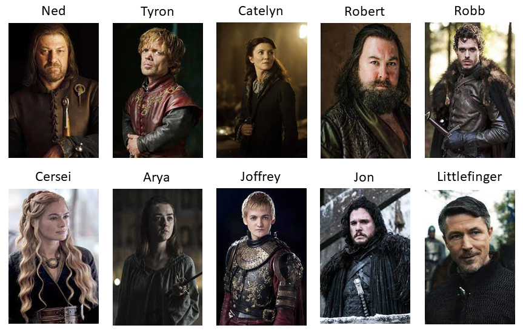
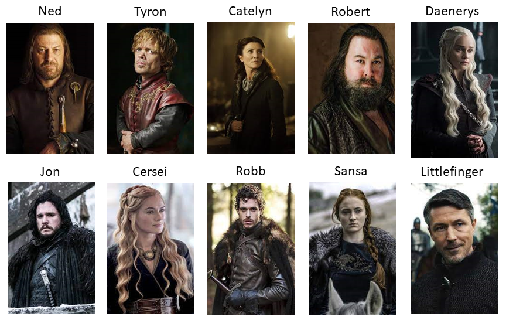
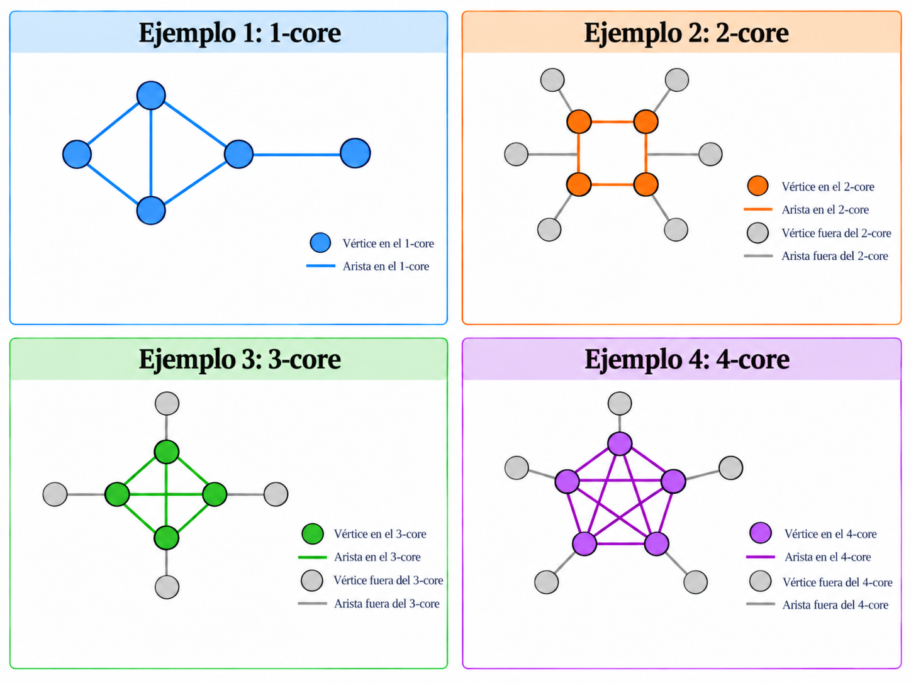

```{r setup, include=FALSE}
knitr::opts_chunk$set(echo = TRUE)
```

# Introducción

Se quiere caracterizar aspectos fundamentales de la **estructura de una red** representada con un grafo $G=(V,E)$:

- **Importancia de individuos**.
- Dinámicas sociales.
- Flujo de la información.
- Formación de comunidades.


# Grado y fuerza

El **grado** (*degree*) $d_v$ de un vértice $v\in V$ se define como $d_v = |\left\{\{v,u\}\in E:u\in V \right\}|$, i.e., $d_v$ corresponde al número de aristas incidentes en $v$. 

A partir de la **matriz de adyacencia** $\mathbf{Y}=[y_{i,j}]$ se tiene que el grado del individuo $i$ se puede calcular mediante
$$
d_i = \sum_{j:j \neq i} y_{i,j}\,,\qquad \text{para}\,\,i=1,\ldots,n\,.
$$

En una red no dirigida, el grado de un vértice refleja su **nivel de conectividad** o **actividad relacional** dentro de la red.

**(Ejercicio)** ¿Cómo se adaptan estos conceptos en el caso de los **digrafos**?

En redes ponderadas, la **fuerza** (*strength*) $s_v$ de un vértice $v\in V$ se define como 
$$
s_v = \sum_{u\in V:\{v,u\}\in E} w_{\{v,u\}}\,,
$$
esto es, la suma de los pesos de las aristas incidentes en $v$. 


## Ejemplo: Juego de Tronos (*Game of Thrones*)

Red de **interacción de personajes** de la temporada 1 de la serie de HBO Juego de Tronos.

Esto datos fueron recolectados para **estudiar la dinámica** de los Siete Reinos de Juego de Tronos.

Los personajes están conectados mediante aristas ponderadas por el **número de interacciones** de los personajes.

Una descripción completa de los datos se puede encontrar [aquí](https://networkofthrones.wordpress.com/the-series/season-1/).

Disponible este [enlace](https://github.com/mathbeveridge/gameofthrones?tab=readme-ov-file) de GitHub.

```{r}
suppressMessages(suppressWarnings(library(igraph)))
```


```{r}
# datos
setwd("~/Dropbox/UN/netwroks_lectures")
dat_nodes <- read.csv("got-s1-nodes.csv")
dat_edges <- read.csv("got-s1-edges.csv")
```


```{r}
# grafo
got <- graph_from_data_frame(d = dat_edges[,c(1,2)], vertices = dat_nodes$Id, directed = F) 
E(got)$weight <- dat_edges$Weight
```


```{r}
# orden
vcount(got)
# tamaño
ecount(got)
# dirigida?
is_directed(got)
# ponderada?
is_weighted(got)
```


```{r}
# matriz de adyacencia
Y <- as_adjacency_matrix(got, sparse = FALSE)

# grado
head(
  cbind(
    degree(graph = got), 
    apply(X = Y, MARGIN = 1, FUN = sum), 
    apply(X = Y, MARGIN = 2, FUN = sum)), 
  n = 5)
```


```{r}
# grado
d <- degree(graph = got)
head(sort(d, decreasing = T), n = 10)
```

```{r, eval = TRUE, echo=FALSE, out.width="70%", fig.pos = 'H', fig.align = 'center', fig.cap = "Top 10 de Juego de tronos (temporada 1) de acuerdo con el grado."}

```


```{r}
# fuerza
wd <- strength(got)
head(sort(wd, decreasing = T), n = 10)
```


```{r, eval = TRUE, echo=FALSE, out.width="70%", fig.pos = 'H', fig.align = 'center', fig.cap = "Top 10 de Juego de tronos (temporada 1) de acuerdo con la fuerza."}

```


```{r, fig.align='center', fig.width=12, fig.height=6}
# diseño
set.seed(123)
l <- layout_with_dh(got)

# grado y fuerza
d  <- degree(got)
wd <- strength(got)

# tamaños de los vértices
size_d <- 4 + 14*sqrt(d/max(d))
size_w <- 4 + 14*sqrt(wd/max(wd))

# grosor de las aristas según el peso
ew <- 0.3 + 2*E(got)$weight/max(E(got)$weight)

# top 10
top_d <- order(d, decreasing = TRUE)[1:10]
top_w <- order(wd, decreasing = TRUE)[1:10]

# colores base
col_d <- rep(
  adjustcolor("gray85", alpha.f = 0.65),
  vcount(got)
)

col_w <- rep(
  adjustcolor("gray85", alpha.f = 0.65),
  vcount(got)
)

# paletas para el top 10
pal_d <- hcl.colors(10, palette = "Blues 3")
pal_w <- hcl.colors(10, palette = "YlOrRd")

# asignar colores según el ranking
col_d[top_d] <- rev(pal_d)
col_w[top_w] <- rev(pal_w)

# bordes
frame_d <- rep(
  adjustcolor("gray65", alpha.f = 0.5),
  vcount(got)
)

frame_w <- rep(
  adjustcolor("gray65", alpha.f = 0.5),
  vcount(got)
)

frame_d[top_d] <- "royalblue4"
frame_w[top_w] <- "firebrick4"

# visualización
par(
  mfrow = c(1, 2),
  mar   = c(1, 1, 3, 1),
  oma   = c(0, 0, 2, 0)
)

# grado
plot(
  got,
  layout             = l,
  vertex.size        = size_d,
  vertex.label       = NA,
  vertex.color       = col_d,
  vertex.frame.color = frame_d,
  edge.color         = adjustcolor("gray40", alpha.f = 0.20),
  edge.width         = ew,
  main               = "Grado",
  margin             = 0.05
)

# fuerza
plot(
  got,
  layout             = l,
  vertex.size        = size_w,
  vertex.label       = NA,
  vertex.color       = col_w,
  vertex.frame.color = frame_w,
  edge.color         = adjustcolor("gray40", alpha.f = 0.20),
  edge.width         = ew,
  main               = "Fuerza",
  margin             = 0.05
)

# título general
title(
  main     = "Juego de Tronos: Temporada 1",
  outer    = TRUE,
  line     = 0.5,
  cex.main = 1.3
)
```


# Distribución del grado

La **distribución del grado** (*degree distribution*) de $G$ es la colección de frecuencias relativas $f_0, f_1,\ldots$, donde
$$
f_d = \frac{|\{v\in V:d_v = d\}|}{|V|}\,,\qquad \text{para}\,\,d=0,1,\ldots\,,
$$
esto es, la fracción de vértices en $V$ tales que $d_v = d$.

La **distribución de fuerza** (*strength distribution*) se define de manera análoga.


## Para qué?

Caracterizar la distribución del grado con una una familia de distribuciones sirve para realizar un **resumen interpretable** que captura **cuánta heterogeneidad hay en las conexiones**. Ese resumen no explica toda la red, pero sí responde algunas preguntas clave y guía decisiones prácticas:

- Comparar redes.

- Entender heterogeneidad y presencia de hubs.  

- Conectar datos con mecanismos generativos.

- Anticipar vulnerabilidad, difusión y contagio.


## Ejemplo: Interacciones sociales

Red de **interacciones sociales** entre los miembros de un club de karate.

Estos datos fueron recolectados para **estudiar la fragmentación** que sufrió el club en dos clubes diferentes debido a una disputa entre el director y el administrador.

$y_{i,j} = 1$ si los miembros $i$ y $j$ tuvieron una **interacción social** en el club y $y_{i,j} = 0$ en otro caso.

Una descripción completa de los datos se puede encontrar [aquí](https://rdrr.io/cran/igraphdata/man/karate.html).

Disponible en el paquete `igraphdata` de R.

Zachary, W. W. (1977). **An information flow model for conflict and fission in small groups**. Journal of anthropological research, 33(4), 452-473.

```{r}
# install.packages("igraphdata")
suppressMessages(suppressWarnings(library(igraphdata)))

# data
data(karate)
karate <- upgrade_graph(karate)
# la representación de datos internos a veces cambia entre versiones
```

```{r}
# orden
vcount(karate)
# tamaño
ecount(karate)
# dirigida?
is_directed(karate)
# ponderada?
is_weighted(karate)
```

```{r, fig.height = 8, fig.width = 8, fig.align='center'}
# visualización
par(mar = c(4, 3, 3, 1))

set.seed(123)
plot(karate, 
     layout = layout_with_dh, 
     vertex.size = 10, 
     vertex.frame.color = "black", 
     vertex.label.color = "black", 
     main = "Interacciones sociales")
```

```{r}
# orden 
(n <- vcount(karate))
# grado
(d <- degree(graph = karate))
```

```{r, fig.height = 6, fig.width = 6, fig.align='center'}
# visualización
par(mfrow = c(1,1))

# diagrama de barras
plot(table(factor(d, levels = 0:n))/n, 
     type = "h", 
     lwd = 5, 
     ylim = c(0,0.5), 
     xlab = "Grado", 
     ylab = "Frecuencia relativa", 
     main = "Distribución del grado", 
     xaxt = "n", 
     col = "gray50")
axis(side = 1, at = seq(from = 0, to = 35, by = 5))
```

Los dos vértices con mayor grado corresponden a los actores 1 y 34, que representan al instructor y al administrador, respectivamente, quienes posteriormente protagonizaron la división del club. 

Los actores 2, 3 y 33 presentan los siguientes grados más altos, lo que indica que también ocupan posiciones altamente conectadas dentro de la red.


## Ley de potencias

En algunas redes, una gran proporción de los vértices tiene grado bajo, mientras que una pequeña proporción presenta grados considerablemente altos. Estos últimos suelen denominarse **vértices concentradores** (*hubs*).

Una distribución que permite representar este tipo de heterogeneidad es la **distribución de ley de potencias** (*power-law distribution*). En el caso discreto, se define mediante
$$
f_d = \mathrm{c}\,d^{-\alpha},
\qquad
d=d_{\min},d_{\min}+1,\ldots,
\qquad
\alpha>1,
$$
donde $d_{\min}>0$ determina el grado a partir del cual se supone el comportamiento de ley de potencias y
$$
\mathrm{c}
=
\left(
\sum_{d=d_{\min}}^\infty d^{-\alpha}
\right)^{-1}
$$
es la constante de normalización. El parámetro $\alpha$ determina la rapidez con la que decrece la cola de la distribución.

En escala logarítmica,
$$
\log f_d
=
\log \mathrm{c}
-
\alpha\log d,
$$
por lo que una ley de potencias produce una relación lineal entre $\log d$ y $\log f_d$ para $d\geq d_{\min}$.

Una red cuya distribución del grado sigue aproximadamente una ley de potencias sobre un rango suficientemente amplio suele denominarse **libre de escala** (*scale-free*). En efecto, para valores admisibles de $d$ y una constante $a>0$,
$$
f_{a\,d}
=
\mathrm{c}(a\,d)^{-\alpha}
=
a^{-\alpha}f_d.
$$
Por lo tanto, un cambio de escala en el grado modifica la distribución únicamente mediante un factor multiplicativo.

Sin embargo, observar un comportamiento aproximadamente lineal en una gráfica log-log **no es suficiente para concluir que la distribución del grado sigue una ley de potencias**. Esta representación constituye únicamente una herramienta exploratoria. 

Una evaluación más rigurosa requiere estimar $\alpha$ mediante **máxima verosimilitud** para distintos valores candidatos de $d_{\min}$ y seleccionar $d_{\min}$ mediante un criterio de bondad de ajuste, usualmente minimizando la distancia de Kolmogorov-Smirnov entre la distribución empírica y la ley de potencias ajustada.

Además, debe evaluarse formalmente la bondad del ajuste y comparar la ley de potencias con distribuciones alternativas de cola pesada, como la **lognormal**, la **exponencial truncada**, la **Weibull** o una **ley de potencias con corte exponencial**.


## Ejemplo: Red de amistades de Facebook

Considere una red de **relaciones de amistad entre usuarios de Facebook** obtenida del repositorio [Stanford Network Analysis Project (SNAP)](https://snap.stanford.edu/).
.
Los vértices representan usuarios y una arista indica una relación de amistad entre dos usuarios. 

La red es no dirigida y no ponderada.

Los datos están disponibles en el paquete `threejs` de R.

McAuley, J., & Leskovec, J. (2012). **Learning to discover social circles in ego networks.** Advances in Neural Information Processing Systems, 25.

```{r}
# paquetes
suppressMessages(suppressWarnings(library(igraph)))
suppressMessages(suppressWarnings(library(threejs)))   # datos
suppressMessages(suppressWarnings(library(poweRlaw)))  # distr. de cola pesada
```

```{r}
# datos
data(ego)

facebook <- upgrade_graph(ego)
```

```{r}
# orden
vcount(facebook)

# tamaño
ecount(facebook)

# dirigida?
is_directed(facebook)

# ponderada?
is_weighted(facebook)
```

Las siguientes visualizaciones muestran la estructura global de la red mediante dos algoritmos de disposición diferentes. En todos los casos, el tamaño y el color de los vértices representan su grado, y las etiquetas se omiten para facilitar la visualización.

```{r, fig.width=12, fig.height=6, fig.align='center'}
# grado
d <- degree(facebook)

# tamaño de los vértices
vs <- 1 + 5*sqrt(d/max(d))

# color según el grado
pal <- hcl.colors(100, palette = "Viridis")
ind <- cut(
  log1p(d),
  breaks = 100,
  labels = FALSE,
  include.lowest = TRUE
)

# diseños

set.seed(123)
l_fr <- layout_with_fr(facebook)

set.seed(123)
l_kk <- layout_with_kk(facebook)

# visualización
par(mfrow = c(1, 2), mar = c(0, 0, 2, 0))

plot(
  facebook,
  layout = l_fr,
  vertex.size = vs,
  vertex.label = NA,
  vertex.color = adjustcolor(pal[ind], alpha.f = 0.8),
  vertex.frame.color = NA,
  edge.color = adjustcolor("gray40", alpha.f = 0.05),
  edge.width = 0.2,
  main = "Fruchterman-Reingold"
)

plot(
  facebook,
  layout = l_kk,
  vertex.size = vs,
  vertex.label = NA,
  vertex.color = adjustcolor(pal[ind], alpha.f = 0.8),
  vertex.frame.color = NA,
  edge.color = adjustcolor("gray40", alpha.f = 0.05),
  edge.width = 0.2,
  main = "Kamada-Kawai"
)
```

La distribución del grado permite estudiar la heterogeneidad en el número de relaciones de amistad de los usuarios.

```{r}
# grado
d <- degree(graph = facebook)

# distribución del grado
dd <- degree_distribution(graph = facebook)
grados <- 0:(length(dd) - 1)
```

```{r, fig.height = 6, fig.width = 12, fig.align = "center"}
# visualización
par(
  mfrow = c(1, 2),
  mar   = c(4.5, 4.5, 3, 1),
  las   = 1
)

# distribución del grado
plot(
  x     = grados,
  y     = dd,
  type  = "h",
  lwd   = 3,
  col   = "gray50",
  xlab  = "Grado",
  ylab  = "Frecuencia relativa",
  main  = "Distribución del grado",
  bty   = "l"
)
points(
  x   = grados,
  y   = dd,
  pch = 16,
  cex = 0.5,
  col = "gray30"
)

# distribución del grado en escala log-log
ind <- grados > 0 & dd > 0

plot(
  x     = grados[ind],
  y     = dd[ind],
  log   = "xy",
  pch   = 16,
  cex   = 0.8,
  col   = adjustcolor("gray30", 0.65),
  xlab  = "Grado",
  ylab  = "Frecuencia relativa",
  main  = "Distribución del grado (escala log-log)",
  bty   = "l"
)
```

La distribución es fuertemente asimétrica. La mayoría de los usuarios tiene un número relativamente pequeño de relaciones, mientras que una proporción mucho menor presenta grados considerablemente altos. La representación en escala log-log permite explorar si la cola presenta un comportamiento compatible con una ley de potencias, pero no es suficiente para establecerlo.

### Ajuste de una ley de potencias

Para ajustar una ley de potencias discreta, se consideran distintos valores candidatos de $d_{\min}$. Para cada uno se estima $\alpha$ mediante máxima verosimilitud y se selecciona el valor de $d_{\min}$ que minimiza la distancia de Kolmogorov-Smirnov entre la distribución empírica y la distribución ajustada.

```{r}
# modelo de ley de potencias
m_pl <- displ$new(d)

# estimación de d_min y alpha
ajuste_pl <- estimate_xmin(m_pl)

# modelo estimado
m_pl$setXmin(ajuste_pl)

# resultados
ajuste_pl
```

El ajuste estima $d_{\min}=47$ y $\alpha=2.51$, con una distancia de Kolmogorov-Smirnov de aproximadamente $0.10$. 

Por lo tanto, el ajuste de ley de potencias se realiza sobre los $1,250$ vértices con grado $d\geq 47$, que constituyen la cola de la distribución considerada por el modelo.

```{r, fig.height = 6, fig.width = 12, fig.align = "center"}
# valores de la cola
d_min  <- m_pl$getXmin()
d_tail <- d_min:max(d)

# frecuencia relativa observada
dd     <- degree_distribution(facebook)
grados <- 0:(length(dd) - 1)

# proporción de vértices en la cola
p_tail <- sum(d >= d_min)/length(d)

# ley de potencias ajustada
f_pl <- p_tail*dist_pdf(m = m_pl, q = d_tail)

# valores observados positivos
ind <- grados > 0 & dd > 0

# visualización
par(mfrow = c(1, 2), mar = c(4.5, 4.5, 3, 1), las = 1)

# escala original
plot(
  x     = grados,
  y     = dd,
  type  = "h",
  lwd   = 3,
  col   = "gray60",
  xlab  = "Grado",
  ylab  = "Frecuencia relativa",
  main  = "Escala original",
  bty   = "l"
)

points(
  x   = grados,
  y   = dd,
  pch = 16,
  cex = 0.5,
  col = "gray30"
)

lines(
  x   = d_tail,
  y   = f_pl,
  lwd = 2.5,
  col = "royalblue"
)

abline(
  v   = d_min,
  lty = 2,
  col = "gray50"
)

legend(
  "topright",
  legend = c(
    "Distribución observada",
    "Ley de potencias ajustada",
    expression(d[min])
  ),
  col = c("gray40", "royalblue", "gray50"),
  pch = c(16, NA, NA),
  lty = c(NA, 1, 2),
  lwd = c(NA, 2.5, 1),
  bty = "n"
)

# escala log-log
plot(
  x     = grados[ind],
  y     = dd[ind],
  log   = "xy",
  pch   = 16,
  cex   = 0.7,
  col   = "gray40",
  xlab  = "Grado",
  ylab  = "Frecuencia relativa",
  main  = "Escala log-log",
  bty   = "l"
)

lines(
  x   = d_tail,
  y   = f_pl,
  lwd = 2.5,
  col = "royalblue"
)

abline(
  v   = d_min,
  lty = 2,
  col = "gray50"
)
```

### Comparación con otras distribuciones

La ley de potencias debe compararse con otras distribuciones plausibles para el grado. Entre las alternativas más comunes se encuentran la **lognormal**, que también puede presentar una cola pesada,
$$
f_d
\propto
\frac{1}{d}
\exp\left\{
-\frac{(\log d-\mu)^2}{2\sigma^2}
\right\},
\qquad d\geq d_{\min},
$$
donde $\mu\in\mathbb{R}$ y $\sigma>0$ controlan la localización y dispersión de la distribución. También puede considerarse la **exponencial**,
$$
f_d
\propto
\exp(-\lambda d),
\qquad
d\geq d_{\min},
\qquad
\lambda>0,
$$
caracterizada por un decaimiento más rápido de la cola. Finalmente, la **Poisson**,
$$
f_d
=
\frac{\lambda^d e^{-\lambda}}{d!},
\qquad
d=0,1,\ldots,
\qquad
\lambda>0,
$$
constituye una referencia natural para redes con una distribución del grado más homogénea, dado que satisface $\operatorname{E}(D)=\operatorname{Var}(D)=\lambda$.

Para que la comparación sea válida, todos los modelos se ajustan sobre las mismas observaciones, es decir, sobre los grados tales que  $d\geq d_{\min}$, utilizando el mismo $d_{\min}$ estimado para la ley de potencias.

```{r}
# umbral común
d_min <- m_pl$getXmin()

# lognormal
m_ln <- dislnorm$new(d)          # crea el modelo lognormal
m_ln$setXmin(d_min)              # fija el umbral
est_ln <- estimate_pars(m_ln)    # estima los parámetros
m_ln$setPars(est_ln$pars)        # asigna los parámetros estimados

# exponencial
m_exp <- disexp$new(d)
m_exp$setXmin(d_min)
est_exp <- estimate_pars(m_exp)
m_exp$setPars(est_exp$pars)

# Poisson
m_pois <- dispois$new(d)
m_pois$setXmin(d_min)
est_pois <- estimate_pars(m_pois)
m_pois$setPars(est_pois$pars)
```

Los cuatro modelos pueden compararse mediante sus log-verosimilitudes y los criterios de información de Akaike y Bayesiano,
$$
\text{AIC} = 
-2\ell(\widehat{\boldsymbol{\theta}})
+
2k,
\qquad\text{y}\qquad
\text{BIC} = 
-2\ell(\widehat{\boldsymbol{\theta}})
+
k\log n,
$$
donde $\ell(\widehat{\boldsymbol{\theta}})$ es la log-verosimilitud maximizada, $k$ es el número de parámetros estimados y $n$ es el número de observaciones utilizadas en el ajuste. 

Valores menores de AIC y BIC indican un mejor compromiso entre ajuste y complejidad. 

Debido a que todos los modelos se ajustan sobre las mismas observaciones de la cola, estos criterios son directamente comparables.

```{r}
# log-verosimilitudes
ll <- c(
  dist_ll(m_pl),
  dist_ll(m_ln),
  dist_ll(m_exp),
  dist_ll(m_pois)
)

# número de parámetros
k <- c(1, 2, 1, 1)

# número de observaciones en la cola
n_tail <- sum(d >= d_min)

# criterios de información
aic <- -2*ll + 2*k
bic <- -2*ll + log(n_tail)*k

# comparación
comparacion <- data.frame(
  Modelo = c(
    "Ley de potencias",
    "Lognormal",
    "Exponencial",
    "Poisson"
  ),
  LogLik = ll,
  AIC = aic,
  BIC = bic
)

# diferencias respecto al mejor modelo
comparacion$Delta_AIC <- comparacion$AIC - min(comparacion$AIC)
comparacion$Delta_BIC <- comparacion$BIC - min(comparacion$BIC)

# ordenar según AIC
comparacion <- comparacion[order(comparacion$AIC), ]

# presentar todas las cifras con dos decimales
comparacion[, -1] <- lapply(
     comparacion[, -1],
     function(x) formatC(x, format = "f", digits = 2)
)

comparacion
```

El modelo ubicado en la primera fila presenta el menor AIC y, entre los modelos considerados, proporciona el mejor compromiso entre ajuste y complejidad. La cantidad
$$
\Delta_m
=
\operatorname{AIC}_m
-
\min_j\operatorname{AIC}_j
$$
permite evaluar cuánto se deteriora el ajuste de cada modelo con respecto al mejor.

También es útil comparar, en escala log-log, la proporción observada de vértices con grado superior a $d$ con la correspondiente proporción bajo las distribuciones ajustadas. Esta representación facilita la comparación del comportamiento de las colas, especialmente para grados altos.

```{r, fig.height = 6, fig.width = 6, fig.align = "center"}
# colores
cols <- c(
  "royalblue",
  "darkorange2",
  "forestgreen",
  "firebrick2"
)

# visualización
par(mar = c(4.5, 4.5, 3, 1), las = 1)

# distribución empírica
plot(
  m_pl,
  cut  = TRUE,
  pch  = 16,
  cex  = 0.7,
  col  = adjustcolor("gray30", 0.7),
  xlab = "Grado",
  ylab = expression(P(D > d)),
  main = "Distribuciones ajustadas",
  bty  = "l"
)

# modelos ajustados
lines(
  m_pl,
  cut = TRUE,
  lwd = 2.5,
  col = cols[1]
)

lines(
  m_ln,
  cut = TRUE,
  lwd = 2.5,
  lty = 2,
  col = cols[2]
)

lines(
  m_exp,
  cut = TRUE,
  lwd = 2.5,
  lty = 3,
  col = cols[3]
)

lines(
  m_pois,
  cut = TRUE,
  lwd = 2.5,
  lty = 4,
  col = cols[4]
)

# leyenda
legend(
  "bottomleft",
  legend = c(
    "Ley de potencias",
    "Lognormal",
    "Exponencial",
    "Poisson"
  ),
  col = cols,
  lty = 1:4,
  lwd = 2.5,
  cex = 0.9,
  bty = "n"
)
```

La comparación mediante AIC identifica el modelo que proporciona el mejor ajuste relativo entre las distribuciones consideradas. Sin embargo, una diferencia en AIC no constituye por sí misma una prueba de que una distribución sea el verdadero mecanismo generador de los datos.

Para comparar formalmente modelos no anidados puede utilizarse adicionalmente la **prueba de Vuong**. Por ejemplo, se puede contrastar la ley de potencias con cada una de las distribuciones alternativas.

```{r}
# comparaciones de Vuong
v_ln   <- compare_distributions(m_pl, m_ln)
v_exp  <- compare_distributions(m_pl, m_exp)
v_pois <- compare_distributions(m_pl, m_pois)

# resultados
vuong <- data.frame(
  Alternativa = c(
    "Lognormal",
    "Exponencial",
    "Poisson"
  ),
  Estadistico = c(
    v_ln$test_statistic,
    v_exp$test_statistic,
    v_pois$test_statistic
  ),
  p = c(
    v_ln$p_two_sided,
    v_exp$p_two_sided,
    v_pois$p_two_sided
  )
)

# presentar cifras con cuatro decimales
vuong[, -1] <- lapply(
  vuong[, -1],
  function(x) formatC(x, format = "f", digits = 4)
)

vuong
```

En estas comparaciones, un estadístico positivo favorece la ley de potencias y uno negativo favorece la distribución alternativa. Un valor $p$ pequeño indica que la diferencia entre ambos modelos es estadísticamente apreciable, mientras que un valor $p$ grande indica que los datos no permiten distinguir claramente entre ellos.

En este caso, los resultados favorecen significativamente a la **lognormal** frente a la ley de potencias $(V=-7.9132,\ p<0.0001)$ y a la **exponencial** frente a la ley de potencias $(V=-5.7247,\ p<0.0001)$. En contraste, la ley de potencias es favorecida frente a la **Poisson** $(V=6.8601,\ p<0.0001)$. Por lo tanto, entre las distribuciones consideradas, la evidencia indica que la ley de potencias describe mejor la cola que la Poisson, pero presenta un ajuste inferior al de la lognormal y la exponencial.

### Uso del modelo exponencial ajustado

Una vez seleccionado el modelo exponencial como el mejor ajuste para la cola $d\geq d_{\min}$, este puede utilizarse para **cuantificar el decaimiento de los grados altos**, **calcular la probabilidad de observar vértices con grados superiores a determinados umbrales** y **estimar cuántos vértices con estas características se esperan bajo el modelo**.

El parámetro estimado de la distribución exponencial puede obtenerse mediante

```{r}
# parámetro estimado
lambda <- m_exp$getPars()
lambda
```

Valores mayores de $\lambda$ corresponden a un decaimiento más rápido de la cola y, por lo tanto, a una menor probabilidad de observar grados extremadamente altos.

```{r, fig.align='center'}
# valores de la cola
d_min  <- m_exp$getXmin()
d_tail <- d_min:max(d)

# distribución observada
dd <- degree_distribution(facebook)
grados <- 0:(length(dd) - 1)

# proporción de vértices en la cola
p_tail <- sum(d >= d_min)/length(d)

# distribución exponencial ajustada
f_exp <- p_tail*dist_pdf(m = m_exp, q = d_tail)

# visualización
par(mar = c(4.5, 4.5, 3, 1), las = 1)

plot(
  x     = grados,
  y     = dd,
  type  = "h",
  lwd   = 3,
  col   = "gray60",
  xlab  = "Grado",
  ylab  = "Frecuencia relativa",
  main  = "Distribución del grado",
  bty   = "l"
)

points(
  x   = grados,
  y   = dd,
  pch = 16,
  cex = 0.5,
  col = "gray30"
)

lines(
  x   = d_tail,
  y   = f_exp,
  lwd = 2.5,
  col = "royalblue"
)

abline(
  v   = d_min,
  lty = 2,
  col = "gray50"
)

legend(
  "topright",
  legend = c(
    "Distribución observada",
    "Exponencial ajustada",
    expression(d[min])
  ),
  col = c("gray40", "royalblue", "gray50"),
  pch = c(16, NA, NA),
  lty = c(NA, 1, 2),
  lwd = c(NA, 2.5, 1),
  bty = "n"
)
```

Para diferentes valores de $d$ puede calcularse
$$
P(D>d\mid D\geq d_{\min}),
$$
es decir, la probabilidad de observar un grado superior a $d$ entre los vértices pertenecientes a la cola.

```{r}
# umbrales de grado
umbrales <- c(50, 75, 100, 150, 200)

# probabilidades bajo el modelo
p_mayor <- dist_cdf(
  m_exp,
  q = umbrales,
  lower_tail = FALSE
)

# resultados
data.frame(
  Grado = umbrales,
  Probabilidad = round(p_mayor, 4)
)
```

Estas probabilidades también permiten estimar el número de vértices con grados superiores a cada umbral. Si $n_{\mathrm{cola}}$ es el número de vértices con $d\geq d_{\min}$, el número esperado es
$$
n_{\mathrm{cola}}\,
P(D>d\mid D\geq d_{\min}).
$$

```{r}
# número de vértices en la cola
n_tail <- sum(d >= d_min)

# valores observados y esperados
observados <- sapply(
  umbrales,
  function(x) sum(d > x)
)

esperados <- n_tail*p_mayor

# comparación
data.frame(
  Grado = umbrales,
  Observados = observados,
  Esperados = round(esperados, 2)
)
```

La comparación entre los valores observados y esperados permite evaluar qué tan bien describe el modelo exponencial las diferentes regiones de la cola. Además, probabilidades muy pequeñas para grados elevados permiten identificar vértices excepcionalmente conectados respecto al comportamiento esperado bajo el modelo.

El modelo exponencial ajustado también permite identificar vértices con grados inusualmente altos. Para cada vértice de la cola se calcula la probabilidad de observar un grado aún mayor bajo el modelo,
$$
P(D>d_i\mid D\geq d_{\min}).
$$
Valores pequeños indican vértices especialmente extremos respecto al patrón esperado de conectividad. Por lo tanto, el modelo ajustado no solo resume la forma de la cola de la distribución del grado, sino que también permite **cuantificar la frecuencia esperada de grados altos e identificar vértices con niveles de conectividad inusuales**.

```{r}
# probabilidades para los vértices de la cola
ind <- d >= d_min

p_extremo <- dist_cdf(
  m_exp,
  q = d[ind],
  lower_tail = FALSE
)

# vértices con grados más extremos
extremos <- data.frame(
  Vertice = which(ind),
  Grado = d[ind],
  Probabilidad = p_extremo
)

# ordenar por probabilidad
extremos <- extremos[order(extremos$Probabilidad),]

# top 10
head(extremos, n = 10)
```

Los primeros vértices de la tabla presentan grados excepcionalmente altos respecto al modelo exponencial ajustado. Por ejemplo, el vértice 108, con grado $1045$, tiene una probabilidad de cola prácticamente nula, lo que indica un nivel de conectividad extremadamente inusual.

Sin embargo, **este modelo caracteriza únicamente la distribución marginal del grado y no la estructura completa de la red**.

**(Ejercicio)** ¿Qué otras distribuciones pueden utilizarse para modelar la distribución del grado, además de la ley de potencias, la exponencial, la lognormal y la Poisson? ¿Cómo se comportan estas alternativas para la red analizada?


## Asociación entre grados

Además de estudiar la distribución marginal del grado, resulta útil analizar qué tipos de vértices tienden a conectarse entre sí.

Para un vértice $i$ con grado $d_i>0$, el **grado promedio de sus vecinos** se define como
$$
d_{\mathrm{nn},i}
=
\frac{1}{d_i}
\sum_{j\in N(i)} d_j,
$$
donde $N(i)=\{j\in V:\{i,j\}\in E\}$ es el conjunto de vecinos de $i$. 

Por lo tanto, $d_{\mathrm{nn},i}$ corresponde al promedio de los grados de los vértices adyacentes a $i$ y permite caracterizar el nivel de conectividad de su entorno inmediato.

También puede considerarse el **grado promedio de los vecinos para los vértices de grado** $d$, definido como
$$
\bar d_{N}(d)
=
\frac{1}{|\{i\in V:d_i=d\}|}
\sum_{i:d_i=d}
d_{\mathrm{nn},i}.
$$
Esta cantidad resume el nivel de conectividad promedio de los vecinos de los vértices que tienen grado $d$.

```{r}
# calcula el grado promedio de los vecinos
nn <- knn(graph = facebook)

# valor para cada vértice
d_nn <- nn$knn

# promedio para cada grado
d_nn_grado <- nn$knnk
```

```{r, fig.height = 6, fig.width = 6, fig.align = "center"}
# grados asociados a knnk
grados <- seq_len(length(d_nn_grado))

# valores definidos
ind <- is.finite(d_nn_grado) & d_nn_grado > 0

# visualización
par(mar = c(4.5, 4.5, 3, 1), las = 1)

plot(
  x     = grados[ind],
  y     = d_nn_grado[ind],
  log   = "xy",
  pch   = 16,
  cex   = 0.8,
  col   = adjustcolor("royalblue", 0.65),
  xlab  = "Grado",
  ylab  = "Grado promedio de los vecinos",
  main  = "Asociación entre grados",
  bty   = "l"
)
```

Una **tendencia creciente**   indica que los vértices de grado alto tienden a conectarse con otros vértices de grado alto. 

Una **tendencia decreciente** indica que los vértices de grado alto tienden a relacionarse preferentemente con vértices de menor grado.

Este patrón puede resumirse mediante el **coeficiente de asortatividad por grado**. Para una red no dirigida, el **coeficiente de asortatividad por grado** se define como
$$
r
=
\frac{
\frac{1}{m}\sum_{e=1}^{m} j_e k_e
-
\left[
\frac{1}{2m}\sum_{e=1}^{m}(j_e+k_e)
\right]^2
}{
\frac{1}{2m}\sum_{e=1}^{m}(j_e^2+k_e^2)
-
\left[
\frac{1}{2m}\sum_{e=1}^{m}(j_e+k_e)
\right]^2
},
$$
donde $m=|E|$ es el número de aristas y $j_e$ y $k_e$ son los grados de los vértices ubicados en los extremos de la arista $e$.

Valores positivos indican **asortatividad**, valores negativos indican **disasortatividad** y valores cercanos a cero indican poca asociación lineal entre los grados de los vértices situados en los extremos de las aristas.

```{r}
# asortatividad por grado
r <- assortativity_degree(graph = facebook)
r
```

El coeficiente de asortatividad por grado es $r=0.064$, lo que indica una **asortatividad positiva muy débil**. Por lo tanto, los vértices conectados presentan solo una ligera tendencia a tener grados similares.

# Centralidad

Las medidas de centralidad permiten cuantificar diferentes formas de **prominencia estructural** de los vértices dentro de una red. 

No existe una noción única de centralidad: cada medida responde a una pregunta diferente acerca de la posición que ocupa un vértice.

| Medida         | Interpretación                                                              |
| -------------- | --------------------------------------------------------------------------- |
| Grado          | ¿Cuántos vecinos tiene?                                                     |
| Cercanía       | ¿Qué tan cerca está del resto de la red?                                    |
| Armónica       | ¿Qué tan accesibles son los demás vértices, incluso si la red no es conexa? |
| Intermediación | ¿Con qué frecuencia actúa como puente entre otros vértices?                 |
| Propia         | ¿Está conectado con vértices que también son centrales?                     |
| Coreness       | ¿Qué tan profundamente integrado está en el núcleo de la red?               |
| PageRank       | ¿Recibe conexiones de vértices estructuralmente importantes?                |
| HITS           | ¿Actúa como hub o como autoridad?                                           |

Algunas medidas admiten **versiones normalizadas**, aunque la forma de normalización depende de cada centralidad. Por lo tanto, una normalización **no implica** necesariamente que valores obtenidos en redes diferentes sean directamente comparables.

En **redes dirigidas** también debe **distinguirse la dirección** de los caminos o conexiones. Por ejemplo, pueden considerarse caminos que salen de un vértice, que llegan a él o ignorar temporalmente la dirección de las aristas.

En **redes ponderadas**, la interpretación de los pesos depende de la medida de centralidad. En cercanía, centralidad armónica e intermediación, los pesos representan **distancias o costos**, por lo que pesos asociados con intensidad o frecuencia deben transformarse cuando corresponda. En centralidad propia, PageRank y HITS, pesos mayores representan **conexiones más fuertes**.


## Centralidad de cercanía

La **centralidad de cercanía** (*closeness centrality*) cuantifica qué tan cerca se encuentra un vértice del resto de la red. Para un **grafo conexo**,
$$
c_{\textsf{C}}(v)
=
\frac{1}
{\displaystyle \sum_{\substack{u\in V\\u\neq v}}\textsf{d}(v,u)},
$$
donde $\textsf{d}(v,u)$ es la distancia geodésica entre los vértices $v$ y $u$.

Una versión normalizada es
$$
c_{\textsf{C}}^{*}(v)
=
\frac{n-1}
{\displaystyle \sum_{\substack{u\in V\\u\neq v}}\textsf{d}(v,u)}.
$$
Valores altos indican que, en promedio, se requieren pocos pasos para alcanzar los demás vértices.

La centralidad de cercanía resulta principalmente **apropiada para redes conexas**. Si existen vértices no alcanzables, las distancias correspondientes son infinitas y es preferible considerar la centralidad armónica.


## Ejemplo: Interacciones sociales (cont.)

```{r}
# matriz de distancias
D <- distances(
  graph = karate,
  weights = NA
)

# número de vértices
n <- vcount(karate)

# centralidad de cercanía no normalizada
cc <- closeness(
  graph = karate,
  normalized = FALSE,
  weights = NA
)

# verificación
head(
  cbind(
    igraph = cc,
    manual = 1/rowSums(D)
  ),
  n = 5
)
```

```{r}
# centralidad de cercanía normalizada
cc <- closeness(
  graph = karate,
  normalized = TRUE,
  weights = NA
)

# verificación
head(
  cbind(
    igraph = cc,
    manual = (n - 1)/rowSums(D)
  ),
  n = 5
)

# top 5
head(
  sort(cc, decreasing = TRUE),
  n = 5
)
```


## Centralidad armónica

La **centralidad armónica** (*harmonic centrality*) proporciona una alternativa natural a la cercanía cuando la red **no es conexa**. Su versión normalizada se define como
$$
c_{\textsf{H}}(v)
=
\frac{1}{n-1}
\sum_{\substack{u\in V\\u\neq v}}
\frac{1}{\textsf{d}(v,u)},
$$
donde por convención se asume que $1/\infty=0$.

Por lo tanto, los vértices no alcanzables no generan problemas en el cálculo. Valores altos indican que una gran parte de la red puede alcanzarse mediante distancias relativamente pequeñas.

```{r}
# centralidad armónica
hc <- harmonic_centrality(
  graph = karate,
  normalized = TRUE,
  weights = NA
)

# top 5
head(
  sort(hc, decreasing = TRUE),
  n = 5
)
```


## Centralidad de intermediación

La **centralidad de intermediación** (*betweenness centrality*) mide hasta qué punto un vértice se encuentra en los caminos geodésicos que conectan otros pares de vértices. Para una red no dirigida,
$$
c_{\textsf{B}}(v)
=
\sum_{\substack{s<t\\s\neq v,\;t\neq v}}
\frac{\sigma(s,t\mid v)}
{\sigma(s,t)},
$$
donde $\sigma(s,t)$ es el número de caminos más cortos entre $s$ y $t$, y $\sigma(s,t\mid v)$ es el número de estos caminos que pasan por $v$.

Por lo tanto, un vértice con alta intermediación puede desempeñar un papel importante como **puente** entre diferentes regiones de la red.

La versión normalizada para una red no dirigida es
$$
c_{\textsf{B}}^{*}(v)
=
\frac{2c_{\textsf{B}}(v)}
{(n-1)(n-2)}.
$$


## Ejemplo: Interacciones sociales (cont.)

```{r}
# centralidad de intermediación no normalizada
bc <- betweenness(
  graph = karate,
  directed = FALSE,
  normalized = FALSE,
  weights = NA
)

head(bc, n = 5)
```

```{r}
# centralidad de intermediación normalizada
bc_norm <- betweenness(
  graph = karate,
  directed = FALSE,
  normalized = TRUE,
  weights = NA
)

# verificación
head(
  cbind(
    manual = 2*bc/((n - 1)*(n - 2)),
    igraph = bc_norm
  ),
  n = 5
)

# top 5
head(
  sort(bc_norm, decreasing = TRUE),
  n = 5
)
```


## Centralidad propia

La **centralidad propia** (*eigenvector centrality*) asigna valores altos a vértices conectados con otros vértices que también presentan alta centralidad.

Si $\mathbf{Y}$ es la matriz de adyacencia, el vector de centralidades $\mathbf{c}=\big(c(1),\ldots,c(n)\big)^{\mathsf{T}}$ satisface
$$
\mathbf{Y}\mathbf{c}
=
\lambda_{\max}\mathbf{c},
$$
donde $\lambda_{\max}$ es el mayor valor propio de $\mathbf{Y}$. Equivalentemente,
$$
c_{\textsf{E}}(i)
=
\frac{1}{\lambda_{\max}}
\sum_{j=1}^{n}y_{i,j}\,c_{\textsf{E}}(j).
$$

Por lo tanto, la centralidad de un vértice depende no solo de cuántos vecinos tiene, sino también de la centralidad de esos vecinos.

Para una matriz de adyacencia no negativa y bajo condiciones apropiadas de conectividad, el vector propio principal puede elegirse con entradas no negativas.


## Ejemplo: Interacciones sociales (cont.)

```{r}
# matriz de adyacencia
Y <- as.matrix(
  as_adjacency_matrix(
    karate,
    sparse = FALSE,
    attr = NULL
  )
)

# descomposición espectral
evd <- eigen(Y, symmetric = TRUE)

# vector propio principal
ec_manual <- evd$vectors[, 1]

# orientar el signo
if (sum(ec_manual) < 0) ec_manual <- -ec_manual

# normalizar
ec_manual <- ec_manual/max(ec_manual)

# centralidad propia
ec <- eigen_centrality(
  graph = karate,
  weights = NA
)$vector

# comparación
head(
  cbind(
    igraph = ec,
    manual = ec_manual
  ),
  n = 5
)

# top 5
head(
  sort(ec, decreasing = TRUE),
  n = 5
)
```


## Coreness

Otra medida útil para caracterizar la posición estructural de un vértice es su **coreness**.

Un $k$-core es un **subgrafo maximal** en el cual todos los vértices tienen grado al menos $k$ dentro del propio subgrafo. 

```{r, eval = TRUE, echo=FALSE, out.width="70%", fig.pos = 'H', fig.align = 'center', fig.cap = "Top 10 de Juego de tronos (temporada 1) de acuerdo con el grado."}

```

La **coreness** de un vértice corresponde al mayor valor de $k$ para el cual el vértice pertenece a un $k$-core.

Esta medida permite distinguir entre un vértice con muchos vecinos periféricos y otro que se encuentra integrado en una región densamente conectada de la red.

```{r}
# coreness
kc <- coreness(karate)

# top 5
head(
  sort(kc, decreasing = TRUE),
  n = 5
)
```


## Comparación de medidas

Las diferentes medidas **no necesariamente identifican los mismos vértices** como centrales. Cada medida caracteriza un aspecto estructural distinto.

```{r, fig.height = 8, fig.width = 12, fig.align = 'center'}
# medidas
dc <- degree(
  graph = karate,
  normalized = TRUE
)

cc <- closeness(
  graph = karate,
  normalized = TRUE,
  weights = NA
)

hc <- harmonic_centrality(
  graph = karate,
  normalized = TRUE,
  weights = NA
)

bc <- betweenness(
  graph = karate,
  directed = FALSE,
  normalized = TRUE,
  weights = NA
)

ec <- eigen_centrality(
  graph = karate,
  weights = NA
)$vector

kc <- coreness(karate)
kc <- kc/max(kc)

# medidas en una lista
centralidad <- list(
  "Grado" = dc,
  "Cercanía" = cc,
  "Armónica" = hc,
  "Intermediación" = bc,
  "Propia" = ec,
  "Coreness" = kc
)

# paletas
paletas <- c(
  "Blues 3",
  "Teal",
  "Greens 3",
  "OrRd",
  "Purples 3",
  "YlOrBr"
)

# diseño común
set.seed(123)
l <- layout_with_dh(karate)

# visualización
par(mfrow = c(2, 3), mar = c(1, 1, 3, 1), oma = c(0, 0, 3, 0))

for (j in seq_along(centralidad)) {
  # medida
  x <- centralidad[[j]]
  
  # tamaño según centralidad
  size <- 5 + 17*sqrt(x/max(x))
  
  # top 5
  top <- order(x, decreasing = TRUE)[1:5]
  
  # color base
  col_v <- rep(
    adjustcolor("gray85", alpha.f = 0.50),
    vcount(karate)
  )
  
  # colores del top 5
  pal <- hcl.colors(5, palette = paletas[j])
  
  col_v[top] <- rev(pal)
  
  # bordes
  frame_v <- rep(
    adjustcolor("gray65", alpha.f = 0.30),
    vcount(karate)
  )
  
  frame_v[top] <- adjustcolor(rev(pal)[1], alpha.f = 0.90)
  
  # etiquetas únicamente para el top 5
  labs <- rep(NA, vcount(karate))
  labs[top] <- top
  
  # gráfico
  plot(
    karate,
    layout = l,
    vertex.size = size,
    vertex.label = labs,
    vertex.label.cex = 1.3,
    vertex.label.color = "gray15",
    vertex.color = col_v,
    vertex.frame.color = frame_v,
    edge.color = adjustcolor("gray45", alpha.f = 0.20),
    edge.width = 0.7,
    main = names(centralidad)[j],
    margin = 0.08
  )
}
```

La comparación muestra que un vértice puede ocupar una posición destacada según una medida y no según otra. 

La elección de una centralidad debe estar determinada por la propiedad estructural que resulte relevante para el problema analizado.


# Centralidad en redes dirigidas

En una red dirigida, la **dirección** de las aristas permite distinguir diferentes formas de centralidad. 

Un vértice puede ser importante por las **conexiones que recibe**, por las **conexiones que genera** o por la **importancia estructural** de los vértices con los que se relaciona.

Dos enfoques especialmente útiles son **PageRank** y el algoritmo **HITS**.


## PageRank

PageRank asigna mayor centralidad a un vértice cuando **recibe conexiones** de otros vértices con alta centralidad. 

Cada vértice distribuye su PageRank entre los vértices hacia los que apunta (grado de salida), de modo que la contribución transmitida a cada uno es inversamente proporcional a su grado de salida.

Una representación simplificada es
$$
c_{\textsf{P}}(i)
=
\frac{1-\delta}{n}
+
\delta
\sum_{j:j\rightarrow i}
\frac{c_{\textsf{P}}(j)}
{d_j^{\mathrm{out}}},
$$
donde $\delta\in(0,1)$ es el **parámetro de amortiguamiento** (*damping factor*) y $d_j^{\mathrm{out}}$ es el grado de salida del vértice $j$.

Valores altos de $\delta$ hacen que PageRank dependa más de la estructura de enlaces, mientras que valores bajos producen valores más homogéneos. Habitualmente se utiliza $\delta=0.85$.

Por lo tanto, recibir una conexión desde un vértice importante contribuye más a PageRank que recibirla desde un vértice poco importante.


## Hubs y autoridades

El algoritmo **HITS** distingue dos formas complementarias de centralidad en redes dirigidas.

Un **hub** presenta un valor alto cuando apunta hacia autoridades importantes, mientras que una **autoridad** presenta un valor alto cuando recibe conexiones desde hubs importantes.

Si $h_i$ y $a_i$ representan los valores de hub y autoridad del vértice $i$, respectivamente,
$$
h_i
=
\sum_{j=1}^{n}y_{i,j}\,a_j,
\qquad\text{y}\qquad
a_i
=
\sum_{j=1}^{n}y_{j,i}\,h_j.
$$

En notación matricial,
$$
\mathbf{h}
\propto
\mathbf{Y}\mathbf{Y}^{\mathsf{T}}\mathbf{h},
\qquad\text{y}\qquad
\mathbf{a}
\propto
\mathbf{Y}^{\mathsf{T}}\mathbf{Y}\mathbf{a}.
$$

Por lo tanto, los valores de hub corresponden al vector propio principal de $\mathbf{Y}\mathbf{Y}^{\mathsf{T}}$, mientras que los valores de autoridad corresponden al vector propio principal de $\mathbf{Y}^{\mathsf{T}}\mathbf{Y}$.


## Ejemplo: Red de difusión de información

Considere una red de **difusión de información entre medios de comunicación y blogs** construida a partir de los datos de MemeTracker mediante el algoritmo NetInf.

Los vértices representan sitios web y una arista dirigida $i\rightarrow j$ indica que el sitio $j$ tiende a **copiar o repetir información** que apareció previamente en el sitio $i$. 

La dirección de las aristas representa el flujo potencial de información desde una fuente hacia un sitio que posteriormente reproduce su contenido.

La red se infiere a partir de cascadas temporales de difusión. En consecuencia, las aristas no corresponden necesariamente a transmisiones observadas directamente, sino a relaciones de difusión compatibles con los patrones temporales presentes en los datos.

Se consideran los $1,000$ sitios más activos y $5,000$ relaciones de difusión inferidas a partir de $5,000$ grupos de frases.

Gomez-Rodriguez, M., Leskovec, J., & Krause, A. (2010). **Inferring networks of diffusion and influence.** Proceedings of the 16th ACM SIGKDD International Conference on Knowledge Discovery and Data Mining.

Los datos están disponibles en el [Stanford Network Analysis Project (SNAP)](https://snap.stanford.edu/).

```{r}
# paquete
suppressMessages(suppressWarnings(library(igraph)))

# ubicación de los datos
url <- paste0(
  "https://snap.stanford.edu/netinf/",
  "InfoNet5000Q1000NEXP.txt"
)

# archivo
file_netinf <- "InfoNet5000Q1000NEXP.txt"

# descarga
if (!file.exists(file_netinf)) {
  download.file(
    url,
    destfile = file_netinf,
    mode = "wb"
  )
}
```

```{r}
# datos
dat <- read.table(
  file_netinf,
  header = TRUE,
  stringsAsFactors = FALSE
)

head(dat)
```

El archivo contiene una fila por cada relación de difusión inferida. 

Además de los sitios de origen y destino, incluye información sobre la cantidad de cascadas asociadas con la relación y las diferencias temporales observadas.

Las principales variables son:

* `src`: sitio que actúa como fuente de la información.
* `dst`: sitio que posteriormente copia o repite la información.
* `number_trees`: número de árboles de difusión en los que aparece la relación.
* `marginal_gain`: contribución de la arista al criterio utilizado por NetInf.
* `median_timediff`: diferencia temporal mediana entre fuente y destino.
* `average_timediff`: diferencia temporal promedio entre fuente y destino.

La red dirigida se construye mediante

```{r}
# grafo
netinf <- graph_from_data_frame(
  d = dat[, c(
    "src",
    "dst",
    "number_trees",
    "marginal_gain",
    "median_timediff",
    "average_timediff"
  )],
  directed = TRUE
)
```

```{r}
# orden
vcount(netinf)

# tamaño
ecount(netinf)

# dirigida?
is_directed(netinf)

# simple?
is_simple(netinf)
```

Cada arista representa una posible relación de difusión $i\longrightarrow j$, donde $i$ actúa como fuente y $j$ como receptor posterior de la información. 


### Visualización

La siguiente visualización permite apreciar la estructura global de la red de difusión. El tamaño de los vértices representa su grado total, mientras que los colores permiten distinguir diferentes regiones estructurales de la red. Las aristas se muestran con alta transparencia debido a la densidad de conexiones y únicamente se etiquetan los sitios con mayor grado.

```{r, fig.align='center', fig.width=12, fig.height= 6}
# red no dirigida para el diseño
netinf_u <- as_undirected(
  netinf,
  mode = "collapse"
)

# grado total
d_total <- degree(
  graph = netinf,
  mode = "all"
)

# comunidades
set.seed(123)

com <- cluster_louvain(netinf_u)
membership_com <- membership(com)

# tamaño de las comunidades
freq_com <- sort(table(membership_com), decreasing = TRUE)

# comunidades principales
top_com <- as.integer(names(freq_com)[1:min(8, length(freq_com))])

# paleta
pal <- hcl.colors(length(top_com), palette = "Dark 3")

# colores base
col_v <- rep(
  adjustcolor("gray82", alpha.f = 0.55),
  vcount(netinf)
)

# colores de las comunidades principales
for (j in seq_along(top_com))
  col_v[membership_com == top_com[j]] <- adjustcolor(pal[j], alpha.f = 0.80)

# tamaño según grado total
size_v <- 1.5 + 8*sqrt(d_total/max(d_total))

# sitios con mayor grado
top <- order(d_total, decreasing = TRUE)[1:15]

# etiquetas
labs <- rep(NA, vcount(netinf))

# intensidad de las relaciones
edge_strength <- log1p(E(netinf)$number_trees)

edge_width <- 0.15 + 1.2*edge_strength/max(edge_strength)

# diseño de la red
set.seed(123)

l_netinf <- layout_with_fr(netinf_u)

# matriz de adyacencia
Y <- as.matrix(
  as_adjacency_matrix(
    netinf,
    sparse = FALSE,
    attr = NULL
  )
)

# ordenar comunidades según tamaño
community_order <- as.integer(names(freq_com))

# ordenar vértices por comunidad y luego por grado
ord <- unlist(
  lapply(
    community_order,
    function(g) {
      ind <- which(membership_com == g)
      ind[order(d_total[ind], decreasing = TRUE)]
    }
  )
)

# matriz ordenada
Y_ord <- Y[ord, ord]

# tamaños de las comunidades en el nuevo orden
community_sizes <- as.numeric(freq_com)

# límites entre comunidades
cuts <- cumsum(community_sizes)
cuts <- cuts[-length(cuts)]

# visualización
par(mfrow = c(1, 2), mar = c(1, 1, 3, 1), oma = c(0, 0, 1, 0))

# red
plot(
  netinf,
  layout = l_netinf,
  vertex.size = size_v,
  vertex.label = labs,
  vertex.label.cex = 0.65,
  vertex.label.color = "gray15",
  vertex.color = col_v,
  vertex.frame.color = NA,
  edge.color = adjustcolor("gray35", alpha.f = 0.055),
  edge.width = edge_width,
  edge.arrow.size = 0.05,
  main = "Red de difusión",
  margin = 0.08
)

# matriz de adyacencia ordenada
n <- nrow(Y_ord)

image(
  x = 1:n,
  y = 1:n,
  z = t(Y_ord[n:1, ]),
  col = c("white", "gray15"),
  useRaster = TRUE,
  axes = FALSE,
  xlab = "",
  ylab = "",
  main = "Matriz de adyacencia"
)

# límites entre comunidades
abline(
  v = cuts + 0.5,
  col = adjustcolor("royalblue", 0.40),
  lwd = 0.7
)

abline(
  h = n - cuts + 0.5,
  col = adjustcolor("royalblue", 0.40),
  lwd = 0.7
)

# marco
box(
  col = "gray50",
  lwd = 0.8
)

# etiquetas de los ejes
mtext(
  "Destino",
  side = 1,
  line = 0.2,
  cex = 0.85
)

mtext(
  "Origen",
  side = 2,
  line = 0.2,
  cex = 0.85
)
```

La visualización muestra una estructura heterogénea, en la que algunos sitios ocupan posiciones mucho más conectadas que otros. 

Sin embargo, en una red dirigida el número total de conexiones no distingue entre **difundir información hacia muchos sitios** y **recibir información desde muchas fuentes**. Esta distinción puede estudiarse mediante los grados de salida y de entrada.


### Grado de entrada y grado de salida

El **grado de salida** de un sitio corresponde al número de sitios hacia los que difunde directamente información, mientras que el **grado de entrada** corresponde al número de sitios desde los que recibe información.

```{r}
# grado de entrada
d_in <- degree(graph = netinf, mode = "in")

# grado de salida
d_out <- degree(graph = netinf, mode = "out")
```

Un grado de salida alto identifica sitios que actúan como **fuentes de información para muchos otros sitios**.

```{r}
# top 10 según grado de salida
top_out <- order(d_out, decreasing = TRUE)[1:10]

data.frame(
  Sitio = V(netinf)$name[top_out],
  Grado_salida = unname(d_out[top_out])
)
```

Por el contrario, un grado de entrada alto identifica sitios que reproducen información procedente de un conjunto amplio de fuentes.

```{r}
# top 10 según grado de entrada
top_in <- order(d_in, decreasing = TRUE)[1:10]

data.frame(
  Sitio = V(netinf)$name[top_in],
  Grado_entrada = unname(d_in[top_in])
)
```

Por lo tanto, el grado de salida caracteriza el **alcance directo potencial de una fuente**, mientras que el grado de entrada caracteriza la **diversidad de fuentes desde las que un sitio recibe información**.


### PageRank

El grado de entrada cuenta las fuentes que apuntan a cada sitio, mientras que **PageRank** incorpora además su importancia estructural. 

Así, un PageRank alto identifica sitios que reciben información de fuentes relevantes dentro de la red.

```{r}
# PageRank
pr <- page_rank(
  graph = netinf,
  directed = TRUE,
  damping = 0.85,
  weights = NA
)$vector

# top 10
top_pr <- order(pr, decreasing = TRUE)[1:10]

data.frame(
  Sitio = V(netinf)$name[top_pr],
  PageRank = round(pr[top_pr], 5)
)
```

PageRank no mide únicamente cuántas fuentes preceden a un sitio, sino también la importancia estructural de esas fuentes.

### Hubs y autoridades

El algoritmo HITS distingue dos funciones complementarias dentro del proceso de difusión. 

Un **hub** es un sitio que difunde información hacia autoridades relevantes, mientras que una **autoridad** recibe o reproduce información proveniente de hubs importantes.

```{r}
# HITS
hits <- hits_scores(
  graph = netinf,
  scale = TRUE,
  weights = NA
)

# valores
hs   <- hits$hub
auth <- hits$authority
```

```{r}
# top 10 hubs
top_hs <- order(hs, decreasing = TRUE)[1:10]

data.frame(
  Sitio = V(netinf)$name[top_hs],
  Hub = round(hs[top_hs], 4)
)
```

```{r}
# top 10 autoridades
top_auth <- order(auth, decreasing = TRUE)[1:10]

data.frame(
  Sitio = V(netinf)$name[top_auth],
  Autoridad = round(auth[top_auth], 4)
)
```

HITS permite distinguir así entre sitios que ocupan posiciones relevantes como **fuentes de difusión** y sitios que ocupan posiciones relevantes como **receptores dentro de las rutas de difusión**.


### Comparación

Las diferentes medidas caracterizan aspectos distintos de la posición de un sitio dentro de la red.

* El **grado de salida** cuantifica a cuántos sitios puede difundirse directamente la información.
* El **grado de entrada** cuantifica desde cuántas fuentes diferentes recibe información un sitio.
* **PageRank** incorpora la importancia estructural de las fuentes que apuntan hacia cada sitio.
* **HITS** distingue explícitamente entre el papel de una fuente como hub y el papel de un receptor como autoridad.

Los primeros lugares de cada ranking pueden compararse mediante:

```{r}
# comparación de rankings
ranking <- data.frame(
  Posicion = 1:10,
  Grado_entrada = V(netinf)$name[top_in],
  Grado_salida = V(netinf)$name[top_out],
  PageRank = V(netinf)$name[top_pr],
  Hub = V(netinf)$name[top_hs],
  Autoridad = V(netinf)$name[top_auth]
)

ranking
```

La coincidencia parcial entre los rankings permite observar que **no existe una única noción de centralidad**. 

Un sitio puede destacar por difundir información hacia numerosos destinos, recibirla desde muchas fuentes, estar conectado con sitios estructuralmente importantes o desempeñar una función específica como hub o autoridad.


### Visualización de las medidas

Para facilitar la comparación, se utiliza el mismo diseño de la red en todas las representaciones. 

El tamaño de los vértices es proporcional a la medida correspondiente. Los diez sitios con valores más altos se resaltan y se etiquetan.

```{r, fig.height = 8, fig.width = 12, fig.align = "center"}
# tamaños base
size_in   <- 1.5 + 7*sqrt(d_in/max(d_in))
size_out  <- 1.5 + 7*sqrt(d_out/max(d_out))
size_pr   <- 1.5 + 7*sqrt(pr/max(pr))
size_hs   <- 1.5 + 7*sqrt(hs/max(hs))
size_auth <- 1.5 + 7*sqrt(auth/max(auth))

# color base
col_base <- adjustcolor(
  "gray88",
  alpha.f = 0.35
)

# colores base por panel
col_in   <- rep(col_base, vcount(netinf))
col_out  <- rep(col_base, vcount(netinf))
col_pr   <- rep(col_base, vcount(netinf))
col_hs   <- rep(col_base, vcount(netinf))
col_auth <- rep(col_base, vcount(netinf))

# paletas para los top 10
pal_in   <- rev(hcl.colors(10, palette = "Blues 3"))
pal_out  <- rev(hcl.colors(10, palette = "Teal"))
pal_pr   <- rev(hcl.colors(10, palette = "Purples 3"))
pal_hs   <- rev(hcl.colors(10, palette = "YlOrRd"))
pal_auth <- rev(hcl.colors(10, palette = "Greens 3"))

# asignar colores a los top 10
col_in[top_in]     <- pal_in
col_out[top_out]   <- pal_out
col_pr[top_pr]     <- pal_pr
col_hs[top_hs]     <- pal_hs
col_auth[top_auth] <- pal_auth

# bordes
frame_in   <- rep(NA, vcount(netinf))
frame_out  <- rep(NA, vcount(netinf))
frame_pr   <- rep(NA, vcount(netinf))
frame_hs   <- rep(NA, vcount(netinf))
frame_auth <- rep(NA, vcount(netinf))

frame_in  [top_in]   <- "navy"
frame_out [top_out]  <- "darkcyan"
frame_pr  [top_pr]   <- "purple4"
frame_hs  [top_hs]   <- "firebrick4"
frame_auth[top_auth] <- "darkgreen"

# destacar aún más los nodos centrales
size_in  [top_in]   <- size_in[top_in] * 1.5
size_out [top_out]  <- size_out[top_out] * 1.5
size_pr  [top_pr]   <- size_pr[top_pr] * 1.5
size_hs  [top_hs]   <- size_hs[top_hs] * 1.5
size_auth[top_auth] <- size_auth[top_auth] * 1.5

# visualización
par(mfrow = c(2, 3), mar = c(1, 1, 3, 1), oma = c(0, 0, 2, 0))

plot(
  netinf,
  layout = l_netinf,
  vertex.size = size_in,
  vertex.label = NA,
  vertex.color = col_in,
  vertex.frame.color = frame_in,
  vertex.frame.width = 1.2,
  edge.color = adjustcolor("gray40", 0.02),
  edge.width = 0.18,
  edge.arrow.size = 0.025,
  main = "Grado de entrada"
)

plot(
  netinf,
  layout = l_netinf,
  vertex.size = size_out,
  vertex.label = NA,
  vertex.color = col_out,
  vertex.frame.color = frame_out,
  vertex.frame.width = 1.2,
  edge.color = adjustcolor("gray40", 0.02),
  edge.width = 0.18,
  edge.arrow.size = 0.025,
  main = "Grado de salida"
)

plot(
  netinf,
  layout = l_netinf,
  vertex.size = size_pr,
  vertex.label = NA,
  vertex.color = col_pr,
  vertex.frame.color = frame_pr,
  vertex.frame.width = 1.2,
  edge.color = adjustcolor("gray40", 0.02),
  edge.width = 0.18,
  edge.arrow.size = 0.025,
  main = "PageRank"
)

plot(
  netinf,
  layout = l_netinf,
  vertex.size = size_hs,
  vertex.label = NA,
  vertex.color = col_hs,
  vertex.frame.color = frame_hs,
  vertex.frame.width = 1.2,
  edge.color = adjustcolor("gray40", 0.02),
  edge.width = 0.18,
  edge.arrow.size = 0.025,
  main = "Hubs"
)

plot(
  netinf,
  layout = l_netinf,
  vertex.size = size_auth,
  vertex.label = NA,
  vertex.color = col_auth,
  vertex.frame.color = frame_auth,
  vertex.frame.width = 1.2,
  edge.color = adjustcolor("gray40", 0.02),
  edge.width = 0.18,
  edge.arrow.size = 0.025,
  main = "Autoridades"
)

plot.new()
text(
  x = 0.5,
  y = 0.62,
  labels = "Los vértices del top 10\nse resaltan en cada panel.",
  cex = 1.1
)
text(
  x = 0.5,
  y = 0.38,
  labels = "Mismo diseño, distinta noción\nde centralidad.",
  cex = 0.9,
  col = "gray35"
)
```

Las visualizaciones muestran que los sitios más destacados dependen de la función estructural considerada.

En una red de difusión, esta distinción permite separar sitios que actúan principalmente como **fuentes**, sitios que reciben información de múltiples orígenes y sitios cuya posición adquiere importancia por la estructura global de las rutas de propagación.


## Otras medidas

Existen numerosas medidas adicionales para caracterizar la posición de los vértices. Entre ellas se encuentran:

* **Katz centrality**, que generaliza la centralidad propia incorporando también caminos de diferentes longitudes.
* **Subgraph centrality**, basada en la participación de un vértice en recorridos cerrados.
* **Communicability centrality**, relacionada con la cantidad de recorridos que permiten conectar un vértice con el resto de la red.

La selección de una medida de centralidad debe depender siempre de la **pregunta sustantiva** y del mecanismo mediante el cual se supone que ocurren las interacciones, la comunicación o el flujo dentro de la red.


