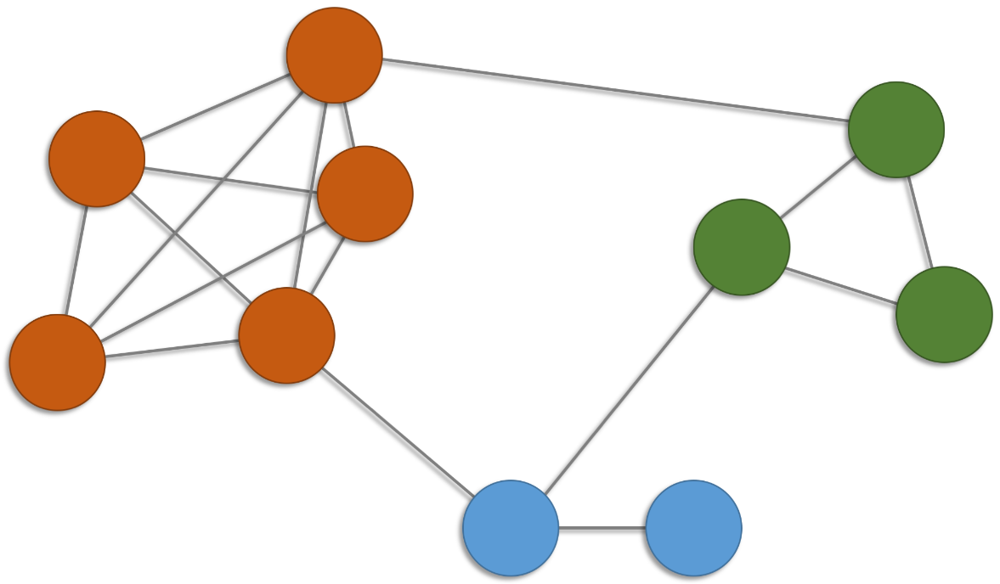
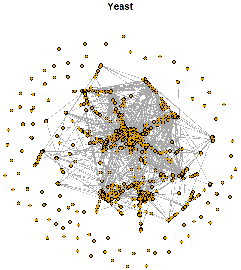
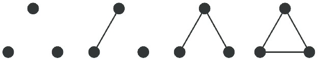
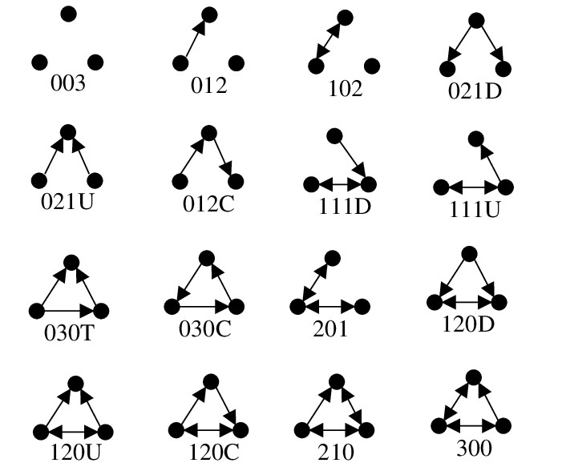

```{r setup, include=FALSE}
knitr::opts_chunk$set(echo = TRUE)
```

# Introducción

La **cohesión** o **conectividad** se refiere a la medida en que **subconjuntos de vértices específicos son cohesivos (adherentes)** respecto a la relación que define las aristas.


# *Cliques*

Un enfoque para definir la **cohesión de una red** es mediante la **especificación de subgrafos** de interés.

Un **clan** (*clique*) $C$ de un grafo $G=(V,E)$ es un subconjunto de vértices tal que cada par de vértices distintos son adyacentes, i.e., el subgrafo de $G$ **inducido** por $C$ es un **grafo completo**. 

Clanes de tamaños más grandes incluyen clanes de tamaños más pequeños. 

¿Cuántos clanes?

```{r, eval = TRUE, echo=FALSE, out.width="35%", fig.pos = 'H', fig.align = 'center'}

```


```{r}
# librerias
suppressMessages(suppressWarnings(library(igraph)))
suppressMessages(suppressWarnings(library(corrplot)))
```


```{r, fig.align='center'}
# datos
g <- make_graph(
       edges = c(1,2,1,3,1,4,1,5,2,3,2,4,2,5,3,4,3,5,4,5,6,7,6,8,7,8,9,10,1,6,2,9,7,9), 
       directed = F
     )
Y <- as.matrix(as_adjacency_matrix(graph = g, names = F))
```


```{r, fig.align='center'}
# visualización
par(mfrow = c(1,2), mar = c(4, 3, 3, 1))
set.seed(42)

plot(g, 
     vertex.size = 20, 
     vertex.color = 0, 
     vertex.label.color = "black", 
     edge.color = "blue4")

corrplot(corr = Y, 
         col.lim = c(0,1), 
         method = "color", 
         tl.col = "black", 
         addgrid.col = "gray", 
         cl.pos = "n")
```


```{r}
# orden
vcount(g)
# tamaño
ecount(g)
# clan?
c1 <- induced_subgraph(graph = g, vids = c(6,7,8))
ecount(c1) == choose(n = vcount(c1), k = 2)
# frecuencias de clanes
table(sapply(X = cliques(graph = g, min = 1, max = 10), FUN = length))
```


Un **clan maximal** (*maximal clique*) es un clan que no se puede extender incluyendo algún otro vértice.

```{r}
# clanes maximales
max_cliques(graph = g)
```

Un **clan máximo** (*maximum clique*) es el clan maximal más grande.

El **número clan** (*clique number*) es el tamaño del clan máximo.

```{r}
# clanes máximos
largest_cliques(graph = g)
# número clan
clique_num(graph = g)
```

En la práctica, **clanes "grandes" son escasos**, ya que requieren que el grafo sea denso, dado que las **redes reales tienden a ser dispersas** (*sparse*).


## Ejemplo: Interacciones sociales

Red de **interacciones sociales** entre los miembros de un club de karate.

Estos datos fueron recolectados para **estudiar la fragmentación** que sufrió el club en dos clubes diferentes debido a una disputa entre el director y el administrador.

$y_{i,j} = 1$ si los miembros $i$ y $j$ tuvieron una **interacción social** en el club y $y_{i,j} = 0$ en otro caso.

Una descripción completa de los datos se puede encontrar [aquí](https://rdrr.io/cran/igraphdata/man/karate.html).

Disponible en el paquete `igraphdata` de R.

Zachary, W. W. (1977). **An information flow model for conflict and fission in small groups**. Journal of anthropological research, 33(4), 452-473.


```{r}
# install.packages("igraphdata")
suppressMessages(suppressWarnings(library(igraphdata)))

# data
data(karate)
karate <- upgrade_graph(karate)
# la representación de datos internos a veces cambia entre versiones
```


```{r}
# orden
vcount(karate)
# tamaño
ecount(karate)
# dirigida?
is_directed(karate)
# ponderada?
is_weighted(karate)
```


```{r, fig.height = 6, fig.width = 6, fig.align='center'}
# visualización
par(mar = c(4, 3, 3, 1))

set.seed(123)
plot(karate, 
     layout = layout_with_dh, 
     vertex.size = 10, 
     vertex.frame.color = "black", 
     vertex.label.color = "black", 
     main = "Interacciones sociales")
```


```{r}
# clanes máximos
largest_cliques(graph = karate)
# número clan
clique_num(graph = karate)
```


## Ejemplo: Interacciones proteína-proteína

Red de **interacción de proteínas** de levadura. 

Las interacciones proteína-proteína prometen revelar aspectos del sistema regulatorio que subyace a la función celular.

Los nodos corresponden a proteínas y solo se consideran aquellas interacciones que tienen una confianza "moderada" y "alta". 

Una descripción completa de los datos se puede encontrar [aquí](http://www.nature.com/nature/journal/v417/n6887/suppinfo/nature750.html).

Disponible en el paquete `igraphdata` de R.

Von Mering, C., Krause, R., Snel, B., Cornell, M., Oliver, S. G., Fields, S., & Bork, P. (2002). **Comparative assessment of large-scale data sets of protein–protein interactions.** Nature, 417(6887), 399-403.


```{r, eval = TRUE, echo=FALSE, out.width="50%", fig.pos = 'H', fig.align = 'center'}

```


```{r}
# datos
data(yeast)
yeast <- upgrade_graph(yeast)
# la representación de datos internos a veces cambia entre versiones
```


```{r}
# orden
vcount(yeast)
# tamaño
ecount(yeast)
# dirigida?
is_directed(yeast)
# ponderada?
is_weighted(yeast)
```


```{r}
# número clan
clique_num(graph = yeast)
```


El número clan es relativamente pequeño (incluso para redes "grandes").


# Díadas y tríadas

Otras cantidades de interés son las **díadas** y las **tríadas**.

¿Cuáles son los estados diádicos no dirigidos y dirigidos? 

¿Y los triádicos?

### Estados triádicos no dirigidos (*undirected triadic motifs*)

```{r, eval = TRUE, echo=FALSE, out.width="43%", fig.pos = 'H', fig.align = 'center'}

```

### Estados triádicos dirigidos (*directed triadic motifs*)

```{r, eval = TRUE, echo=FALSE, out.width="58%", fig.pos = 'H', fig.align = 'center'}

```

- Dado que una tríada tiene 3 pares no ordenados de nodos, los dígitos siempre suman 3. Por ejemplo, 021 significa 0 díadas mutuas, 2 díadas unidireccionales y 1 díada no conectada.

- **D** (Down) indica una **configuración descendente**, en la que un nodo dirige arcos hacia otros dos nodos. Por ejemplo, \(A \to B\) y \(A \to C\).

- **U** (Up) indica una **configuración ascendente**, en la que dos nodos dirigen arcos hacia un mismo nodo. Por ejemplo, \(A \to C\) y \(B \to C\).

- **T** (Transitive) indica una **configuración transitiva**, en la que si un nodo se relaciona con un segundo y este con un tercero, entonces también existe relación entre el primero y el tercero. Por ejemplo, \(A \to B\), \(B \to C\) y \(A \to C\).

- **C** (Cyclic) indica una **configuración cíclica**, en la que los tres nodos forman un ciclo dirigido. Por ejemplo, \(A \to B\), \(B \to C\) y \(C \to A\).

Davis, J.A. and Leinhardt, S. (1972). **The Structure of Positive Interpersonal Relations in Small Groups.** In J. Berger (Ed.), Sociological Theories in Progress, Volume 2, 218-251. Boston: Houghton Mifflin.

Un **censo de los estados diádicos** o **triádicos** proporciona una medida de la conectividad de una red.

### Puntuaciónes estandarizadas (*z-scores*)

La **puntuación estandarizada normalizada** de un motivo triádico dirigido mide **qué tan más o menos frecuente** es ese motivo en la red observada, **respecto a lo esperado por azar** bajo un modelo nulo (una versión aleatorizada de la red original usada como referencia).

Para cada motivo \(k\), primero se calcula
$$
Z_k = \frac{N_k^{\text{obs}} - \textsf{E}(N_k^{\text{rand}})}{\textsf{SD}(N_k^{\text{rand}})},
$$
donde \(N_k^{\text{obs}}\) es el número observado de ocurrencias del motivo, mientras que \(\textsf{E}(N_k^{\text{rand}})\) y \(\textsf{SD}(N_k^{\text{rand}})\) se estiman a partir de redes aleatorizadas. Luego, estos puntajes se normalizan como
$$
\hat{z}_k = \frac{Z_k}{\sqrt{\sum_j Z_j^2}}.
$$
De esta forma, \(\hat{z}_k > 0\) indica que el motivo aparece más de lo esperado por azar, \(\hat{z}_k < 0\) indica que aparece menos de lo esperado, y su magnitud refleja su importancia relativa dentro del perfil global de motivos de la red.

## Ejemplo: Blogs de SIDA

Red de **blogs de SIDA, pacientes y sus redes de apoyo**. 

Un enlace dirigido de un blog a otro indica que el primero tiene un enlace al segundo en su página web. 

Una descripción completa de los datos se puede encontrar [aquí](https://rdrr.io/cran/sand/man/aidsblog.html).

Disponible en el paquete `sand` de R.

Miller, H. J. (2007). **Societies and cities in the age of instant access**. In Societies and cities in the age of instant access (pp. 3-28). Springer, Dordrecht.


```{r}
# librerías
suppressMessages(suppressWarnings(library(sand)))
```


```{r}
# data
data(aidsblog)
aidsblog <- upgrade_graph(aidsblog)
# la representación de datos internos a veces cambia entre versiones
```


```{r}
# orden
vcount(aidsblog)
# tamaño
ecount(aidsblog)
# dirigida?
is_directed(aidsblog)
# ponderada?
is_weighted(aidsblog)
```


```{r, fig.height = 6, fig.width = 6, fig.align='center'}
# visualización
set.seed(123)
par(mfrow = c(1,1), mar = c(4, 3, 3, 1))
plot(aidsblog, 
     layout = layout_with_kk, 
     vertex.label = NA, vertex.size = 5, 
     vertex.frame.color = 1, 
     edge.arrow.size = 0.5, 
     main = "")
```


```{r}
# simple?
is_simple(aidsblog)
# simplificación
aidsblog <- simplify(aidsblog)
```


```{r}
# censo de estados diádicos
#   mut   The number of pairs with mutual connections.
#   asym  The number of pairs with non-mutual connections.
#   null  The number of pairs with no connection between them.
dyad_census(aidsblog)
# censo de estados triádicos
#   003   A,B,C, the empty graph.
#   012   A->B, C, the graph with a single directed edge.
#   102   A<->B, C, the graph with a mutual connection between two vertices.
#   021D  A<-B->C, the out-star.
#   021U  A->B<-C, the in-star.
#   021C  A->B->C, directed line.
#   111D  A<->B<-C.
#   111U  A<->B->C.
#   030T  A->B<-C, A->C.
#   030C  A<-B<-C, A->C.
#   201   A<->B<->C.
#   120D  A<-B->C, A<->C.
#   120U  A->B<-C, A<->C.
#   120C  A->B->C, A<->C.
#   210   A->B<->C, A<->C.
#   300   A<->B<->C, A<->C, the complete graph.

# etiquetas de las 16 tríadas dirigidas
triad_labels <- c(
  "003",  "012",  "102",  "021D", "021U", "021C",
  "111D", "111U", "030T", "030C", "201",
  "120D", "120U", "120C", "210",  "300"
)

# censo de triadas
obs_counts <- triad_census(aidsblog)
names(obs_counts) <- triad_labels

obs_counts
```


```{r}
# número de redes nulas
B <- 1000

# grados de salida y entrada del grafo observado
out_deg <- igraph::degree(aidsblog, mode = "out")
in_deg  <- igraph::degree(aidsblog, mode = "in")

# matriz para guardar los censos triádicos bajo el modelo nulo
null_counts <- matrix(
  NA_real_,
  nrow = B,
  ncol = length(triad_labels),
  dimnames = list(NULL, triad_labels)
)

# redes nulas dirigidas con la misma secuencia de grados
set.seed(123)
for (b in seq_len(B)) {
  g_null <- igraph::sample_degseq(
    out.deg = out_deg,
    in.deg  = in_deg,
    method  = "edge.switching.simple"
  )
  
  null_counts[b, ] <- igraph::triad_census(g_null)
}

# media y desviación estándar bajo el modelo nulo
mu_null <- colMeans(null_counts)
sd_null <- apply(X = null_counts, MARGIN = 2, FUN = sd)

# puntuaciones Z
# puntuaciones Z
z_scores <- ifelse(
  sd_null > 0,
  (obs_counts - mu_null) / sd_null,
  NA_real_
)

# versión normalizada
z_scores_norm <- z_scores / sqrt(sum(z_scores^2, na.rm = TRUE))

# tabla de resultados
triad_z <- data.frame(
  triad   = triad_labels,
  obs     = as.numeric(obs_counts),
  mean    = mu_null,
  sd      = sd_null,
  z       = z_scores,
  z_norm  = z_scores_norm,
  row.names = NULL
)

# tabla
triad_z
```


```{r, fig.align='center'}
# visualización
par(mfrow = c(1, 1), mar = c(8, 4, 3, 1))
barplot(
  height = triad_z$z_norm,
  names.arg = triad_z$triad,
  las = 2,
  ylab = "Z-score normalizado",
  main = "Puntuaciones normalizadas de motivos triádicos dirigidos"
)
abline(h = 0, col = 2)
```


- Valores con \(|z| \gtrsim 2\) sugieren diferencias importantes frente al modelo nulo.

- Se observan más tríadas \(003\) y \(102\) de lo esperado por azar.

- Se observan menos tríadas \(012\), \(021D\), \(021C\) y \(030T\) de lo esperado por azar.

- La tríada \(111U\) muestra una sobrerrepresentación débil, cercana al umbral de significancia.

- Las tríadas \(021U\), \(111D\) y \(030C\) no muestran evidencia clara de desviación frente al modelo nulo.

- La red parece más dispersa y con menor presencia de estructuras triádicas organizadas, especialmente de tipo transitivo.

- La gran mayoría de los estados son nulos y de los que no lo son, casi todos son asimétricos, lo que indica una unilateralidad (asimetría) preponderante en la manera en que los blogs se referencian.

# Densidad

La **densidad** (*density*) de un grafo se define como la frecuencia relativa de las aristas observadas respecto al potencial de aristas.

Para un subgrafo $H=(V_H,E_H)$ del grafo $G=(V,E)$, la densidad se calcula como
$$
\textsf{den(H)}=\frac{|E_H|}{|V_H|(|V_H|-1)/2}\,.
$$
En el caso de un **digrafo** el denominador debe ser $|V_H|(|V_H|-1)$.

La densidad asume valores entre 0 y 1 y se puede interpretar como una medida de qué tan cerca se encuentra $H$ de ser un clan.


## Ejemplo: Interacciones sociales


```{r, fig.align='center'}
# densidad
ecount(karate)/(vcount(karate)*(vcount(karate)-1)/2)
edge_density(graph = karate)
mean(Y[lower.tri(Y, diag = F)])
mean(Y[upper.tri(Y, diag = F)])
```


```{r}
# ego networks
g_1  <- induced_subgraph(graph = karate, vids = neighborhood(graph = karate, order = 1, nodes = 1) [[1]])
g_34 <- induced_subgraph(graph = karate, vids = neighborhood(graph = karate, order = 1, nodes = 34)[[1]])
```


```{r}
# densidades
edge_density(graph = g_1)
edge_density(graph = g_34)
```

# Transitividad global

Una **tripla** está constituida por tres nodos que están conectados por dos (tripla abierta) o tres (tripla cerrada) aristas.

La **transitividad** (*transitivity*) de un grafo se cuantifica por medio del **coeficiente de agrupamiento** (*clustering coeffitient*) que se calcula como
$$
\textsf{cl} (G) =\frac{\text{no. triplas cerradas}}{\text{no. triplas}} =\frac{3\times \text{no. triángulos}}{\text{no. triplas}} = \frac{3\tau_\triangle(G)}{\tau_3(G)}\,,
$$
donde $\tau_\triangle(G)$ es el **número de triángulos** de $G$ y $\tau_3(G)$ es el **número de triplas**.

El coeficiente de agrupamiento es una **medida de agrupamiento global** que caracteriza la propensión con la que las triplas forman triángulos.


## Ejemplo

```{r}
# datos
h <- make_graph(edges = c(1,2,1,3,2,3,1,4), directed = F)
```


```{r, fig.align='center'}
# visualización
set.seed(123)
plot(h, 
     vertex.size = 20, 
     vertex.color = 0, 
     vertex.label.color = "black", 
     edge.color = "blue4")
```


```{r}
# número de triángulos por vértice
count_triangles(graph = h)
# vértices que son parte de un triángulo
triangles(graph = h)
# conteos de estados triádicos
# Las clases no conexas no se consideran motivos y por eso aparecen como NA
# NA NA <camino_de_3_nodos> <triangulo>
# Clase 0: subgrafo vacío, NA
# Clase 1: un solo enlace, NA
# Clase 2: camino de longitud 2 o “V”
# Clase 3: triángulo
(mot <- motifs(graph = h, size = 3))
# transitividad
3*mot[4]/(mot[3] + 3*mot[4])
transitivity(graph = h, type = "global")
```

- \(\{1,2,3\}\) induce un triángulo, porque están las aristas \(1-2\), \(1-3\) y \(2-3\).

- \(\{1,2,4\}\) induce un camino de longitud 2, porque están \(1-2\) y \(1-4\), pero no \(2-4\).

- \(\{1,3,4\}\) induce otro camino de longitud 2, porque están \(1-3\) y \(1-4\), pero no \(3-4\).

- \(\{2,3,4\}\) induce un subgrafo con una sola arista, \(2-3\), y el nodo \(4\) aislado, así que no es conexo y no cuenta como motivo.


## Ejemplo

```{r}
# datos
g <- make_graph(edges = c(1,2,1,3,1,4,1,5,2,3,2,4,2,5,3,4,3,5,4,5,6,7,6,8,7,8,9,10,1,6,2,9,7,9), directed = F)
```


```{r, fig.align='center'}
# visualización
set.seed(42)
plot(g, 
     vertex.size = 20, 
     vertex.color = 0, 
     vertex.label.color = "black",
     edge.color = "blue4")
```


```{r}
# número de triángulos por vértice
count_triangles(graph = g)
# vértices que son parte de un triángulo
sort(triangles(graph = g))
# conteos de estados triádicos
(mot <- motifs(graph = g, size = 3))
# transitividad global
3*mot[4]/(mot[3] + 3*mot[4])
transitivity(graph = g, type = "global")
```


# Transitividad local

El **coeficiente de agrupamiento** del vértice $v\in V$ se define teniendo en cuenta la incidencia de $v$ en las aristas que conforman las triplas:
$$
\textsf{cl}(v) = \frac{\text{no. triplas cerradas que incluyen a $v$}}{k_v(k_v-1)/2}\,,
$$
donde $k_v$ es el grado del nodo $v$.

El coeficiente de agrupamiento de un vértice es una **medida de agrupamiento local** que cuantifica qué tan cerca están los vecinos del vértice de ser un clan.

Alternativamente, el  **coeficiente de agrupamiento global** también se puede definir como el promedio de los coeficientes de agrupamiento locales de todos los vértices:
$$
\textsf{cl} (G) = \frac{1}{|V|}\sum_{v\in V} \textsf{cl}(v)\,.
$$

## Ejemplo

```{r}
# datos
g <- make_graph(edges = c(1,2,1,3,1,4,1,5,2,3,2,4,2,5,3,4,3,5,4,5,6,7,6,8,7,8,9,10,1,6,2,9,7,9), directed = F)
```


```{r, fig.align='center'}
# visualización
set.seed(42)
plot(g, 
     vertex.size = 20, 
     vertex.color = 0, 
     vertex.label.color = "black", 
     edge.color = "blue4")
```


```{r}
# intransitividad local del vértice 1
count_triangles(graph = g)
degree(graph = g)
6/(5*(5-1)/2)
transitivity(graph = g, type = "local")
# transitividad global alternativa
mean(transitivity(graph = g, type = "local", vids = V(g)), na.rm = T)
```


## Ejemplo: Interacciones sociales

```{r}
# transitividad
transitivity(graph = karate, type = "global")
# intransitividad local
transitivity(karate, type = "local", vids = c(1, 34))
``` 


# Reciprocidad

Un concepto exclusivo de los dígrafos es la **reciprocidad**, i.e., la propensión con la que hay reciprocidad de aristas en la red. 

Las frecuencias se pueden calcular respecto al número de díadas o de aristas:
$$
\textsf{rec}(G) = \frac{\text{no. aristas reciprocas}}{\text{no. aristas}}\,,
$$
o alternativamente,
$$
\textsf{rec}(G) = \frac{\text{no. diadas reciprocas}}{\text{no. diadas no reciprocas}}\,.
$$


## Ejemplo: Blogs de SIDA

```{r}
# reciprocidad (aristas)
reciprocity(aidsblog, mode = "default")
# reciprocidad (díadas)
reciprocity(aidsblog, mode = "ratio")
```


# Conectividad

Típicamente, una de las componentes conectadas de un grafo $G=(V,E)$ domina a las demás en magnitud. Tal componente se denomina **componente gigante** (*giant component*).

En la práctica, la atención se restringe a la componente gigante para llevar a cabo tanto el análisis como el modelamiento.

Un grafo \(G=(V,E)\) se llama **\(k\)-conectado por vértices** si, para todo subconjunto de vértices \(X \subset V\) con \(|X| < k\), el subgrafo inducido por \(V \setminus X\) permanece conectado.

La **conectividad nodal** de un grafo \(G=(V,E)\) es el mayor entero \(k\) tal que \(G\) es \(k\)-conectado por vértices. Equivalentemente, corresponde al menor número de vértices cuya eliminación desconecta el grafo.

Un grafo \(G=(V,E)\) se llama **\(k\)-conectado por aristas** si, para todo subconjunto de aristas \(F \subset E\) con \(|F| < k\), el grafo \((V, E \setminus F)\) permanece conectado.

La **conectividad por aristas** de un grafo \(G=(V,E)\) es el mayor entero \(k\) tal que \(G\) es \(k\)-conectado por aristas. Equivalentemente, corresponde al menor número de aristas cuya eliminación desconecta el grafo.

Un vértice que al ser removido desconecta el grafo se denomina **vértice de corte** (*cut vertex*) o **punto de articulación** (*articulation point*). 

La identificación de tales vértices proporciona una idea de dónde es vulnerable una red.


## Ejemplo

```{r}
# datos
f <- make_graph(edges = c(1,2,1,3,2,3,1,4,4,5), directed = F)
```


```{r, fig.align='center'}
# visualización
set.seed(123)
plot(f, 
     vertex.size = 20, 
     vertex.color = 0, 
     vertex.label.color = "black", 
     edge.color = "blue4")
```


```{r}
# red conectada?
is_connected(f)
# conectividad nodal
vertex_connectivity(f)
# conectividad por aristas
edge_connectivity(f)
# puntos de articulación
articulation_points(f)
```


## Ejemplo: Interacciones proteína-proteína

```{r}
# red conectada?
is_connected(yeast)
# componentes
componentes <- decompose(yeast)
length(componentes)
table(sapply(X = componentes, FUN = vcount))
# tamaño de la componte gigante
max(sapply(X = componentes, FUN = vcount))
max(sapply(X = componentes, FUN = vcount))/vcount(yeast)
# componente gigante
yeast_gc <- decompose(yeast)[[1]]
# conectividad nodal
vertex_connectivity(yeast_gc)
# conectivaidad por aristas
edge_connectivity(yeast_gc)
# puntos de articulación
yeast_cv <- articulation_points(yeast_gc)
length(yeast_cv)
length(yeast_cv)/vcount(yeast_gc)
```

Se requiere la eliminación de un solo vértice o una sola arista para dividir el componente gigante en componentes adicionales.

Aproximadamente el 15\% de los vértices son puntos de articulación.