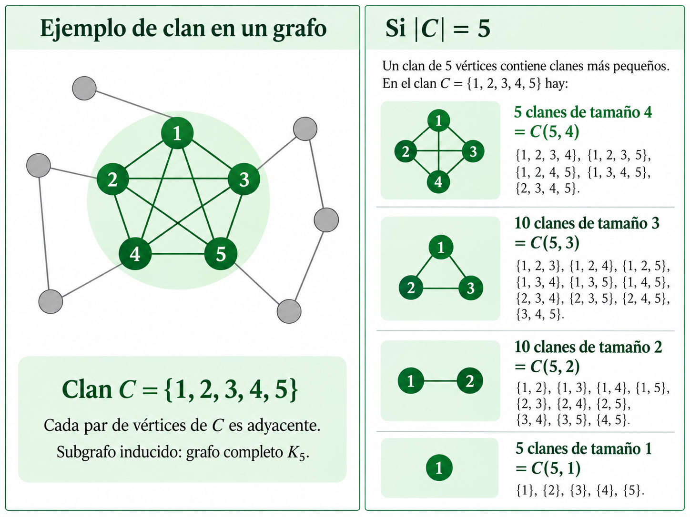
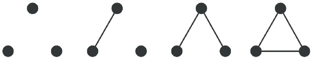
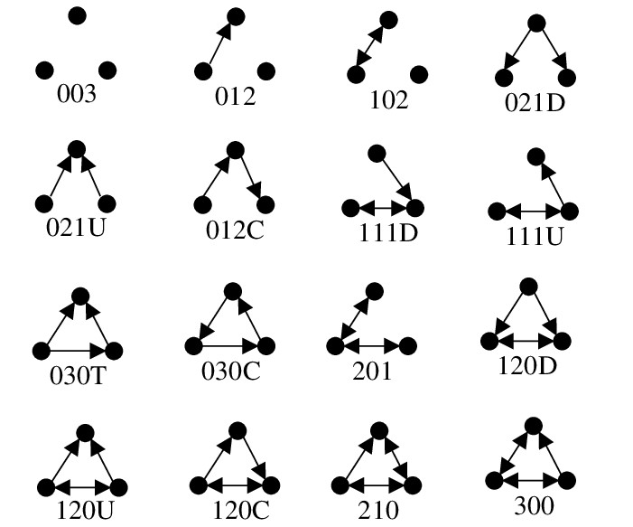

```{r setup, include=FALSE}
knitr::opts_chunk$set(echo = TRUE)
```


# Introducción

La **cohesión** describe el grado en que los vértices de una red forman subconjuntos internamente conectados o estructuralmente robustos. 

La **conectividad** describe específicamente la existencia de caminos entre vértices y la resistencia de la red a la eliminación de vértices o aristas.

Estas ideas pueden estudiarse desde diferentes escalas: 

- Los **clanes** describen cohesión extrema en subconjuntos de vértices. 
- Las **díadas** y **tríadas** caracterizan configuraciones locales. 
- La **densidad**, la **transitividad** y la **reciprocidad** resumen patrones globales o locales de conexión. 
- Los **$k$-cores**, las **componentes**, la **conectividad nodal** y la **conectividad por aristas** permiten estudiar la robustez estructural de la red.

A menos que se indique lo contrario, las definiciones de densidad, transitividad, clanes y conectividad se presentan para **grafos simples** (sin bucles ni aristas múltiples).

Cuando los datos originales contienen múltiples relaciones entre un mismo par de vértices, es **necesario decidir explícitamente** si se agregan, ponderan o binarizan antes de aplicar estas medidas.


# *Cliques*

Un enfoque clásico para estudiar la **cohesión local** consiste en identificar subgrafos particularmente densos.

Un **clan** (*clique*) $C \subseteq V$ de un grafo no dirigido $G=(V,E)$ es un subconjunto de vértices tal que cada par de vértices distintos de $C$ es adyacente. Equivalentemente, el subgrafo de $G$ inducido por $C$ es un **grafo completo**.

Si un clan tiene tamaño $k$, entonces contiene $\binom{k}{r}$ clanes de tamaño $r$ para cada $1 \leq r < k$. Por esta razón, contar todos los clanes puede producir una cantidad muy grande de subgrafos incluso en redes de tamaño moderado.

```{r, eval=TRUE, echo=FALSE, out.width="75%", fig.pos='H', fig.align='center'}

```

```{r}
# Paquetes
suppressMessages(suppressWarnings(library(igraph)))
suppressMessages(suppressWarnings(library(corrplot)))
suppressMessages(suppressWarnings(library(igraphdata)))
suppressMessages(suppressWarnings(library(sand)))
```

```{r, fig.align='center'}
# Datos
g_clique <- make_graph(
  edges = c(
    1, 2, 1, 3, 1, 4, 1, 5,
    2, 3, 2, 4, 2, 5,
    3, 4, 3, 5, 4, 5,
    6, 7, 6, 8, 7, 8,
    9, 10, 1, 6, 2, 9, 7, 9
  ),
  directed = FALSE
)

Y <- as.matrix(as_adjacency_matrix(g_clique, sparse = FALSE))
```

```{r, fig.align='center'}
# Visualización
par(mfrow = c(1, 2), mar = c(4, 3, 3, 1))
set.seed(42)

plot(
  g_clique,
  vertex.size = 20,
  vertex.color = 0,
  vertex.label.color = "black",
  edge.color = "blue4"
)

corrplot(
  corr = Y,
  col.lim = c(0, 1),
  method = "color",
  tl.col = "black",
  addgrid.col = "gray",
  cl.pos = "n"
)
```

```{r}
# Orden y tamaño
vcount(g_clique)
ecount(g_clique)

# ¿Los vértices 6, 7 y 8 forman un clan?
g_sub <- induced_subgraph(graph = g_clique, vids = c(6, 7, 8))

ecount(g_sub) == choose(vcount(g_sub), 2)

# Frecuencia de clanes por tamaño
clique_sizes <- vapply(
  cliques(g_clique, min = 1),
  FUN = length,
  FUN.VALUE = integer(1)
)

table(clique_sizes)
```

Un **clan maximal** (*maximal clique*) es un clan que no está contenido estrictamente en otro clan.

```{r}
# Clanes maximales
max_cliques(g_clique)
```

Un **clan máximo** (*maximum clique*) es un clan de cardinalidad máxima entre todos los clanes del grafo.

El **número clan** (*clique number*), denotado por $\omega(G)$, es el tamaño de un clan máximo.

```{r}
# Clanes máximos
largest_cliques(g_clique)

# Número clan
clique_num(g_clique)
```

Todo clan máximo es maximal, pero un clan maximal no tiene que ser máximo.

La enumeración de clanes maximales puede ser computacionalmente costosa. En redes grandes suele ser preferible calcular únicamente el número clan, restringir el tamaño de los clanes buscados o utilizar estructuras menos restrictivas, como los $k$-cores.


## Ejemplo. Interacciones sociales

Red de **interacciones sociales** entre los miembros de un club de karate.

Los datos fueron recolectados para estudiar la fragmentación del club en dos grupos después de una disputa entre el director y el administrador.

$y_{i,j}=1$ si los miembros $i$ y $j$ tuvieron una interacción social y $y_{i,j}=0$ en otro caso.

Una descripción completa de los datos se puede encontrar [aquí](https://rdrr.io/cran/igraphdata/man/karate.html).

Disponible en el paquete `igraphdata` de R.

Zachary, W. W. (1977). **An information flow model for conflict and fission in small groups.** *Journal of Anthropological Research*, 33(4), 452--473.

```{r}
# Datos
data(karate)
karate <- upgrade_graph(karate)
```

```{r}
# Orden
vcount(karate)

# Tamaño
ecount(karate)

# ¿Dirigida?
is_directed(karate)

# ¿Ponderada?
is_weighted(karate)

# ¿Simple?
is_simple(karate)
```

```{r, fig.height=6, fig.width=6, fig.align='center'}
# Visualización
par(mar = c(4, 3, 3, 1))

set.seed(123)
plot(
  karate,
  layout = layout_with_dh,
  vertex.size = 10,
  vertex.frame.color = "black",
  vertex.label.color = "black",
  main = "Interacciones sociales"
)
```

```{r}
# Clanes máximos
largest_cliques(karate)

# Número clan
clique_num(karate)
```

La red tiene **dos clanes máximos de tamaño 5**. 

Ambos comparten a **Actor 2, Mr Hi, Actor 4 y Actor 3**, quienes forman un núcleo completamente conectado. 

El quinto integrante es **Actor 8** en uno de los clanes y **Actor 14** en el otro. 

El **número clan es 5**, es decir, no existe un grupo de más de cinco miembros en el que todos interactúen entre sí.


## Ejemplo. Blogs políticos franceses

Red no dirigida de **blogs políticos franceses** construida a partir de una instantánea tomada en octubre de 2006 antes de la elección presidencial francesa de 2007.

Los vértices representan blogs y una arista indica que existe una relación de referencia entre dos blogs en la versión agregada no dirigida de la red. Cada blog tiene además una clasificación de afiliación política.

La red contiene 192 vértices y 1431 aristas.

Una descripción completa de los datos se puede encontrar [aquí](https://search.r-project.org/CRAN/refmans/sand/html/fblog.html).

Disponible en el paquete `sand` de R.

Latouche, P., Birmelé, E., & Ambroise, C. (2011). **Overlapping stochastic block models with application to the French political blogosphere.** *The Annals of Applied Statistics*, 5(1), 309--336.

```{r}
# Datos
data(fblog)
fblog <- upgrade_graph(fblog)
```

```{r}
# Orden
vcount(fblog)

# Tamaño
ecount(fblog)

# ¿Dirigida?
is_directed(fblog)

# ¿Ponderada?
is_weighted(fblog)

# ¿Simple?
is_simple(fblog)
```

```{r, fig.height=6, fig.width=7, fig.align='center'}
# Afiliación política
party <- as.factor(V(fblog)$PolParty)

# Grado de los vértices
deg <- degree(fblog)

# Tamaño de los vértices según el grado
vertex_size <- 4 + 8*sqrt(deg/max(deg))

# Colores según afiliación política
party_colors <- hcl.colors(
  n = nlevels(party),
  palette = "Dark 3"
)

# Etiquetas
labels <- rep(NA, vcount(fblog))

# Layout
set.seed(123)
lay <- layout_with_fr(fblog)

# Visualización
par(mar = c(1, 1, 3, 1))

plot(
  fblog,
  layout = lay,
  vertex.size = vertex_size,
  vertex.color = party_colors[as.integer(party)],
  vertex.frame.color = "white",
  vertex.frame.width = 0.7,
  vertex.label = labels,
  vertex.label.cex = 0.65,
  vertex.label.color = "black",
  vertex.label.dist = 0.5,
  edge.color = adjustcolor("gray40", alpha.f = 0.18),
  edge.width = 0.6,
  main = "Blogs políticos franceses"
)

# Leyenda
legend(
  "topleft",
  legend = levels(party),
  col = party_colors,
  pch = 19,
  pt.cex = 1.2,
  cex = 0.75,
  bty = "n",
  title = "Afiliación política"
)
```

```{r}
# Número clan
clique_num(fblog)

# Número de clanes maximales
count_max_cliques(fblog)
```

El ejemplo ilustra que una red puede contener muchos clanes maximales sin que el clan máximo represente una fracción grande del conjunto de vértices. 

Por esta razón, el número clan debe interpretarse junto con el tamaño y la densidad de la red.


# Díadas y tríadas

Las **díadas** y **tríadas** describen la estructura local de una red a partir de subgrafos inducidos por conjuntos de dos y tres vértices, respectivamente.


### Estados diádicos

En un grafo   simple, una díada puede encontrarse en uno de dos estados, **conectada** o **nula**, dependiendo de si existe o no una arista entre sus dos vértices.

En un dígrafo simple, una díada puede encontrarse en uno de tres estados:

* **Mutua**, cuando existen los dos arcos entre los vértices.
* **Asimétrica**, cuando existe exactamente uno de los dos arcos posibles.
* **Nula**, cuando no existe ningún arco entre los vértices.


### Estados triádicos no dirigidos

Para un conjunto de tres vértices de un grafo no dirigido simple existen **cuatro clases isomorfas de subgrafos inducidos**, correspondientes a configuraciones con 0, 1, 2 o 3 aristas.

Las configuraciones con 0 o 1 arista son no conexas. 

Las dos configuraciones conexas corresponden a un **camino de longitud 2** y a un **triángulo**.

```{r, eval=TRUE, echo=FALSE, out.width="43%", fig.pos='H', fig.align='center'}

```


### Estados triádicos dirigidos

En un dígrafo simple existen **16 clases isomorfas de tríadas inducidas**. 

La notación de Davis y Leinhardt (*The Structure of Positive Interpersonal Relations in Small Groups*, 1972) identifica cada clase mediante tres dígitos que indican, respectivamente, el número de díadas **mutuas**, **asimétricas** y **nulas**. Como una tríada contiene exactamente tres pares no ordenados de vértices, estos tres números siempre suman 3.

Por ejemplo, `021` representa una tríada con 0 díadas mutuas, 2 díadas asimétricas y 1 díada nula.

Cuando varias configuraciones tienen los mismos conteos diádicos, se utilizan letras para distinguir sus orientaciones:

* **D** (*down*) indica una configuración en la que dos arcos salen de un mismo vértice.
* **U** (*up*) indica una configuración en la que dos arcos llegan a un mismo vértice.
* **C** (*cyclic*) indica una configuración que contiene un ciclo dirigido.
* **T** (*transitive*) indica una configuración transitiva.

```{r, eval=TRUE, echo=FALSE, out.width="58%", fig.pos='H', fig.align='center'}

```

### Censos diádico y triádico

El **censo diádico** cuenta el número de díadas mutuas, asimétricas y nulas presentes en un dígrafo. Para una red dirigida simple con $n$ vértices, estos conteos satisfacen
$$
N_{\mathrm{mut}} + N_{\mathrm{asym}} + N_{\mathrm{null}}
=
\binom{n}{2}.
$$

El **censo triádico** cuenta cuántas tríadas pertenecen a cada una de las 16 clases isomorfas. Como cada subconjunto de tres vértices induce exactamente una de estas configuraciones,
$$
\sum_{k=1}^{16} N_k
=
\binom{n}{3},
$$
donde $N_k$ denota el número de tríadas observadas que pertenecen a la clase isomorfa $k$.

Estos censos proporcionan una descripción de la **estructura local de conectividad** de la red y permiten estudiar propiedades como reciprocidad, transitividad, jerarquía y formación de ciclos.


## Ejemplo. Red de correos electrónicos de Enron

La red de **correos electrónicos de Enron** contiene comunicaciones entre direcciones de correo del conjunto de datos hecho público durante la investigación de Enron.

Los vértices representan direcciones de correo y cada arista dirigida corresponde a un mensaje enviado desde una dirección hacia otra. 

La red original contiene aristas múltiples porque una misma persona puede enviar varios mensajes a otra. 

Para estudiar díadas, tríadas y reciprocidad como propiedades de una red binaria, se eliminan los bucles y se colapsan las aristas múltiples.

Una descripción completa de los datos se puede encontrar [aquí](https://search.r-project.org/CRAN/refmans/igraphdata/html/enron.html).

Disponible en el paquete `igraphdata` de R.

Priebe, C. E., Conroy, J. M., Marchette, D. J., & Park, Y. (2005). **Scan statistics on Enron graphs.** *Computational and Mathematical Organization Theory*, 11(3), 229--247.

```{r}
# Datos
data(enron)
enron <- upgrade_graph(enron)
```

```{r}
# Orden
vcount(enron)

# Tamaño
ecount(enron)

# ¿Dirigida?
is_directed(enron)

# ¿Ponderada?
is_weighted(enron)

# ¿Simple?
is_simple(enron)
```

```{r}
# Red binaria simple
enron_bin <- simplify(
  enron,
  remove.multiple = TRUE,
  remove.loops = TRUE,
  edge.attr.comb = "ignore"
)

# Orden
vcount(enron_bin)

# Tamaño
ecount(enron_bin)

# ¿Simple?
is_simple(enron_bin)
```

```{r, fig.height=6, fig.width=7, fig.align='center'}
# Versión no dirigida para detectar comunidades y construir el layout
enron_und <- as_undirected(enron_bin, mode = "collapse")

# Comunidades mediante el algoritmo de Louvain
com <- cluster_louvain(enron_und)

# Comunidad de cada vértice
membership_com <- membership(com)

# Número de comunidades
n_com <- length(unique(membership_com))

# PageRank
pr <- page_rank(enron_bin)$vector

# Tamaño de los vértices según PageRank
vertex_size <- 3 + 12*sqrt(pr/max(pr))

# Colores según comunidad
community_colors <- hcl.colors(n = n_com, palette = "Dark 3")

# Color de cada vértice
vertex_color <- community_colors[membership_com]

# Etiquetas
labels <- rep(NA, vcount(enron_bin))

# Layout
set.seed(123)
lay <- layout_with_dh(enron_und,)

# Visualización
par(mar = c(1, 1, 3, 1))

plot(
  enron_bin,
  layout = lay,
  vertex.size = 2.5 + 6*sqrt(pr/max(pr)),
  vertex.color = vertex_color,
  vertex.frame.color = "white",
  vertex.frame.width = 0.4,
  vertex.label = NA,
  edge.color = adjustcolor("gray30", alpha.f = 0.20),
  edge.width = 0.4,
  edge.arrow.size = 0.18,
  edge.arrow.width = 0.4,
  edge.curved = 0.05,
  main = "Correos electrónicos"
)
```

```{r}
# Censo diádico
dyads <- dyad_census(enron_bin)
dyads

# Verificación
a <- unlist(dyads)
sum(a) == choose(vcount(enron_bin), 2)
```

En la red de correos de Enron se observan 913 díadas mutuas, 1184 asimétricas y 14 739 nulas. 

La mayoría de los pares de actores no intercambian correos, mientras que entre los pares conectados existe una presencia importante de reciprocidad.

```{r}
# Etiquetas de las 16 tríadas dirigidas
triad_labels <- c(
  "003", "012", "102", "021D", "021U", "021C",
  "111D", "111U", "030T", "030C", "201",
  "120D", "120U", "120C", "210", "300"
)

# Censo triádico
obs_counts <- triad_census(enron_bin)
names(obs_counts) <- triad_labels
obs_counts

# Verificación
sum(obs_counts) == choose(vcount(enron_bin), 3)
```

La distribución está fuertemente dominada por tríadas **dispersas**. De las \(1\,021\,384=\binom{184}{3}\) tríadas posibles, aproximadamente **68.6 %** son de tipo `003`, es decir, no contienen ningún arco. Le siguen `012` (**14.7 %**) y `102` (**11.6 %**), correspondientes a configuraciones con una sola relación dirigida o una relación mutua, respectivamente.

Las configuraciones más estructuradas, como las transitivas (`030T`), cíclicas (`030C`) o completamente conectadas (`300`), son mucho menos frecuentes. Esto refleja la **baja densidad de la red de correos**. 

Sin embargo, estos conteos por sí solos no permiten determinar qué tríadas están sobre o subrepresentadas; para ello es necesario compararlas con un **modelo nulo** (colección de redes dirigidas aleatorias que conservan la misma secuencia de grados de entrada y de salida que la red observada de Enron).


## Comparación con un modelo nulo

El conteo observado de un motivo depende fuertemente del tamaño, la densidad y la distribución de grados de la red. Por esta razón, una frecuencia grande no implica por sí sola que una configuración esté sobrerrepresentada.

Una estrategia consiste en comparar la red observada con una colección de redes aleatorias que preservan las secuencias de grados de entrada y salida. 

Para cada tríada $k$, se calcula
$$
Z_k =
\frac{N_k^{\mathrm{obs}} - \operatorname{E}(N_k^{\mathrm{null}})}
{\operatorname{SD}(N_k^{\mathrm{null}})}.
$$

Un valor positivo indica sobrerrepresentación respecto al modelo nulo y un valor negativo indica subrepresentación. 

El valor $|Z_k| \gtrsim 2$ puede utilizarse como regla descriptiva basada en una aproximación normal (no debe interpretarse como una prueba formal de significancia).

Para **comparar perfiles de motivos entre redes** se puede normalizar el vector de puntuaciones como
$$
\widehat{Z}_k =
\frac{Z_k}{\sqrt{\sum_j Z_j^2}}.
$$

Esta normalización conserva el patrón relativo de sobrerrepresentación y subrepresentación, pero **no conserva la escala de una puntuación estandarizada**. 

El criterio $|Z| \gtrsim 2$ no puede aplicarse a $\widehat{Z}_k$, cuyos valores están necesariamente entre $-1$ y $1$.

El **valor \(p\) de Monte Carlo** cuantifica qué tan extremo es el conteo observado de una tríada respecto a los conteos obtenidos bajo el modelo nulo.

Sea \(N_k^{\mathrm{obs}}\) el conteo observado de la tríada \(k\) y \(N_k^{(1)},\ldots,N_k^{(B)}\) los conteos obtenidos de \(B\) redes generadas bajo el modelo nulo. Las probabilidades de cola se estiman mediante
$$
p_{\mathrm{upper}}
=
\frac{1+\sum_{b=1}^{B} I\left(N_k^{(b)}\geq N_k^{\mathrm{obs}}\right)}
{B+1}
\qquad\text{y}\qquad
p_{\mathrm{lower}}
=
\frac{1+\sum_{b=1}^{B} I\left(N_k^{(b)}\leq N_k^{\mathrm{obs}}\right)}
{B+1}.
$$

El valor \(p\) bilateral de Monte Carlo se calcula como
$$
p_{\mathrm{MC}}
=
\min\left\{1,\,
2\min\left(p_{\mathrm{upper}},p_{\mathrm{lower}}\right)
\right\}.
$$

Un valor pequeño, por ejemplo \(p_{\mathrm{MC}}<0.05\), indica evidencia de que la tríada está **sobre o subrepresentada** respecto al modelo nulo, dependiendo de si su conteo observado es mayor o menor que el esperado.

```{r}
# Número de redes nulas
B <- 1000

# Grados de salida y entrada
out_deg <- degree(enron_bin, mode = "out")
in_deg  <- degree(enron_bin, mode = "in")

# Censos triádicos bajo el modelo nulo
null_counts <- matrix(
  NA_real_,
  nrow = B,
  ncol = length(triad_labels),
  dimnames = list(NULL, triad_labels)
)

set.seed(123)
for (b in seq_len(B)) {
  g_null <- sample_degseq(
    out.deg = out_deg,
    in.deg = in_deg,
    method = "edge.switching.simple"
  )

  null_counts[b, ] <- triad_census(g_null)
}

# Media y desviación estándar bajo el modelo nulo
mu_null <- colMeans(null_counts)
sd_null <- apply(null_counts, 2, sd)

# Puntuaciones Z
z_scores <- ifelse(
  sd_null > 0,
  (obs_counts - mu_null) / sd_null,
  NA_real_
)

# Perfil normalizado
z_norm_const  <- sqrt(sum(z_scores^2, na.rm = TRUE))
z_scores_norm <- if (z_norm_const > 0) {
  z_scores / z_norm_const
} else {
  rep(NA_real_, length(z_scores))
}

# Valores p de Monte Carlo de dos colas
obs_mat <- matrix(
  obs_counts,
  nrow = B,
  ncol = length(obs_counts),
  byrow = TRUE
)

p_upper <- (1 + colSums(null_counts >= obs_mat)) / (B + 1)
p_lower <- (1 + colSums(null_counts <= obs_mat)) / (B + 1)
p_mc    <- pmin(1, 2 * pmin(p_upper, p_lower))

# Resultados
triad_z <- data.frame(
  triad     = triad_labels,
  obs       = as.numeric(obs_counts),
  mean_null = round(mu_null, 3),
  sd_null   = round(sd_null, 3),
  z         = round(z_scores, 3),
  z_norm    = round(z_scores_norm, 3),
  p_mc      = round(p_mc, 3),
  row.names = NULL
)

triad_z
```

```{r, fig.height=5, fig.width=9, fig.align='center'}
# Visualización
par(mfrow = c(1, 2), mar = c(8, 4, 3, 1))

barplot(
  height = triad_z$z,
  names.arg = triad_z$triad,
  las = 2,
  ylab = "Z-score",
  main = "Puntuaciones Z"
)
abline(h = c(-2, 0, 2), lty = c(2, 1, 2), col = 2)

barplot(
  height = triad_z$z_norm,
  names.arg = triad_z$triad,
  las = 2,
  ylab = "Perfil normalizado",
  main = "Perfil de motivos"
)
abline(h = 0)
```
     
Respecto al modelo nulo que conserva los grados de entrada y salida:

* La sobrerrepresentación de **`003`** indica que existen más ternas de empleados completamente desconectadas de lo esperado, lo que sugiere una estructura **segmentada** de la comunicación.
* La sobrerrepresentación de **`102`** muestra una fuerte presencia de **intercambios recíprocos entre pares** que no involucran directamente a un tercer actor.
* La subrepresentación de **`021D`, `021U` y `021C`** indica que las configuraciones simples de envío o recepción alrededor de tres actores son menos frecuentes de lo esperado.
* La subrepresentación de **`030T`** sugiere menor **cierre transitivo**: que \(A\) escriba a \(B\) y \(B\) a \(C\) no implica con tanta frecuencia que \(A\) escriba también a \(C\).
* La escasez de **`030C`** indica que los **ciclos dirigidos de comunicación entre tres actores** son particularmente poco frecuentes.

La red parece organizarse más alrededor de **interacciones recíprocas entre pares y grupos relativamente separados**, y menos alrededor de estructuras triádicas densas, transitivas o cíclicas, incluso después de controlar por los grados de entrada y salida.

     
# Densidad

La **densidad** (*density*) mide la proporción de aristas observadas respecto al número máximo de aristas posibles.

Para un grafo simple no dirigido $G=(V,E)$ con $n=|V|$ vértices y $m=|E|$ aristas,
$$
\operatorname{den}(G)
=
\frac{m}{\binom{n}{2}}
=
\frac{2m}{n(n-1)}.
$$

Para un dígrafo simple sin bucles,
$$
\operatorname{den}(G)
=
\frac{m}{n(n-1)}.
$$

La densidad toma valores entre 0 y 1 únicamente bajo estas convenciones de grafo simple. 

En multigrafos, contar aristas múltiples directamente puede producir valores que ya no admiten esta interpretación.

En un grafo no dirigido, una densidad cercana a 1 indica que el grafo está cerca de ser completo. 

La densidad depende del tamaño de la red y del mecanismo con que se observan las relaciones. Por esta razón, comparar densidades entre redes de tamaños o contextos muy diferentes requiere cautela.


## Ejemplo. Interacciones sociales

```{r}
# Densidad
edge_density(karate)

# Cálculo directo
2 * ecount(karate) / (vcount(karate) * (vcount(karate) - 1))

# A partir de la matriz de adyacencia
Y_karate <- as.matrix(as_adjacency_matrix(karate, sparse = FALSE))
mean(Y_karate[lower.tri(Y_karate, diag = FALSE)])
```

La densidad también puede calcularse sobre subgrafos para comparar cohesión local.

La **red ego de orden 1** de un vértice \(v\) es el subgrafo inducido por \(v\) y todos sus vecinos inmediatos. Formalmente, si $N(v)=\{u\in V:(u,v)\in E\}$, entonces la red ego de orden 1 de \(v\) es
$$
G_v=G\big(\{v\}\cup N(v)\big).
$$
Por lo tanto, contiene al vértice focal \(v\), sus vecinos y todas las aristas existentes entre estos vértices.

```{r}
# Redes ego de orden 1
ego_graphs <- make_ego_graph(
  karate,
  order = 1,
  nodes = c(1, 34)
)

g_1  <- ego_graphs[[1]]
g_34 <- ego_graphs[[2]]

# Densidades
edge_density(g_1)
edge_density(g_34)
```


# Transitividad global

Una **tripla conectada** centrada en un vértice $v$ corresponde a un par de vecinos de $v$. Por lo tanto, un vértice de grado $k_v$ participa como centro en $\binom{k_v}{2}$ triplas conectadas.

Una tripla es **cerrada** si sus tres vértices forman un triángulo.

La **transitividad global** o **coeficiente de agrupamiento global** se define como la proporción de triplas conectadas que están cerradas formando triángulos, es decir, 
$$
C(G)
=
\frac{3\,T}{\sum_{v \in V}\binom{k_v}{2}},
$$
donde $T$ es el número de triángulos (conjuntos de tres vértices en el que cada par está conectado por una arista). 

El factor 3 aparece porque cada triángulo contiene tres triplas conectadas, una centrada en cada vértice.

La transitividad global cuantifica la propensión de dos vecinos de un mismo vértice a estar conectados entre sí.

En `igraph`, `transitivity(graph, type = "global")` ignora la dirección de las aristas si se aplica a un dígrafo. Para estudiar cierre triádico propiamente dirigido es preferible utilizar el censo triádico.


## Ejemplo

```{r}
# Datos
g_trans <- make_graph(
  edges = c(1, 2, 1, 3, 2, 3, 1, 4),
  directed = FALSE
)
```

```{r, fig.align='center'}
# Visualización
set.seed(123)
plot(
  g_trans,
  vertex.size = 20,
  vertex.color = 0,
  vertex.label.color = "black",
  edge.color = "blue4"
)
```

```{r}
# Triángulos por vértice
count_triangles(g_trans)

# Lista de triángulos
matrix(triangles(g_trans), nrow = 3)

# Número total de triángulos
T <- length(triangles(g_trans)) / 3

# Número de triplas conectadas
tau <- sum(choose(degree(g_trans), 2))

# Transitividad global
3 * T / tau
transitivity(g_trans, type = "global")
```

En esta red, $\{1,2,3\}$ forma un triángulo. 

Las configuraciones $\{1,2,4\}$ y $\{1,3,4\}$ forman triplas abiertas centradas en el vértice 1. 

El subconjunto $\{2,3,4\}$ no forma una tripla conectada porque el vértice 4 está aislado dentro del subgrafo inducido.


## Ejemplo

```{r}
# Datos
g_trans2 <- g_clique
```

```{r, fig.align='center'}
# Visualización
set.seed(42)
plot(
  g_trans2,
  vertex.size = 20,
  vertex.color = 0,
  vertex.label.color = "black",
  edge.color = "blue4"
)
```

```{r}
# Triángulos por vértice
count_triangles(g_trans2)

# Número total de triángulos
T <- length(triangles(g_trans2)) / 3

# Número de triplas conectadas
tau <- sum(choose(degree(g_trans2), 2))

# Transitividad global
3 * T / tau
transitivity(g_trans2, type = "global")
```


# Transitividad local

El **coeficiente de agrupamiento local** del vértice $v$ mide qué proporción de pares de vecinos de $v$ están conectados entre sí.

Si $t_v$ es el número de triángulos que contienen a $v$ y $k_v$ es su grado, entonces
$$
C_v
=
\frac{t_v}{\binom{k_v}{2}}
=
\frac{2t_v}{k_v(k_v-1)},
$$
para $k_v \geq 2$.

Cuando $k_v<2$, el denominador es cero y el coeficiente no está definido. `igraph` devuelve `NaN` por defecto para estos vértices.

```{r}
# Transitividad local
t_v <- count_triangles(g_trans2)
k_v <- degree(g_trans2)

2 * t_v / (k_v * (k_v - 1))
transitivity(g_trans2, type = "local")
```

Existen dos medidas globales relacionadas, pero **no equivalentes**, de agrupamiento en una red.

La **transitividad global** otorga mayor peso a los vértices que participan como centro en un mayor número de triplas conectadas.

En contraste, el **promedio de los coeficientes de agrupamiento locales** asigna el mismo peso a cada vértice con grado al menos 2,

$$
\overline{C}
=
\frac{1}{|V_2|}
\sum_{v \in V_2} C_v,
\qquad
V_2=\{v\in V:k_v\geq2\}.
$$


```{r}
# Transitividad global
transitivity(g_trans2, type = "global")

# Promedio de transitividades locales
mean(
  transitivity(g_trans2, type = "local"),
  na.rm = TRUE
)

# Implementación directa en igraph
transitivity(g_trans2, type = "average")
```


## Ejemplo. Interacciones sociales

```{r}
# Transitividad global
transitivity(karate, type = "global")

# Transitividad local de los vértices 1 y 34
transitivity(
  karate,
  type = "local",
  vids = c(1, 34)
)

# Promedio de transitividades locales
transitivity(karate, type = "average")
```


# Reciprocidad

La **reciprocidad** es una propiedad exclusiva de redes dirigidas y mide la tendencia a que una relación $i \to j$ esté acompañada por la relación opuesta $j \to i$.

Sea $M$ el número de díadas mutuas y $A$ el número de díadas asimétricas.

La reciprocidad basada en aristas es
$$
r_{\mathrm{edge}}
=
\frac{2M}{2M+A}.
$$

Esta cantidad es la proporción de aristas dirigidas cuya contraparte opuesta también está presente. Corresponde a `reciprocity(graph, mode = "default")`.

La reciprocidad basada en díadas conectadas es
$$
r_{\mathrm{dyad}}
=
\frac{M}{M+A}.
$$

Esta cantidad es la proporción de pares conectados que son mutuos. Corresponde a `reciprocity(graph, mode = "ratio")`.

Estas dos medidas no son equivalentes y deben identificarse explícitamente al reportar resultados.


## Ejemplo. Red de correos electrónicos de Enron

```{r}
# Reciprocidad basada en aristas
reciprocity(enron_bin, mode = "default")

# Reciprocidad basada en díadas conectadas
reciprocity(enron_bin, mode = "ratio")

# Verificación a partir del censo diádico
M <- unname(dyads$mut)
A <- unname(dyads$asym)

2 * M / (2 * M + A)
M / (M + A)
```


# $k$-cores

Un **$k$-core** es un subgrafo maximal en el que todos los vértices tienen grado al menos $k$ dentro del propio subgrafo.

Los $k$-cores están anidados. El $(k+1)$-core siempre está contenido en el $k$-core. 

La **coreness** de un vértice es el mayor valor de $k$ para el cual el vértice pertenece al $k$-core.

A diferencia de un clan, un $k$-core no exige que todos sus vértices estén conectados entre sí. Por esta razón, los $k$-cores son una herramienta menos restrictiva y con frecuencia más útil para identificar núcleos cohesivos en redes grandes.

```{r}
# Coreness en la red de karate
core_karate <- coreness(karate)
table(core_karate)
max(core_karate)
```

```{r, fig.height=6, fig.width=6, fig.align='center'}
# Visualización según coreness
set.seed(123)
plot(
  karate,
  layout = layout_with_fr,
  vertex.size = 6 + 2 * core_karate,
  vertex.color = core_karate + 1,
  vertex.label.color = "black",
  main = "Coreness"
)
```


# Conectividad y vulnerabilidad estructural

Un grafo es **conectado** si existe un camino entre todo par de vértices.

Una **componente conectada** es un subgrafo conectado maximal. 

En muchas redes reales existe una componente considerablemente más grande que las demás, denominada **componente gigante** (*giant component*). Sin embargo, no debe suponerse automáticamente que las componentes pequeñas carecen de interés. Excluirlas puede eliminar información sustantiva del análisis.

En un dígrafo se distinguen dos conceptos:

- Una componente es **débilmente conectada** si es conectada al ignorar la dirección de las aristas.
- Una componente es **fuertemente conectada** si cada vértice es alcanzable desde cualquier otro mediante caminos dirigidos.


## Conectividad nodal y por aristas

Un grafo $G=(V,E)$ es **$k$-conectado por vértices** si permanece conectado después de eliminar cualquier conjunto de menos de $k$ vértices.

La **conectividad nodal**, denotada por $\kappa(G)$, es el menor número de vértices cuya eliminación desconecta el grafo.

Un grafo es **$k$-conectado por aristas** si permanece conectado después de eliminar cualquier conjunto de menos de $k$ aristas.

La **conectividad por aristas**, denotada por $\lambda(G)$, es el menor número de aristas cuya eliminación desconecta el grafo.

Un **punto de articulación** (*articulation point*) es un vértice cuya eliminación incrementa el número de componentes conectadas.

Un **puente** (*bridge*) es una arista cuya eliminación incrementa el número de componentes conectadas.

La identificación de puntos de articulación y puentes permite localizar vulnerabilidades estructurales de la red.


## Ejemplo

```{r}
# Datos
g_conn <- make_graph(
  edges = c(1, 2, 1, 3, 2, 3, 1, 4, 4, 5),
  directed = FALSE
)
```

```{r, fig.align='center'}
# Visualización
set.seed(123)
plot(
  g_conn,
  vertex.size = 20,
  vertex.color = 0,
  vertex.label.color = "black",
  edge.color = "blue4"
)
```

```{r}
# ¿La red es conexa?
is_connected(g_conn)

# Conectividad nodal
vertex_connectivity(g_conn)

# Conectividad por aristas
edge_connectivity(g_conn)

# Puntos de articulación
articulation_points(g_conn)

# Puentes
bridges(g_conn)
```


## Ejemplo. Blogs políticos franceses

```{r}
# Componentes conectadas
comp_fblog <- components(fblog)

# Número de componentes conectadas
comp_fblog$no

# Tamaño de las componentes conectadas
sort(comp_fblog$csize, decreasing = TRUE)

# Proporción de vértices en la componente gigante
max(comp_fblog$csize) / vcount(fblog)

# Componente gigante
fblog_gc <- largest_component(fblog)

# Orden de la componente gigante
vcount(fblog_gc)

# Tamaño de la componente gigante
ecount(fblog_gc)
```

```{r}
# Conectividad nodal de la componente gigante
vertex_connectivity(fblog_gc)

# Conectividad por aristas de la componente gigante
edge_connectivity(fblog_gc)

# Grado mínimo de la componente gigante
min(degree(fblog_gc))
```

```{r}
# Puntos de articulación de la componente gigante
fblog_ap <- articulation_points(fblog_gc)

# Número de puntos de articulación
length(fblog_ap)

# Proporción de puntos de articulación
length(fblog_ap) / vcount(fblog_gc)

# Puentes de la componente gigante
fblog_br <- bridges(fblog_gc)

# Número de puentes
length(fblog_br)
```

El análisis de la componente gigante permite estudiar su robustez interna. 

La proporción de puntos de articulación y el número de puentes complementan la conectividad nodal y por aristas porque indican cuántos elementos individuales son estructuralmente críticos.


## Ejemplo. Red dirigida de Enron

En redes dirigidas es importante diferenciar conectividad débil y fuerte.

```{r}
# Componentes débilmente conectadas
comp_enron_weak <- components(enron_bin, mode = "weak")

# Número de componentes débilmente conectadas
comp_enron_weak$no

# Tamaño de las componentes débilmente conectadas
sort(comp_enron_weak$csize, decreasing = TRUE)

# Componentes fuertemente conectadas
comp_enron_strong <- components(enron_bin, mode = "strong")

# Número de componentes fuertemente conectadas
comp_enron_strong$no

# Tamaño de las componentes fuertemente conectadas
sort(comp_enron_strong$csize, decreasing = TRUE)
```

La diferencia entre ambas descomposiciones cuantifica hasta qué punto la orientación de las relaciones restringe la alcanzabilidad dentro de la red.


# Bloques cohesivos

La **cohesión estructural** también puede estudiarse mediante una jerarquía basada en conectividad nodal. Un subconjunto es más cohesivo cuanto mayor es el número mínimo de vértices cuya eliminación se requiere para desconectarlo.

Los **bloques cohesivos** (*cohesive blocks*) identifican subconjuntos maximales anidados con niveles crecientes de conectividad nodal. Esta construcción permite describir una jerarquía de cohesión dentro de la red.

Moody, J., & White, D. R. (2003). **Structural cohesion and embeddedness: A hierarchical concept of social groups.** *American Sociological Review*, 68(1), 103--127.

```{r}
# Bloques cohesivos en la red de karate
karate_cb <- cohesive_blocks(karate)
karate_cb

# Cohesión de cada bloque
cohesion(karate_cb)

# Máximo nivel de cohesión de cada vértice
max_cohesion(karate_cb)
```

La salida muestra una **estructura jerárquica de bloques cohesivos** en la red del club de Karate:

* `B-1` contiene los **34 vértices** y tiene cohesión 1. Por lo tanto, existe al menos un vértice cuya eliminación desconecta la red.
* Dentro de `B-1` aparecen dos bloques con **cohesión 2**: `B-2`, con 28 vértices, y `B-3`, con 6. En cada uno deben eliminarse al menos dos vértices para producir una desconexión.
* A su vez, estos bloques contienen subconjuntos aún más robustos. `B-5`, `B-6` y `B-8` tienen **cohesión 3**, mientras que `B-4` y `B-7` alcanzan **cohesión 4**.
* `B-4` y `B-7`, ambos con 5 vértices, corresponden a los **núcleos estructuralmente más cohesivos** de la red.
* Las cadenas de `o` indican los vértices que pertenecen a cada bloque.
* En síntesis, aunque la red completa es relativamente vulnerable, contiene **núcleos internos considerablemente más robustos**, con conectividad nodal de hasta 4.
