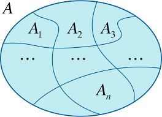
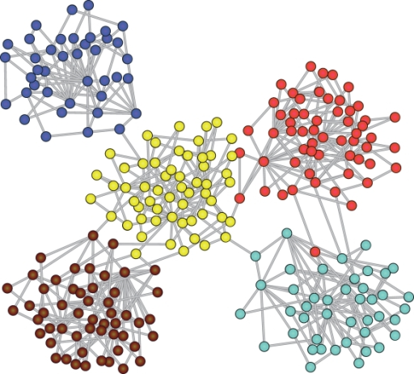
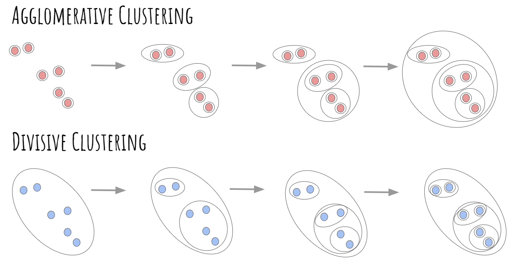
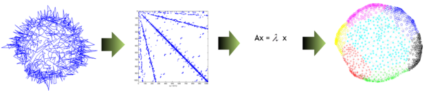

```{r setup, include=FALSE}
knitr::opts_chunk$set(
  echo = TRUE,
  message = FALSE,
  warning = FALSE,
  fig.align = "center",
  out.width = "100%"
)

options(stringsAsFactors = FALSE)
```

# Introducción

El **agrupamiento** (*clustering*) busca identificar subconjuntos de elementos que sean similares según un criterio determinado. 

En redes, la **detección de comunidades** (*community detection*) estudia agrupaciones de vértices definidas por sus patrones relacionales.

Una **partición** $\mathcal{C}$ de un conjunto $S$ es una colección de subconjuntos $\mathcal{C}=\{C_1,\ldots,C_K\}$ que satisface
$$
C_k\neq\emptyset,
\qquad
C_k\cap C_\ell=\emptyset\quad(k\neq\ell),
\qquad
\bigcup_{k=1}^{K}C_k=S.
$$

Por tanto, cada elemento pertenece a **exactamente un grupo**. 

```{r, eval = TRUE, echo=FALSE, out.width="40%", fig.pos = 'H', fig.align = 'center'}

```

En muchas redes sociales, las comunidades son **asortativas**, donde las relaciones son más frecuentes dentro de los grupos que entre ellos. Sin embargo, algunas redes presentan estructuras **disasortativas**.

```{r, eval = TRUE, echo=FALSE, out.width="40%", fig.pos = 'H', fig.align = 'center'}

```

Estos métodos son principalmente **algorítmicos** y no proporcionan directamente incertidumbre inferencial sobre las comunidades. 

La **estabilidad** de estos algoritmos puede evaluarse ante distintas inicializaciones, perturbaciones o valores de parámetros.


# Métodos jerárquicos

Los métodos jerárquicos generan una **secuencia restringida de particiones** mediante operaciones sucesivas de fusión o división. 

**No exploran exhaustivamente** el espacio de todas las particiones posibles.

- **Agrupamiento aglomerativo** (*agglomerative clustering*): comienza con grupos pequeños y los fusiona progresivamente. Ejemplos: *fast greedy* y *walktrap*.
- **Agrupamiento divisivo** (*divisive clustering*): comienza con grupos grandes y los divide progresivamente. Un ejemplo clásico es *edge betweenness* o Girvan--Newman.

```{r, eval = TRUE, echo=FALSE, out.width="75%", fig.pos = 'H', fig.align = 'center'}

```

En cada etapa se modifica la partición de acuerdo con el criterio propio del algoritmo. 

Por ejemplo, *fast greedy* busca aumentos locales de **modularidad**.


##    Modularidad

Sea $G=(V,E)$ un grafo simple no dirigido con $n=|V|$ vértices y $m=|E|$ aristas. Sea $\mathbf{Y}=[y_{i,j}]$ su matriz de adyacencia y $d_i=\sum_j y_{i,j}$ el grado del vértice $i$.

Para una partición $\mathcal{C}$ con etiqueta $c_i$ para el vértice $i$, la **modularidad** se define como
$$
Q(\mathcal{C})
=
\frac{1}{2m}
\sum_{i,j}
\left(
 y_{i,j}-\frac{d_i d_j}{2m}
\right)
\delta(c_i,c_j),
$$
donde
$$
\delta(x,y)=
\begin{cases}
1, & x=y,\\
0, & x\neq y.
\end{cases}
$$

El término
$$
\frac{d_i d_j}{2m}
$$
representa la cantidad esperada de conexión entre \(i\) y \(j\) bajo el **modelo nulo de configuración**, que preserva la secuencia de grados observada y genera conexiones aleatoriamente sujetas a esa restricción.

Así, la modularidad compara la concentración observada de aristas dentro de los grupos con la que se esperaría bajo ese modelo nulo.

Bajo el **modelo nulo**, \(Q\) se espera alrededor de cero y también puede tomar valores negativos. Valores mayores indican una mayor **concentración de relaciones dentro de los grupos** respecto del modelo nulo. 

No existe una **escala universal** para interpretar \(Q\).


## Parámetro de resolución

Una generalización importante introduce un parámetro de resolución $\gamma>0$:
$$
Q_\gamma(\mathcal{C})
=
\frac{1}{2m}
\sum_{i,j}
\left(
 y_{i,j}-\gamma\frac{d_i d_j}{2m}
\right)
\delta(c_i,c_j).
$$

- $\gamma=1$ recupera la modularidad clásica.
- Valores menores de $\gamma$ tienden a producir menos comunidades y de mayor tamaño.
- Valores mayores de $\gamma$ tienden a producir más comunidades y de menor tamaño.

La maximización de la modularidad presenta un **límite de resolución**, ya que puede fusionar comunidades pequeñas pero bien definidas. Por ello, la modularidad no debe usarse como **único criterio** para evaluar una partición.


## Redes ponderadas

Si la red es ponderada y el peso $w_{i,j}$ representa **intensidad de relación**, se define la fortaleza $s_i=\sum_j w_{i,j}$, y el peso total de la red $W=\frac{1}{2}\sum_i s_i$.

La modularidad ponderada es
$$
Q(\mathcal{C})
=
\frac{1}{2W}
\sum_{i,j}
\left(
 w_{i,j}-\frac{s_i s_j}{2W}
\right)
\delta(c_i,c_j).
$$

En `igraph`, los pesos usados en caminos suelen interpretarse como **distancias o costos**. Si representan **intensidad**, conviene transformarlos antes de calcular caminos o intermediación.


# Particionamiento espectral

El **agrupamiento espectral** representa los vértices mediante vectores propios de una **matriz asociada al grafo** y aplica sobre esa representación un método de agrupamiento estándar, como \(k\)-medias.


```{r, eval = TRUE, echo=FALSE, out.width="100%", fig.pos = 'H', fig.align = 'center'}

```


## Matriz laplaciana

Para una red no dirigida, el **Laplaciano** se define como
$$
\mathbf{L}=\mathbf{D}-\mathbf{Y},
$$
donde $\mathbf{Y}$ es la **matriz de adyacencia** y $\mathbf{D}=\textsf{diag}(d_1,\ldots,d_n)$ es la **matriz diagonal de grados**.

Una alternativa especialmente útil cuando los grados son muy **heterogéneos**, es el **Laplaciano simétricamente normalizado** dado por
$$
\mathbf{L}_{\mathrm{sym}}
=
\mathbf{I}-\mathbf{D}^{-1/2}\mathbf{Y}\mathbf{D}^{-1/2}.
$$

Esta normalización reduce el efecto dominante de los vértices con grados muy altos y permite comparar la estructura de conexión de manera más equilibrada.

Para identificar \(K\) grupos mediante **agrupamiento espectral normalizado**, se siguen los siguientes pasos:

* Calcular los **\(K\) vectores propios** asociados con los \(K\) autovalores más pequeños de \(\mathbf{L}_{\mathrm{sym}}\) (corresponden a direcciones en las que la red cambia poco entre vértices conectados).
* Construir una matriz cuyas columnas sean estos vectores propios.
* **Normalizar las filas** de esta matriz.
* Aplicar **\(k\)-medias** a las filas normalizadas para obtener los \(K\) grupos.

Un **salto pronunciado** entre \(\lambda_K\) y \(\lambda_{K+1}\) puede servir como guía exploratoria para elegir \(K\).

En `igraph`, el **agrupamiento espectral normalizado** puede construirse con `laplacian_matrix()` o `embed_laplacian_matrix()` y luego aplicar `kmeans()`.


## Matriz de modularidad

La **matriz de modularidad** es
$$
\mathbf{B}=[b_{i,j}],
\qquad
b_{i,j}=y_{i,j}-\frac{d_i d_j}{2m}.
$$

Los métodos espectrales basados en \(\mathbf{B}\) utilizan sus **autovalores positivos más grandes** para identificar direcciones en las que la red se aparta del **modelo nulo**.

En `igraph`, `cluster_leading_eigen()` utiliza la **matriz de modularidad** \(\mathbf{B}\).


# Principales algoritmos

| Algoritmo | Función en `igraph` | Dirección | Pesos | Jerárquico | Estocástico | Criterio o idea principal |
|:--|:--|:--|:--|:--|:--|:--|
| Fast greedy | `cluster_fast_greedy()` | No dirigida | Sí, como intensidad | Sí, aglomerativo | No | Fusiona comunidades buscando aumentos locales de modularidad |
| Edge betweenness | `cluster_edge_betweenness()` | Dirigida o no dirigida | Sí, como distancia | Sí, divisivo | No | Elimina iterativamente aristas con alta intermediación |
| Leading eigenvector | `cluster_leading_eigen()` | No dirigida | Sí, como intensidad | Recursivo | No | Divide según el signo del vector propio dominante de la matriz de modularidad |
| Louvain | `cluster_louvain()` | No dirigida | Sí, como intensidad | Multinivel | Sí | Optimización multinivel de modularidad |
| Leiden | `cluster_leiden()` | No dirigida | Sí, como intensidad | Multinivel | Sí | Movimiento local, refinamiento y agregación; modularidad o CPM |
| Walktrap | `cluster_walktrap()` | Ignora dirección | Sí, como intensidad | Sí, aglomerativo | No | Caminatas cortas tienden a permanecer dentro de comunidades |
| Label propagation | `cluster_label_prop()` | Admite dirección mediante `mode` | Sí, como intensidad | No | Sí | Actualiza etiquetas por votación en la vecindad |
| Infomap | `cluster_infomap()` | Dirigida o no dirigida | Sí, como intensidad | No | Sí | Minimiza la longitud esperada de descripción de una caminata aleatoria |
| Spinglass | `cluster_spinglass()` | Ignora dirección | Sí | No | Sí | Optimiza una función de energía tipo *spin-glass* mediante recocido simulado |
| Optimal | `cluster_optimal()` | Dirigida o no dirigida | Sí, como intensidad | No | No | Maximiza globalmente la modularidad mediante programación entera |

Los algoritmos **no optimizan todos la misma función objetivo**. 

Por tanto, comparar métodos únicamente por modularidad puede favorecer artificialmente a aquellos diseñados para maximizarla. 


# Evaluación y comparación de particiones

La evaluación puede organizarse en tres dimensiones.

1. **Evaluación externa:** compara la partición estimada con etiquetas externas de referencia.
2. **Evaluación interna:** estudia propiedades de la partición dentro de la red, como modularidad, densidades intra/inter-grupo o conductancia.
3. **Estabilidad:** estudia sensibilidad a inicializaciones, perturbaciones de la red y parámetros del algoritmo.

Cuando existen **etiquetas externas**, estas deben interpretarse como una referencia independiente de la estructura de enlaces, pues no necesariamente coinciden con las comunidades estructurales de la red.


## Índices de comparación

Sean $X$ y $Y$ dos particiones del mismo conjunto de $n$ elementos. El **índice de Rand** es
$$
\textsf{RI}(X,Y)=\frac{a+b}{a+b+c+d},
$$
donde:

- $a$: pares ubicados juntos en ambas particiones;
- $b$: pares separados en ambas particiones;
- $c$: pares juntos en $X$ y separados en $Y$;
- $d$: pares separados en $X$ y juntos en $Y$.

El **índice de Rand** puede ser alto cuando la mayoría de los pares quedan separados en ambas particiones. Por ello, se utiliza principalmente el **índice de Rand ajustado (ARI)**, que corrige el acuerdo esperado por azar.

En `igraph::compare()` se encuentran:

- `adjusted.rand`: mayor es mejor; $1$ indica coincidencia exacta y valores alrededor de $0$ corresponden aproximadamente al acuerdo esperado por azar;
- `nmi`: información mutua normalizada; mayor es mejor;
- `vi`: variación de información; menor es mejor y $0$ indica coincidencia;
- `split.join`: distancia *split-join*; menor es mejor y $0$ indica coincidencia;
- `rand`: índice de Rand no ajustado.


# Ejemplo empírico: red de correo electrónico

Se utiliza la red **email-Eu-core**, construida a partir de comunicaciones por correo electrónico entre miembros de una institución europea de investigación. 

Los vértices representan personas y existe un arco de \(i\) a \(j\) si \(i\) envió al menos un correo electrónico a \(j\).

Cada persona pertenece a uno de **42 departamentos**, lo que proporciona etiquetas externas con las cuales comparar las comunidades detectadas. 

Estas etiquetas constituyen una **referencia externa** y no necesariamente coinciden con una única partición estructural de la red.

Para este análisis se construye una red **simple no dirigida**: dos personas se consideran conectadas si existió comunicación en al menos una dirección. Posteriormente se conserva la componente conexa más grande.

Datos tomados de Stanford Network Analysis Project (SNAP).


## Carga y preparación de los datos

```{r datos-email}
# Librerías
library(igraph)

# Directorio para almacenar los datos.
data_dir <- "data_email_eu"
if (!dir.exists(data_dir)) dir.create(data_dir)

# Archivos de SNAP.
base_url <- "https://snap.stanford.edu/data/"

edge_url <- paste0(base_url, "email-Eu-core.txt.gz")

label_url <- paste0(base_url, "email-Eu-core-department-labels.txt.gz")

edge_file <- file.path(data_dir, "email-Eu-core.txt.gz")

label_file <- file.path(data_dir, "email-Eu-core-department-labels.txt.gz")

# Descargar los archivos únicamente si no existen localmente.
if (!file.exists(edge_file)) {
  download.file(
    edge_url,
    destfile = edge_file,
    mode = "wb",
    quiet = TRUE
  )
}

if (!file.exists(label_file)) {
  download.file(
    label_url,
    destfile = label_file,
    mode = "wb",
    quiet = TRUE
  )
}

# Leer la lista de aristas.
con_edges <- gzfile(edge_file, open = "rt")

edges <- read.table(
  con_edges,
  header = FALSE,
  col.names = c("from", "to")
)

close(con_edges)

# Leer las etiquetas departamentales.
con_labels <- gzfile(label_file, open = "rt")

labels <- read.table(
  con_labels,
  header = FALSE,
  col.names = c("id", "department")
)

close(con_labels)

# Los identificadores se manejan como caracteres.
edges$from <- as.character(edges$from)
edges$to   <- as.character(edges$to)
labels$id  <- as.character(labels$id)

# Red dirigida original.
g_email_directed <- graph_from_data_frame(
  d = edges,
  directed = TRUE,
  vertices = labels
)

# Conversión a red no dirigida.
g_email_undirected <- as_undirected(g_email_directed, mode = "collapse")

# Eliminar autoenlaces y posibles aristas múltiples.
g_email_undirected <- simplify(
  g_email_undirected,
  remove.multiple = TRUE,
  remove.loops = TRUE
)

# Identificar la componente conexa más grande.
comp_email <- components(g_email_undirected)

largest_component <- which.max(comp_email$csize)

keep_vertices <- which(comp_email$membership == largest_component)

# Red utilizada en el análisis.
g_email <- induced_subgraph(g_email_undirected, vids = keep_vertices)

# Etiquetas externas.
ground_truth <- as.integer(factor(V(g_email)$department))

ground_truth_factor <- factor(V(g_email)$department)

K_truth <- length(unique(ground_truth))
```


## Características de la red

```{r resumen-email}
cat("Número de vértices:", vcount(g_email), "\n")
cat("Número de aristas:", ecount(g_email), "\n")
cat("Red dirigida:", is_directed(g_email), "\n")
cat("Red ponderada:", is_weighted(g_email), "\n")
cat("Número de componentes:", components(g_email)$no, "\n")
cat("Grado promedio:", round(mean(degree(g_email)), 2), "\n")
cat("Densidad:", round(edge_density(g_email), 4), "\n")
cat("Número de departamentos:", K_truth, "\n")
```

Los departamentos presentan tamaños diferentes, lo cual permite estudiar la detección de comunidades en presencia de **grupos desbalanceados**.

```{r tamanos-departamentos, fig.height=5, fig.width=10, fig.align='center'}
department_sizes <- sort(
  table(ground_truth_factor),
  decreasing = TRUE
)

barplot(
  department_sizes,
  las = 2,
  cex.names = 0.65,
  border = NA,
  xlab = "Departamento",
  ylab = "Número de vértices",
  main = "Tamaño de los departamentos"
)
```


## Visualización de la red

Se visualiza la red utilizando las **etiquetas externas** correspondientes a los departamentos.

```{r plot-email-ground-truth, fig.height=7, fig.width=10, fig.align='center'}
# Diseño
set.seed(2026)
layout_email <- layout_nicely(g_email)

# Etiquetas
truth_colors <- hcl.colors(K_truth, palette = "Dynamic")

# Visualización
plot(
  g_email,
  layout = layout_email,
  vertex.label = NA,
  vertex.size = 3,
  vertex.color = truth_colors[ground_truth],
  vertex.frame.color = NA,
  edge.color = adjustcolor(1, alpha.f = 0.15),
  edge.width = 0.2,
  main = paste0("Departamentos: ", K_truth, " grupos de referencia")
)
```


## Matriz de adyacencia

La matriz de adyacencia puede ordenarse según las etiquetas departamentales para examinar la presencia de estructura de bloques.

```{r matriz-email, fig.height=7, fig.width=7, fig.align='center'}
# Matriz de adyacencia
A_email <- as_adjacency_matrix(g_email, sparse = TRUE)

# Ordenar vértices por departamento
order_truth <- order(ground_truth)

A_ordered <- A_email[order_truth, order_truth]

n_email <- nrow(A_ordered)

# Visualizar la matriz ordenada
image(
  x = seq_len(n_email),
  y = seq_len(n_email),
  z = t(as.matrix(A_ordered[n_email:1, ])),
  col = c("white", "red"),
  axes = FALSE,
  xlab = "Vértices ordenados",
  ylab = "Vértices ordenados",
  main = "Matriz de adyacencia ordenada por departamento"
)

# Tamaños y límites de los departamentos
department_ordered <- ground_truth[order_truth]

block_sizes <- as.numeric(table(department_ordered))

block_limits <- cumsum(block_sizes)

# Delimitar los bloques departamentales
for (cut_point in block_limits[-length(block_limits)]) {
  abline(
    v = cut_point + 0.5,
    lwd = 0.5,
    col = "gray60"
  )

  abline(
    h = n_email - cut_point + 0.5,
    lwd = 0.5,
    col = "gray60"
  )
}

box()
```

La presencia de bloques sobre la diagonal sugiere una estructura **asortativa**, con mayor concentración de relaciones entre personas del mismo departamento.


## Aplicación de algoritmos de detección de comunidades

Se aplican varios algoritmos basados en principios diferentes. 

Los algoritmos pueden agruparse según su principio principal en:

* **Jerárquicos**: Fast greedy y Walktrap;
* **Espectrales**: Leading eigenvector;
* **Multinivel**: Louvain y Leiden;
* **Propagación**: Label propagation;
* **Flujo/información**: Infomap.

El método **Leading eigenvector** también puede interpretarse como jerárquico divisivo, ya que divide recursivamente la red.


```{r algoritmos-email, cache=TRUE}
# Fast greedy.
comm_fast_greedy <- cluster_fast_greedy(g_email)

# Leading eigenvector.
comm_leading_eigen <- cluster_leading_eigen(g_email)

# Walktrap.
comm_walktrap <- cluster_walktrap(g_email)

# Louvain.
set.seed(1001)
comm_louvain <- cluster_louvain(g_email)

# Leiden.
set.seed(1002)
comm_leiden <- cluster_leiden(g_email, objective_function = "modularity")

# Propagación de etiquetas.
set.seed(1003)
comm_label_prop <- cluster_label_prop(g_email)

# Infomap.
set.seed(1004)
comm_infomap <- cluster_infomap(g_email)
```

El número de comunidades identificado por cada procedimiento puede ser diferente.

```{r numero-comunidades-email}
data.frame(
  metodo = c(
    "fast greedy",
    "leading eigen",
    "walktrap",
    "louvain",
    "leiden",
    "label propagation",
    "infomap"
  ),
  K = c(
    length(comm_fast_greedy),
    length(comm_leading_eigen),
    length(comm_walktrap),
    length(comm_louvain),
    length(comm_leiden),
    length(comm_label_prop),
    length(comm_infomap)
  )
)
```

Una diferencia entre el número de comunidades detectadas y los **42 departamentos** no implica un error. 

Los departamentos son una clasificación externa, mientras que los algoritmos identifican grupos a partir de la **estructura relacional** de la red.


## Agrupamiento espectral

Además de los métodos anteriores, se implementa explícitamente un procedimiento de **agrupamiento espectral** basado en el Laplaciano simétricamente normalizado, con el fin de ilustrar directamente la construcción espectral de las comunidades.


```{r funcion-espectral}
spectral_clustering <- function(graph, k, n_eigenvalues = 60, seed = 1) {

  if (k < 2 || k >= vcount(graph)) {
    stop("k debe estar entre 2 y el número de vértices menos uno.")
  }

  n_eigenvalues <- min(
    max(n_eigenvalues, k + 1),
    vcount(graph) - 1
  )

  # Laplaciano simétricamente normalizado
  L_sym <- laplacian_matrix(
    graph,
    sparse = TRUE,
    normalization = "symmetric"
  )

  # Autovalores más pequeños y vectores propios asociados
  eig <- RSpectra::eigs_sym(
    L_sym,
    k = n_eigenvalues,
    which = "SA"
  )

  # Ordenar autovalores y vectores propios
  ord <- order(eig$values)
  eigenvalues <- eig$values[ord]
  eigenvectors <- eig$vectors[, ord, drop = FALSE]

  # Primeros K vectores propios
  U <- eigenvectors[, seq_len(k), drop = FALSE]

  # Normalizar las filas
  row_norm <- sqrt(rowSums(U^2))
  row_norm[row_norm == 0] <- 1
  Z <- sweep(U, 1, row_norm, "/")

  # K-medias sobre la representación espectral
  set.seed(seed)
  fit <- kmeans(
    Z,
    centers = k,
    nstart = 50,
    iter.max = 100
  )

  list(
    membership = fit$cluster,
    eigenvalues = eigenvalues,
    eigenvectors = eigenvectors,
    embedding = Z
  )
}
```

Para facilitar la comparación con las **etiquetas externas**, se fija inicialmente \(K=42\). 

Así, las particiones tienen el mismo número de grupos; en un análisis completamente no supervisado, \(K\) debe seleccionarse sin utilizar etiquetas externas.


```{r aplicar-espectral-email, cache=TRUE}
spectral_email <- spectral_clustering(
  g_email,
  k = K_truth,
  n_eigenvalues = 60,
  seed = 1005
)
```


## Representación espectral

El objeto `spectral_email$embedding` contiene la **representación espectral normalizada** utilizada posteriormente por \(k\)-medias. 

Vértices con patrones de conexión similares tienden a ubicarse próximos en este espacio.

A continuación se muestran dos de sus primeras coordenadas no triviales, coloreadas según las **etiquetas externas**.

```{r embedding-email, fig.height=6, fig.width=8, fig.align='center'}
plot(
  spectral_email$embedding[, 2],
  spectral_email$embedding[, 3],
  pch = 19,
  col = truth_colors[ground_truth],
  cex = 0.65,
  xlab = expression(z[2]),
  ylab = expression(z[3]),
  main = "Representación espectral"
)
```


## Eigengap

Los autovalores almacenados en `spectral_email$eigenvalues` permiten explorar el número de comunidades. 

Un **salto pronunciado** entre \(\lambda_K\) y \(\lambda_{K+1}\) sugiere un valor plausible para \(K\).

El criterio anterior selecciona
$$
\widehat K_{\mathrm{eigengap}}
=
\arg\max_k
\big(\lambda_{k+1}-\lambda_k\big),
$$
entre los autovalores examinados. 

Este valor debe interpretarse como una **guía exploratoria**, no como una estimación definitiva del número de comunidades.

```{r eigengap-email, fig.height=5.5, fig.width=8, fig.align='center'}
lambda_email <- spectral_email$eigenvalues

# Diferencias entre autovalores consecutivos
eigen_gaps <- diff(lambda_email)

# Tres eigengaps más grandes
top_gaps <- head(order(eigen_gaps, decreasing = TRUE), 3)

cat(
  "Valores de K sugeridos por los tres mayores eigengaps:",
  top_gaps,
  "\n"
)

# Visualización del espectro
plot(
  seq_along(lambda_email),
  lambda_email,
  type = "b",
  pch = 19,
  cex = 0.6,
  xlab = "índice",
  ylab = expression(lambda[k]),
  main = "Autovalores del laplaciano normalizado"
)

# Resaltar los tres mayores eigengaps
for (j in seq_along(top_gaps)) {
  k <- top_gaps[j]
  
  abline(v =  k, col = j, lty = 2)
}
```


## Comparación con las etiquetas externas

Las particiones se comparan mediante distintas medidas de concordancia y calidad.

El **índice de Rand ajustado (ARI)** se utiliza como medida externa principal. También se consideran la **información mutua normalizada (NMI)**, la **variación de información (VI)** y la distancia **split-join**.

La **modularidad** se reporta como medida interna complementaria, pero no debe emplearse como único criterio para evaluar una partición.

```{r funcion-evaluacion-email}
evaluate_partition <- function(
  graph,
  truth,
  membership,
  method_name,
  resolution = 1
) {

  data.frame(
    metodo = method_name,
    K = length(unique(membership)),
    modularidad = modularity(
      graph,
      membership = membership,
      resolution = resolution,
      directed = FALSE
    ),
    ARI = compare(truth, membership, method = "adjusted.rand"),
    NMI = compare(truth, membership, method = "nmi"),
    VI = compare(truth, membership, method = "vi"),
    split_join = compare(truth, membership, method = "split.join")
  )
}
```

```{r comparacion-email}
partitions_email <- list(
  "fast greedy" = membership(comm_fast_greedy),
  "leading eigen" = membership(comm_leading_eigen),
  "walktrap" = membership(comm_walktrap),
  "louvain" = membership(comm_louvain),
  "leiden" = membership(comm_leiden),
  "label propagation" = membership(comm_label_prop),
  "infomap" = membership(comm_infomap),
  "espectral" = spectral_email$membership
)

results_email <- do.call(
  rbind,
  Map(
    f = function(memb, name) {
      evaluate_partition(
        graph = g_email,
        truth = ground_truth,
        membership = memb,
        method_name = name
      )
    },
    memb = partitions_email,
    name = names(partitions_email)
  )
)

numeric_columns <- c(
  "modularidad",
  "ARI",
  "NMI",
  "VI",
  "split_join"
)

results_email[, numeric_columns] <- round(results_email[, numeric_columns], 3)

knitr::kable(
  results_email,
  align = c("l", "r", "r", "r", "r", "r", "r"),
  caption = paste0(
    "Comparación de las particiones con los ",
    K_truth,
    " departamentos."
  )
)
```

Para **ARI** y **NMI**, valores mayores indican mayor concordancia; para **VI** y *split-join*, valores menores indican mayor similitud entre particiones.

Las **etiquetas externas** no necesariamente coinciden con la **partición relacional**, pues describen una clasificación sustantiva distinta de la estructura de enlaces.

Las particiones difieren frente a los **42 departamentos**. El método **espectral** logra mayor concordancia externa, mientras **Leiden** alcanza alta modularidad y ofrece el mejor equilibrio estructural. **Walktrap** sobresegmenta y **Label propagation** colapsa la red.


## Visualización de las particiones

Para facilitar la comparación se utiliza la **misma disposición de los vértices** en todas las visualizaciones.

```{r funcion-plot-particion}
plot_partition <- function(graph, layout, membership, title) {

  # Número de comunidades y colores
  k <- length(unique(membership))
  palette <- hcl.colors(k, palette = "Dynamic")
  color_index <- as.integer(factor(membership))

  # Visualización
  plot(
    graph,
    layout = layout,
    vertex.label = NA,
    vertex.size = 2.8,
    vertex.color = palette[color_index],
    vertex.frame.color = NA,
    edge.color = adjustcolor("gray40", alpha.f = 0.05),
    edge.width = 0.2,
    main = paste0(title, " (K = ", k, ")")
  )
}
```

```{r plot-particiones-email, fig.height=10, fig.width=12, fig.align='center'}
par(
  mfrow = c(2, 2),
  mar = c(0.5, 0.5, 2.5, 0.5)
)

# Etiquetas externas
plot(
  g_email,
  layout = layout_email,
  vertex.label = NA,
  vertex.size = 2.8,
  vertex.color = truth_colors[ground_truth],
  vertex.frame.color = NA,
  edge.color = adjustcolor("gray40", alpha.f = 0.05),
  edge.width = 0.2,
  main = paste0("Departamentos (K = ", K_truth, ")")
)

# Louvain
plot_partition(
  g_email,
  layout_email,
  membership(comm_louvain),
  "Louvain"
)

# Leiden
plot_partition(
  g_email,
  layout_email,
  membership(comm_leiden),
  "Leiden"
)

# Espectral
plot_partition(
  g_email,
  layout_email,
  spectral_email$membership,
  "Espectral"
)
```

Las etiquetas de las comunidades son **arbitrarias**. 

Un mismo número no necesariamente identifica el mismo grupo entre distintos algoritmos.


## Sensibilidad al parámetro de resolución

Los algoritmos **Louvain** y **Leiden** permiten controlar la resolución mediante \(\gamma\). 

En `igraph`, el valor por defecto es \(\gamma=1\). Valores mayores suelen producir **más comunidades y de menor tamaño**, mientras que valores menores generan **menos comunidades y de mayor tamaño**.


```{r sensibilidad-resolucion-email, cache=TRUE}
# Valores del parámetro de resolución
resolution_grid <- c(0.5, 0.75, 1, 1.25, 1.5, 2)

# Almacenar resultados
resolution_results <- vector(
  "list",
  2 * length(resolution_grid)
)

row_id <- 1

for (i in seq_along(resolution_grid)) {

  gamma <- resolution_grid[i]

  # Louvain
  set.seed(2000 + i)
  fit_louvain <- cluster_louvain(
    g_email,
    resolution = gamma
  )

  memb_louvain <- membership(fit_louvain)

  resolution_results[[row_id]] <- data.frame(
    metodo = "louvain",
    gamma = gamma,
    K = length(unique(memb_louvain)),
    Q_gamma = modularity(
      g_email,
      memb_louvain,
      resolution = gamma,
      directed = FALSE
    ),
    ARI = compare(
      ground_truth,
      memb_louvain,
      method = "adjusted.rand"
    )
  )

  row_id <- row_id + 1

  # Leiden
  set.seed(3000 + i)
  fit_leiden <- cluster_leiden(
    g_email,
    objective_function = "modularity",
    resolution = gamma,
    n_iterations = 2
  )

  memb_leiden <- membership(fit_leiden)

  resolution_results[[row_id]] <- data.frame(
    metodo = "leiden",
    gamma = gamma,
    K = length(unique(memb_leiden)),
    Q_gamma = modularity(
      g_email,
      memb_leiden,
      resolution = gamma,
      directed = FALSE
    ),
    ARI = compare(
      ground_truth,
      memb_leiden,
      method = "adjusted.rand"
    )
  )

  row_id <- row_id + 1
}

# Consolidar resultados
resolution_results <- do.call(rbind, resolution_results)

# Redondear métricas
resolution_results[, c("Q_gamma", "ARI")] <- round(
  resolution_results[, c("Q_gamma", "ARI")],
  3
)

# Mostrar resultados
knitr::kable(
  resolution_results,
  caption = "Sensibilidad de Louvain y Leiden al parámetro de resolución."
)
```

```{r plot-resolucion-email, fig.height=5.5, fig.width=10, fig.align='center'}
par(mfrow = c(1, 2))

for (method_name in c("louvain", "leiden")) {

  # Resultados del método
  idx <- resolution_results$metodo == method_name

  plot(
    resolution_results$gamma[idx],
    resolution_results$K[idx],
    type = "b",
    pch = 19,
    xlab = expression(gamma),
    ylab = "Número de comunidades",
    main = method_name
  )

  # Número de grupos de referencia
  abline(h = K_truth, lty = 2)
}
```


## Estabilidad de los algoritmos

Fijar una semilla garantiza la **reproducibilidad** de una ejecución, pero algunos algoritmos pueden variar entre corridas. 

Para evaluar esta **estabilidad**, se repiten Louvain, Leiden y propagación de etiquetas sobre la misma red.

```{r estabilidad-email, cache=TRUE}
N_stability <- 100

# Almacenar resultados
stability_results <- vector("list", 3 * N_stability)
row_id <- 1

for (b in seq_len(N_stability)) {

  # Louvain
  set.seed(40000 + b)
  fit_louvain <- cluster_louvain(g_email)

  # Leiden
  set.seed(50000 + b)
  fit_leiden <- cluster_leiden(
    g_email,
    objective_function = "modularity",
    resolution = 1,
    n_iterations = 2
  )

  # Propagación de etiquetas
  set.seed(60000 + b)
  fit_label <- cluster_label_prop(g_email)

  fit_list <- list(
    louvain = fit_louvain,
    leiden = fit_leiden,
    label_propagation = fit_label
  )

  # Evaluar cada partición
  for (method_name in names(fit_list)) {

    fit <- fit_list[[method_name]]
    memb <- membership(fit)

    stability_results[[row_id]] <- data.frame(
      repeticion = b,
      metodo = method_name,
      K = length(unique(memb)),
      modularidad = modularity(
        g_email,
        memb,
        directed = FALSE
      ),
      ARI = compare(
        ground_truth,
        memb,
        method = "adjusted.rand"
      )
    )

    row_id <- row_id + 1
  }
}

# Consolidar resultados
stability_results <- do.call(rbind, stability_results)
```

```{r resumen-estabilidad-email}
stability_summary <- do.call(
  rbind,
  lapply(
    split(stability_results, stability_results$metodo),
    function(x) {
      data.frame(
        metodo = unique(x$metodo),
        K_min = min(x$K),
        K_mediana = median(x$K),
        K_max = max(x$K),
        ARI_media = mean(x$ARI),
        ARI_sd = sd(x$ARI),
        ARI_q10 = unname(quantile(x$ARI, 0.10)),
        ARI_mediana = median(x$ARI),
        ARI_q90 = unname(quantile(x$ARI, 0.90))
      )
    }
  )
)

# Redondear métricas de ARI
stability_summary[, 5:9] <- round(
  stability_summary[, 5:9],
  3
)

# Mostrar resultados
knitr::kable(
  stability_summary,
  caption = "Estabilidad en 100 ejecuciones sobre la misma red."
)
```

```{r boxplot-estabilidad-email, fig.height=5.5, fig.width=9, fig.align='center'}
# Orden de los métodos
stability_results$metodo <- factor(
  stability_results$metodo,
  levels = c("louvain", "leiden", "label_propagation"),
  labels = c("Louvain", "Leiden", "Propagación de etiquetas")
)

# Medias de ARI
ari_mean <- tapply(
  stability_results$ARI,
  stability_results$metodo,
  mean
)

# Configuración gráfica
op <- par(mar = c(5, 5, 3, 1))

# Distribución del ARI
boxplot(
  ARI ~ metodo,
  data = stability_results,
  notch = TRUE,
  outline = FALSE,
  col = "gray90",
  border = "gray30",
  xlab = "",
  ylab = "ARI",
  main = "Variabilidad entre ejecuciones"
)

# Ejecuciones individuales
stripchart(
  ARI ~ metodo,
  data = stability_results,
  vertical = TRUE,
  method = "jitter",
  pch = 16,
  cex = 0.45,
  col = adjustcolor("gray30", alpha.f = 0.35),
  add = TRUE
)

# ARI promedio
points(
  seq_along(ari_mean),
  ari_mean,
  pch = 18,
  cex = 1.4
)

# Referencia
abline(h = 0, lty = 2, col = "gray50")

par(op)
```

Una distribución estrecha del ARI indica que el procedimiento produce resultados similares entre ejecuciones, mientras que una mayor dispersión revela **sensibilidad a la aleatoriedad del algoritmo**.

## Consideraciones finales

Este ejemplo destaca varios aspectos clave de la **detección de comunidades**:

* Distintos algoritmos pueden producir **particiones diferentes**.
* Las **etiquetas externas** no necesariamente coinciden con la estructura relacional.
* La **modularidad** es una medida interna útil, pero no un criterio universal.
* **ARI, NMI y VI** permiten comparar las particiones con una clasificación externa.
* El número de comunidades puede depender del **parámetro de resolución**.
* Los métodos estocásticos pueden presentar **variabilidad entre ejecuciones**.
* El agrupamiento espectral utiliza la estructura del **Laplaciano del grafo** para representar y agrupar los vértices.


# Simulación: modelo de bloques estocásticos

El **modelo de bloques estocásticos** (*stochastic block model*, SBM) es un modelo probabilístico básico para representar y estudiar **comunidades** en redes.

Sea \(\xi_i\in\{1,\ldots,K\}\) la **comunidad** del vértice \(i\). Condicionalmente a estas etiquetas,
$$
y_{i,j}\mid \xi_i,\xi_j,\boldsymbol{\Theta}
\sim
\textsf{Ber}\big(\theta_{\xi_i,\xi_j}\big),
\qquad 1\leq i<j\leq n,
$$
donde \(\boldsymbol{\Theta}=[\theta_{k,\ell}]\) es una matriz simétrica de **probabilidades de enlace entre comunidades**.

En un SBM **asortativo** simple,
$$
\theta_{k,k}=p_{\mathrm{in}},
\qquad
\theta_{k,\ell}=p_{\mathrm{out}},\quad k\neq \ell,
$$
con $p_{\mathrm{in}}>p_{\mathrm{out}}$, de modo que los enlaces son más probables **dentro de las comunidades** que entre ellas.


## Función de simulación

```{r funcion-sbm}
simulate_sbm <- function(
  n = 200,
  proportions = rep(0.25, 4),
  p_in = 0.20,
  p_out = 0.04
) {

  # Número y proporciones de comunidades
  K <- length(proportions)
  proportions <- proportions / sum(proportions)

  # Tamaños de los bloques
  block_sizes <- floor(n * proportions)
  difference <- n - sum(block_sizes)

  if (difference > 0) {
    block_sizes[seq_len(difference)] <- block_sizes[seq_len(difference)] + 1
  }

  # Matriz de probabilidades de enlace
  Theta <- matrix(p_out, nrow = K, ncol = K)
  diag(Theta) <- p_in

  # Simular la red
  graph <- sample_sbm(
    n = sum(block_sizes),
    pref.matrix = Theta,
    block.sizes = block_sizes,
    directed = FALSE,
    loops = FALSE
  )

  # Comunidades verdaderas
  membership_true <- rep(seq_len(K), times = block_sizes)

  list(
    graph = graph,
    membership = membership_true,
    Theta = Theta,
    block_sizes = block_sizes
  )
}
```

## Escenario base

Se utiliza inicialmente un escenario fácil de interpretar con $n=200$, $K=4$, tamaños balanceados, $p_{\mathrm{in}}=0.20$ y $p_{\mathrm{out}}=0.04$.

```{r simular-sbm-base}
set.seed(7001)

# Simular SBM base
sbm_base <- simulate_sbm(
  n = 200,
  proportions = rep(0.25, 4),
  p_in = 0.20,
  p_out = 0.04
)

# Red y comunidades verdaderas
g_sbm <- sbm_base$graph
truth_sbm <- sbm_base$membership

# Matriz de probabilidades de enlace
sbm_base$Theta
```

```{r plot-sbm-base, fig.height=6, fig.width=12, fig.align='center'}
# Disposición de la red
set.seed(7002)
layout_sbm <- layout_with_fr(g_sbm)

# Matriz de adyacencia ordenada por comunidad
order_sbm <- order(truth_sbm)
A_sbm <- as_adjacency_matrix(g_sbm, sparse = TRUE)
A_sbm_ordered <- A_sbm[order_sbm, order_sbm]

n_sbm <- vcount(g_sbm)

par(mfrow = c(1, 2), mar = c(2, 2, 3, 1))

# Red simulada
plot(
  g_sbm,
  layout = layout_sbm,
  vertex.label = NA,
  vertex.size = 6,
  vertex.color = truth_sbm,
  vertex.frame.color = NA,
  edge.color = adjustcolor("gray40", alpha.f = 0.25),
  main = "SBM: comunidades reales"
)

# Matriz de adyacencia
image(
  x = seq_len(n_sbm),
  y = seq_len(n_sbm),
  z = t(as.matrix(A_sbm_ordered[n_sbm:1, ])),
  col = c("white", "black"),
  axes = FALSE,
  xlab = "",
  ylab = "",
  main = "Matriz de adyacencia ordenada"
)

# Límites de las comunidades
cuts <- cumsum(sbm_base$block_sizes)

for (cut in cuts[-length(cuts)]) {
  abline(
    v = cut + 0.5,
    h = n_sbm - cut + 0.5
  )
}

box()

par(mfrow = c(1, 1))

```

## Recuperación de comunidades en una red simulada

```{r algoritmos-sbm-base}
# Métodos jerárquicos
fit_sbm_fast <- cluster_fast_greedy(g_sbm)
fit_sbm_leading <- cluster_leading_eigen(g_sbm)
fit_sbm_walktrap <- cluster_walktrap(g_sbm)

# Louvain
set.seed(7101)
fit_sbm_louvain <- cluster_louvain(g_sbm)

# Leiden
set.seed(7102)
fit_sbm_leiden <- cluster_leiden(
  g_sbm,
  objective_function = "modularity"
)

# Agrupamiento espectral
fit_sbm_spectral <- spectral_clustering(
  g_sbm,
  k = 4,
  seed = 7103
)
```

```{r evaluar-sbm-base}
# Particiones estimadas
partitions_sbm <- list(
  "fast greedy" = membership(fit_sbm_fast),
  "leading eigen" = membership(fit_sbm_leading),
  "walktrap" = membership(fit_sbm_walktrap),
  "louvain" = membership(fit_sbm_louvain),
  "leiden" = membership(fit_sbm_leiden),
  "espectral" = fit_sbm_spectral$membership
)

# Evaluación de las particiones
results_sbm <- do.call(
  rbind,
  Map(
    f = function(memb, name) {
      data.frame(
        metodo = name,
        K_estimado = length(unique(memb)),
        ARI = compare(truth_sbm, memb, method = "adjusted.rand"),
        NMI = compare(truth_sbm, memb, method = "nmi"),
        VI = compare(truth_sbm, memb, method = "vi"),
        modularidad = modularity(g_sbm, memb, directed = FALSE)
      )
    },
    memb = partitions_sbm,
    name = names(partitions_sbm)
  )
)

# Redondear métricas
results_sbm[, 3:6] <- round(results_sbm[, 3:6], 3)

# Mostrar resultados
knitr::kable(
  results_sbm,
  caption = "Recuperación de comunidades en un SBM simulado."
)
```


# Simulación repetida: efecto de la intensidad de la señal

Una sola red simulada no permite evaluar adecuadamente el desempeño de los métodos. 

Por ello, se consideran distintos niveles de separación entre comunidades, manteniendo \(p_{\mathrm{out}}=0.04\) y variando \(p_{\mathrm{in}}\).

Para preservar la reproducibilidad, **primero se simulan todas las redes** y luego se aplican los algoritmos con semillas independientes.

```{r preparar-simulaciones}
N_sim <- 100
p_out_sim <- 0.04
p_in_grid <- c(0.08, 0.12, 0.16, 0.20, 0.24)

set.seed(8001)

# Simular todas las redes
simulated_networks <- lapply(
  p_in_grid,
  function(p_in) {
    lapply(
      seq_len(N_sim),
      function(b) {
        simulate_sbm(
          n = 200,
          proportions = rep(0.25, 4),
          p_in = p_in,
          p_out = p_out_sim
        )
      }
    )
  }
)

# Identificar los escenarios por p_in
names(simulated_networks) <- as.character(p_in_grid)
```

Para mantener un tiempo de cómputo razonable se comparan cinco métodos representativos.

```{r ejecutar-simulaciones, cache=TRUE}
# Almacenar resultados
simulation_results <- vector("list", length(p_in_grid) * N_sim * 5)

row_id <- 1

for (s in seq_along(p_in_grid)) {

  p_in <- p_in_grid[s]

  for (b in seq_len(N_sim)) {

    # Red y comunidades verdaderas
    sim <- simulated_networks[[s]][[b]]
    graph <- sim$graph
    truth <- sim$membership

    # Fast greedy y Walktrap
    fit_fast <- cluster_fast_greedy(graph)
    fit_walktrap <- cluster_walktrap(graph)

    # Louvain
    set.seed(900000 + 1000 * s + b)
    fit_louvain <- cluster_louvain(graph)

    # Leiden
    set.seed(910000 + 1000 * s + b)
    fit_leiden <- cluster_leiden(
      graph,
      objective_function = "modularity",
      resolution = 1,
      n_iterations = 2
    )

    # Agrupamiento espectral
    fit_spectral <- spectral_clustering(
      graph,
      k = 4,
      seed = 920000 + 1000 * s + b
    )

    # Particiones estimadas
    fitted <- list(
      fast_greedy = membership(fit_fast),
      walktrap = membership(fit_walktrap),
      louvain = membership(fit_louvain),
      leiden = membership(fit_leiden),
      espectral = fit_spectral$membership
    )

    # Evaluar cada método
    for (method_name in names(fitted)) {

      memb <- fitted[[method_name]]

      simulation_results[[row_id]] <- data.frame(
        p_in = p_in,
        p_out = p_out_sim,
        senal = p_in - p_out_sim,
        repeticion = b,
        metodo = method_name,
        K_estimado = length(unique(memb)),
        ARI = compare(truth, memb, method = "adjusted.rand")
      )

      row_id <- row_id + 1
    }
  }
}

# Consolidar resultados
simulation_results <- do.call(rbind, simulation_results)
```

## Resumen de desempeño

Se reportan la **media, desviación estándar, mediana y cuantiles del ARI**. 

No se utiliza el coeficiente de variación, pues resulta poco interpretable para una medida acotada que puede tomar valores cercanos a cero o negativos.

```{r resumen-simulaciones}
     simulation_summary <- do.call(
  rbind,
  lapply(
    split(
      simulation_results,
      interaction(
        simulation_results$metodo,
        simulation_results$p_in,
        drop = TRUE
      )
    ),
    function(x) {
      data.frame(
        metodo = unique(x$metodo),
        p_in = unique(x$p_in),
        senal = unique(x$senal),
        ARI_media = mean(x$ARI),
        ARI_sd = sd(x$ARI),
        ARI_q10 = unname(quantile(x$ARI, 0.10)),
        ARI_mediana = median(x$ARI),
        ARI_q90 = unname(quantile(x$ARI, 0.90)),
        K_media = mean(x$K_estimado)
      )
    }
  )
)

# Redondear métricas
simulation_summary[, 4:9] <- round(
  simulation_summary[, 4:9],
  3
)

# Ordenar resultados
simulation_summary <- simulation_summary[
  order(simulation_summary$p_in, simulation_summary$metodo),
]

row.names(simulation_summary) <- NULL

# Mostrar resultados
knitr::kable(
  simulation_summary,
  caption = "Desempeño en 100 redes por nivel de separación entre comunidades."
)
```

```{r boxplot-simulaciones, fig.height=8, fig.width=12, fig.align='center'}
par(mfrow = c(2, 3), mar = c(7, 4, 3, 1))

# Distribución del ARI por nivel de separación
for (p_in_value in p_in_grid) {

  tmp <- simulation_results[
    simulation_results$p_in == p_in_value,
  ]

  boxplot(
    ARI ~ metodo,
    data = tmp,
    las = 2,
    ylim = c(-0.1, 1),
    xlab = "",
    ylab = "ARI",
    main = bquote(
      p["in"] == .(p_in_value) ~ "," ~
      p["out"] == .(p_out_sim)
    )
  )

  abline(h = 0, lty = 2)
}

# Interpretación general
plot.new()

text(
  0.5,
  0.5,
  expression(
    atop(
      "La recuperación mejora",
      "cuando aumenta la separación entre comunidades"
    )
  ),
  cex = 1.2
)
```

# Simulación con tamaños desbalanceados

El desempeño de los métodos puede variar cuando las comunidades tienen **tamaños desbalanceados**. 

Para evaluar este efecto, se considera una red con proporciones
$$
(0.10,\,0.20,\,0.30,\,0.40).
$$


```{r sbm-desbalanceado}
set.seed(10001)

# Simular SBM con comunidades desbalanceadas
sbm_unbalanced <- simulate_sbm(
  n = 200,
  proportions = c(0.10, 0.20, 0.30, 0.40),
  p_in = 0.18,
  p_out = 0.04
)

g_unbalanced <- sbm_unbalanced$graph
truth_unbalanced <- sbm_unbalanced$membership

# Fast greedy
fit_unbalanced_fast <- cluster_fast_greedy(g_unbalanced)

# Louvain
set.seed(10002)
fit_unbalanced_louvain <- cluster_louvain(g_unbalanced)

# Leiden
set.seed(10003)
fit_unbalanced_leiden <- cluster_leiden(
  g_unbalanced,
  objective_function = "modularity",
  resolution = 1,
  n_iterations = 2
)

# Agrupamiento espectral
fit_unbalanced_spectral <- spectral_clustering(
  g_unbalanced,
  k = 4,
  seed = 10004
)

# Particiones estimadas
unbalanced_partitions <- list(
  fast_greedy = membership(fit_unbalanced_fast),
  louvain = membership(fit_unbalanced_louvain),
  leiden = membership(fit_unbalanced_leiden),
  espectral = fit_unbalanced_spectral$membership
)

# Evaluar las particiones
unbalanced_results <- do.call(
  rbind,
  lapply(
    names(unbalanced_partitions),
    function(method_name) {

      memb <- unbalanced_partitions[[method_name]]

      data.frame(
        metodo = method_name,
        K_estimado = length(unique(memb)),
        ARI = compare(
          truth_unbalanced,
          memb,
          method = "adjusted.rand"
        ),
        modularidad = modularity(
          g_unbalanced,
          memb,
          directed = FALSE
        )
      )
    }
  )
)

# Redondear métricas
unbalanced_results[, c("ARI", "modularidad")] <- round(
  unbalanced_results[, c("ARI", "modularidad")],
  3
)

# Mostrar resultados
knitr::kable(
  unbalanced_results,
  caption = "Recuperación con comunidades de tamaños desbalanceados."
)
```


# Consideraciones prácticas

## Redes dirigidas

No todos los algoritmos incorporan la **dirección de las aristas**. Por ello, convertir una red dirigida en no dirigida debe responder a una justificación sustantiva. En el ejemplo de los blogs, la transformación responde a la pregunta: **¿existe alguna relación entre ambos blogs, independientemente de su dirección?**

## Redes ponderadas

Cuando los pesos representan **intensidad**, un valor mayor suele interpretarse como una conexión más fuerte. En cálculos de caminos o intermediación, en cambio, los pesos suelen representar **distancias o costos**. Por tanto, su interpretación debe adaptarse al método utilizado.

## Número de comunidades

Algunos métodos estiman implícitamente \(K\), mientras que otros requieren fijarlo. Que el valor estimado difiera de una clasificación externa no implica necesariamente un error, pues la **estructura relacional** puede ser más fina o más gruesa que las categorías externas.

## Modularidad y validación

Una **modularidad alta** no valida por sí sola una partición. Conviene complementarla con medidas internas, información externa, análisis de estabilidad, sensibilidad a parámetros como \(\gamma\) e interpretación sustantiva de los grupos.

