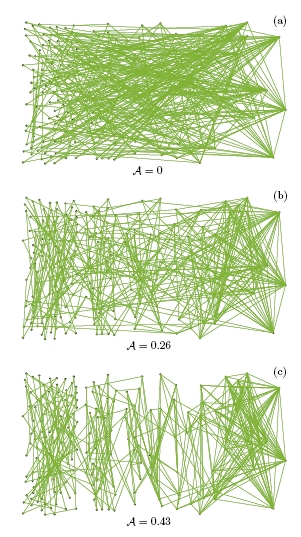
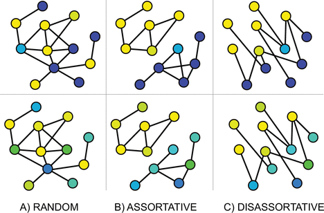
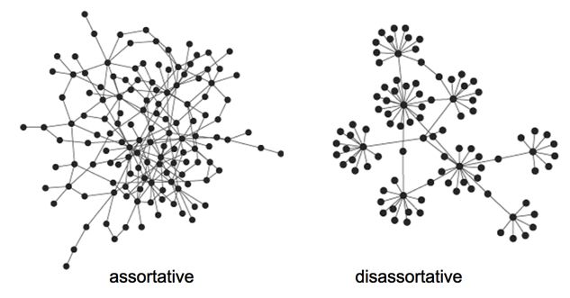

```{r setup, include=FALSE}
knitr::opts_chunk$set(
  echo = TRUE,
  warning = FALSE,
  message = FALSE,
  fig.align = "center"
)

suppressPackageStartupMessages({
  library(igraph)
  library(igraphdata)
  library(sand)
})
```

# Introducción

Sea $G=(V,E)$ un grafo con $n=|V|$ vértices y $m=|E|$ aristas. La **mezcla** (*mixing*) describe la forma en que los vértices se conectan de acuerdo con alguna **característica nodal**.

Existe **mezcla asortativa** cuando los vértices con características iguales o similares tienden a conectarse entre sí. 

Existe **mezcla desasortativa** cuando las conexiones tienden a ocurrir entre vértices con características diferentes.

El **coeficiente de asortatividad** resume el patrón de mezcla mediante un valor $r_a$:

- $r_a>0$: predomina la **mezcla asortativa**.
- $r_a<0$: predomina la **mezcla desasortativa**.
- $r_a\approx 0$: no existe una tendencia global clara hacia ninguno de los dos patrones.

No existen umbrales universales. La interpretación depende de la **estructura de la red**, la **distribución de la característica** y los **grados de los vértices**.

```{r, echo=FALSE, out.width="40%"}

```

# Tipo de característica

La medida apropiada depende de la naturaleza de la característica nodal.

- Una característica **categórica** identifica clases sin asumir distancias numéricas entre ellas, por ejemplo, oficina, profesión o grupo político. En este caso se utiliza la **asortatividad nominal**.
- Una característica **numérica** asigna valores cuantitativos a los vértices, por ejemplo, edad, número de publicaciones, grado o fuerza. En este caso se utiliza la **asortatividad numérica**.

# Características categóricas

## Matriz de mezcla

Suponga que cada vértice pertenece a una de $M$ categorías. 

Sea $\mathbf{E}=(e_{ij})$ la **matriz de mezcla** de $M\times M$, donde $e_{ij}$ representa la **fracción de conexiones** cuyo primer extremo pertenece a la categoría $i$ y cuyo segundo extremo pertenece a la categoría $j$.

Para una **red no dirigida**, cada arista $\{u,v\}$ se considera en las dos orientaciones $(u,v)$ y $(v,u)$. De esta forma,
$$
\sum_{i=1}^M\sum_{j=1}^M e_{ij}=1.
$$

Defina las distribuciones marginales $a_i=\sum_{j=1}^M e_{ij}$ y  $b_j=\sum_{i=1}^M e_{ij}$.

Para una **red no dirigida**, se tiene que $a_i=b_i$.

La cantidad $p_{\mathrm{obs}}=\sum_{i=1}^M e_{ii}$ es la **proporción observada de conexiones entre vértices de la misma categoría**. 

Bajo mezcla independiente, la **proporción esperada** es $p_{\mathrm{esp}}=\sum_{i=1}^M a_i b_i$.

El coeficiente de asortatividad nominal se define como
$$
r_a=
\frac{p_{\mathrm{obs}}-p_{\mathrm{esp}}}
{1-p_{\mathrm{esp}}}
=
\frac{\displaystyle\sum_{i=1}^M e_{ii}-\displaystyle\sum_{i=1}^M a_i b_i}
{1-\displaystyle\sum_{i=1}^M a_i b_i}.
$$

Esta expresión corrige la proporción de conexiones dentro de las categorías por la cantidad que se esperaría únicamente debido a su composición marginal.

## Interpretación

El coeficiente satisface $-1\leq r_a\leq 1$.

- $r_a=1$: **asortatividad perfecta**.
- $r_a=0$: ausencia de **mezcla asortativa neta**.
- $r_a<0$: **mezcla desasortativa**.
- El mínimo alcanzable puede ser mayor que $-1$, dependiendo de la **distribución de las categorías** y de la **estructura de la red**.

Un valor cercano a cero no implica **ausencia de estructura**, ya que distintos patrones de mezcla pueden compensarse. Por ello, conviene analizar conjuntamente $r_a$ y la **matriz de mezcla**.

Por ejemplo, con tres categorías \(A\), \(B\) y \(C\), una fuerte concentración de conexiones entre \(A\) y \(B\) puede compensarse con pocas conexiones entre \(B\) y \(C\), produciendo \(r_a\approx 0\). Por ello, un valor cercano a cero no implica ausencia de estructura y debe interpretarse junto con la **matriz de mezcla**.

En `igraph`, la asortatividad nominal se calcula mediante `assortativity_nominal()`.

```{r, echo=FALSE, out.width="75%"}

```

# Características numéricas

Sea $x_v$ el valor de una característica numérica para el vértice $v$.

En una red dirigida, cada arista $(u,v)$ diferencia un extremo de **salida** y uno de **entrada**. El coeficiente corresponde a la **correlación de Pearson** entre los valores observados en ambos extremos de las aristas.

En una red no dirigida no existe una orientación natural. Por ello, cada arista $\{u,v\}$ se considera en ambas orientaciones, $(u,v)$ y $(v,u)$. Si $E^\star$ denota este conjunto de $2m$ pares orientados, entonces
$$
\mu_x=\frac{1}{2m}\sum_{(u,v)\in E^\star}x_u,
\qquad
\sigma_x^2=\frac{1}{2m}\sum_{(u,v)\in E^\star}(x_u-\mu_x)^2,
$$
por lo que
$$
r_a=
\frac{\displaystyle\frac{1}{2m}
\sum_{(u,v)\in E^\star}(x_u-\mu_x)(x_v-\mu_x)}
{\sigma_x^2}.
$$

Así, $r_a$ mide la **correlación entre los valores de una característica en vértices conectados**.

En `igraph`, la asortatividad numérica se calcula mediante `assortativity()`.

```{r, echo=FALSE, out.width="80%"}

```

# Asortatividad por grado

Una aplicación particularmente importante utiliza el **grado** como característica nodal. 

Para una **red no dirigida**, si $k_u$ es el grado del vértice $u$, la **asortatividad por grado** mide la correlación entre los grados de vértices conectados.

- $r_k>0$: los vértices de alto grado tienden a conectarse con otros vértices de alto grado y los de bajo grado con otros de bajo grado.
- $r_k<0$: los vértices de alto grado tienden a conectarse con vértices de bajo grado.

En `igraph` se calcula con `assortativity_degree()`.

## Grado medio de los vecinos

El coeficiente $r_k$ resume todo el patrón grado--grado en un único número. Una descripción complementaria es

$$
k_{nn}(u)=\frac{1}{k_u}\sum_{v\in N(u)}k_v,
$$

donde $N(u)$ es el conjunto de vecinos de $u$. 

También puede estudiarse promedio de $k_{nn}(u)$ entre los vértices con grado $k$ de forma que

$$
k_{nn}(k)
=
\frac{1}{|\{u\in V:k_u=k\}|}
\sum_{\substack{u\in V\\ k_u=k}}
k_{nn}(u).
$$

Una **tendencia creciente** de $k_{nn}(k)$ es compatible con **mezcla asortativa por grado**, mientras que una **tendencia decreciente** es compatible con **mezcla desasortativa**. 

En `igraph` estas cantidades se obtienen con `knn()`.

# Redes dirigidas

En una **red dirigida**, los extremos de una arista cumplen funciones diferentes. 

Para una arista $(u,v)$, $u$ es el origen y $v$ el destino. Por tanto, la mezcla puede depender de características distintas en ambos extremos.

Para atributos numéricos, `assortativity()` permite especificar mediante `values` los valores asociados al extremo de salida y mediante `values.in` los valores asociados al extremo de entrada. 

Esto permite estudiar, por ejemplo, si actores con valores altos en una característica tienden a dirigir conexiones hacia actores con valores altos en otra.

# Redes ponderadas

En una red ponderada, el **grado** y la **fuerza** de un vértice $u$ se definen, respectivamente, como

$$
k_u=|N(u)|,
\qquad
s_u=\sum_{v\in N(u)} w_{uv},
$$

donde $w_{uv}$ es el peso de la arista entre $u$ y $v$.

En una **red ponderada**, los pesos pueden incorporarse de dos formas:

- Como **característica nodal**, se usa la **fuerza** \(s_u\) de cada vértice,
$$
r_s=\operatorname{Cor}(s_u,s_v).
$$

- Como **peso de las conexiones**, cada arista contribuye según \(w_{uv}\), 
\[
r_w=
\frac{\sum_{(u,v)} w_{uv}(x_u-\bar{x}_w)(x_v-\bar{y}_w)}
{\sqrt{\sum_{(u,v)}w_{uv}(x_u-\bar{x}_w)^2
\sum_{(u,v)}w_{uv}(x_v-\bar{y}_w)^2}},
\]
donde
\[
\bar{x}_w=\frac{\sum_{(u,v)}w_{uv}x_u}{\sum_{(u,v)}w_{uv}},
\qquad
\bar{y}_w=\frac{\sum_{(u,v)}w_{uv}x_v}{\sum_{(u,v)}w_{uv}}.
\]

La primera opción incorpora los pesos en los **atributos nodales**; la segunda pondera directamente las **conexiones**.

# Ejemplo: Interacciones sociales

Considere la red de **interacciones sociales** entre miembros de un club de karate estudiada por Zachary (1977). Los datos fueron recolectados para analizar la fragmentación del club después de una disputa entre sus principales administradores.

Los vértices representan miembros del club. Una arista indica interacción social entre dos miembros y su **peso** registra el número de actividades compartidas.

Los datos están disponibles en el paquete `igraphdata`.

Zachary, W. W. (1977). **An information flow model for conflict and fission in small groups**. *Journal of Anthropological Research*, 33(4), 452--473.

```{r}
# datos
data("karate", package = "igraphdata")
karate <- upgrade_graph(karate)
```

```{r}
# propiedades básicas
vcount(karate)
ecount(karate)
is_directed(karate)
is_weighted(karate)
```

La matriz de adyacencia puede construirse ignorando los pesos si el interés está únicamente en la existencia de conexiones. 

```{r}
# matriz de adyacencia binaria
Y <- as.matrix(as_adjacency_matrix(karate, names = FALSE))

# número de aristas recuperado desde Y
sum(Y) / 2
```

```{r, fig.height=6, fig.width=6, fig.align='center'}
# visualización
set.seed(123)
plot(
  karate,
  layout = layout_with_fr,
  vertex.size = 12,
  vertex.color = as.integer(as.factor(V(karate)$Faction)) + 1,
  vertex.frame.color = "black",
  vertex.label.color = "black"
)
```

## Asortatividad por facción

El atributo `Faction` identifica los dos grupos en los que finalmente se dividió el club. 

Por tratarse de una característica **categórica**, debe utilizarse **asortatividad nominal**.

```{r}
# facción de cada miembro
v.types <- V(karate)$Faction

# asortatividad nominal
r.faction <- assortativity_nominal(karate, types = v.types, directed = FALSE)

r.faction
```

\(r_a=0.743\) indica **fuerte asortatividad por facción**, es decir, los miembros tienden a conectarse con otros de la **misma facción**.

La **matriz de mezcla** permite observar qué **proporción de las conexiones** ocurre **dentro** y **entre** las facciones.

```{r}
# función para construir la matriz de mezcla
mixing_matrix <- function(graph, types) {
  lev <- sort(unique(as.character(types)))
  ed  <- ends(graph, E(graph), names = FALSE)

  x <- factor(types[ed[, 1]], levels = lev)
  y <- factor(types[ed[, 2]], levels = lev)
  
  tab <- table(x, y)

  # cada arista no dirigida aporta las dos orientaciones
  if (!is_directed(graph)) tab <- tab + t(tab)

  tab / sum(tab)
}

# matriz de mezcla por facción
E.faction <- mixing_matrix(karate, v.types)
round(E.faction, 3)
```
La matriz muestra una **fuerte concentración de conexiones dentro de cada facción** (42.3% y 44.9%) y pocas conexiones entre facciones (6.4% en cada dirección).

```{r, fig.height=4.5, fig.width=5, fig.align='center'}
# mapa de calor de la matriz de mezcla
heatmap(
  E.faction,
  Rowv = NA,
  Colv = NA,
  scale = "none",
  xlab = "Categoría del segundo extremo",
  ylab = "Categoría del primer extremo"
)
```

A partir de esta matriz puede recuperarse directamente el coeficiente.

```{r}
# proporciones marginales
avec <- rowSums(E.faction)
bvec <- colSums(E.faction)

# asortatividad calculada desde la matriz de mezcla
r.manual <- (sum(diag(E.faction)) - sum(avec * bvec)) / (1 - sum(avec * bvec))

r.manual
```

El coeficiente es una normalización de la diferencia entre la mezcla dentro de las categorías **observada** y **esperada**.

## Asortatividad por grado y fuerza

La misma red permite estudiar características estructurales numéricas.

```{r}
# grado de los vértices
(r.degree <- assortativity_degree(karate, directed = FALSE))

# fuerza de los vértices
v.strength <- strength(karate)
(r.strength <- assortativity(karate, values = v.strength, directed = FALSE))
```

Estos coeficientes responden preguntas diferentes. El primero compara el **número de vecinos** de vértices conectados y el segundo compara su **intensidad total de interacción**.

Ambos valores indican **disasortatividad**. Los vértices tienden a conectarse con otros de **distinto grado** y **distinta fuerza**, siendo este patrón ligeramente más marcado para la intensidad total de interacción.

## Grado medio de los vecinos

```{r}
# grado medio de los vecinos, ignorando pesos
karate.knn <- knn(karate, weights = NA)
karate.knn$knn
```

```{r}
# grado promedio de los vecinos para cada valor de grado
karate.knnk <- karate.knn$knnk
```

```{r, fig.height=4.5, fig.width=6, fig.align='center'}
# promedio por grado
k  <- seq_along(karate.knnk)
ok <- is.finite(karate.knnk)

plot(
  k[ok], karate.knnk[ok],
  type = "b",
  xlab = "Grado",
  ylab = "Grado medio de los vecinos"
)
```

Este gráfico muestra información que puede quedar oculta por el valor agregado de $r_k$.

# Modelo nulo

Un valor de asortatividad distinto de cero no implica necesariamente un patrón no aleatorio. Para evaluarlo, se compara con un **modelo nulo**.

Para atributos categóricos, una opción simple es **permutar las etiquetas** entre los vértices, manteniendo fija la red y el tamaño de cada categoría.

En la red de Zachary, se **permutan las etiquetas de facción** \(B\) veces para generar la distribución nula de \(r_a\). El **valor \(p\) bilateral** se calcula como

\[
p=\frac{1+\sum_{b=1}^{B}\mathbb{I}\!\left(\left|r_a^{(b)}\right|\geq \left|r_a^{\mathrm{obs}}\right|\right)}{B+1}.
\]

Así, \(p\) representa la **proporción de permutaciones con una asortatividad al menos tan extrema como la observada**.

```{r}
# distribución nula por permutación de etiquetas
B <- 999
r.null <- numeric(B)

set.seed(123)
for (b in 1:B) {
  r.null[b] <- assortativity_nominal(
    karate,
    types = sample(v.types),
    directed = FALSE
  )
}

# valor p de permutación bilateral
p.value <- (1 + sum(abs(r.null) >= abs(r.faction))) / (B + 1)

p.value
```

\(p=0.001\) indica que una asortatividad tan extrema como la observada sería **muy poco probable bajo el modelo nulo**, proporcionando fuerte evidencia de mezcla no aleatoria.

```{r, fig.height=4.5, fig.width=6, fig.align='center'}
# rango del eje x
xlim <- range(c(r.null, r.faction))
xlim <- xlim + c(-0.05, 0.05) * diff(xlim)

# distribución de referencia
hist(
  r.null,
  breaks = 25,
  probability = TRUE,
  xlim = xlim,
  col = "gray90",
  border = "white",
  xlab = "Coeficiente de asortatividad",
  ylab = "Densidad",
  main = ""
)

# asortatividad observada
abline(v = r.faction, lwd = 2, lty = 2)

# etiqueta
text(
  r.faction,
  par("usr")[4] * 0.9,
  labels = expression(r[a]^obs),
  pos = 2
)
```

Si el interés está en la **asortatividad por grado**, una referencia natural consiste en aleatorizar las aristas preservando la secuencia de grados.

```{r}
# asortatividad observada por grado
(r.degree <- assortativity_degree(karate, directed = FALSE))

# distribución nula preservando los grados
B <- 999
r.null <- numeric(B)

set.seed(123)
for (b in 1:B) {
  # aleatorizar aristas conservando la secuencia de grados
  g.null <- rewire(karate, with = keeping_degseq(niter = 10 * ecount(karate)))

  # asortatividad por grado bajo el modelo nulo
  r.null[b] <- assortativity_degree(g.null, directed = FALSE)
}

# valor p bilateral
p.value <- (1 + sum(abs(r.null) >= abs(r.degree))) / (B + 1)

# resultados
p.value
```

\(r_k=-0.476\) indica una **desasortatividad moderada por grado**, por lo que vértices con grados diferentes tienden a conectarse entre sí. 

Como \(p=0.002\), solo alrededor del **0.16 %** de las redes generadas bajo el modelo nulo presentan una asortatividad por grado al menos tan extrema como la observada. Por tanto, existe **fuerte evidencia de desasortatividad por grado** más allá de lo esperado únicamente por la secuencia de grados.

```{r, fig.height=4.5, fig.width=6, fig.align='center'}
# rango del eje x
xlim <- range(c(r.null, r.degree))
xlim <- xlim + c(-0.05, 0.05) * diff(xlim)

# distribución nula
hist(
  r.null,
  breaks = 25,
  probability = TRUE,
  xlim = xlim,
  col = "gray90",
  border = "white",
  xlab = "Asortatividad por grado",
  ylab = "Densidad",
  main = ""
)

# asortatividad observada
abline(v = r.degree, lwd = 2, lty = 2)

# etiqueta
text(
  r.degree,
  par("usr")[4] * 0.9,
  labels = expression(r[k]^obs),
  pos = 4
)
```

# Ejemplo: Trabajo colaborativo

Considere la red de **relaciones de trabajo colaborativo** entre miembros de una firma de abogados estudiada por Lazega (2001). 

Una arista indica que dos abogados trabajaron juntos en al menos un caso.

Los datos están disponibles en el paquete `sand`.

Lazega, E. (2001). **The collegial phenomenon: The social mechanisms of cooperation among peers in a corporate law partnership**. Oxford University Press.

```{r}
# datos
lazega <- graph_from_data_frame(
  d = elist.lazega,
  directed = FALSE,
  vertices = v.attr.lazega
)
V(lazega)$label <- sub("V", "", V(lazega)$name)
```

```{r}
# propiedades básicas
is_simple(lazega)
is_weighted(lazega)
vcount(lazega)
ecount(lazega)
```

```{r, fig.height=6, fig.width=6, fig.align='center'}
# visualización
set.seed(123)
plot(
  lazega,
  layout = layout_with_fr,
  vertex.size = 12,
  vertex.color = as.integer(as.factor(V(lazega)$Office)) + 1,
  vertex.frame.color = "black",
  vertex.label.color = "black"
)
title(main = "Lazega")
```

## Características categóricas

`Office`, `Practice` y `School` son **códigos de categorías**. Por tanto, debe utilizarse `assortativity_nominal()` y no `assortativity()`.

```{r}
# asortatividad nominal
r.office <- assortativity_nominal(
  lazega,
  types = V(lazega)$Office,
  directed = FALSE
)

r.practice <- assortativity_nominal(
  lazega,
  types = V(lazega)$Practice,
  directed = FALSE
)

r.school <- assortativity_nominal(
  lazega,
  types = V(lazega)$School,
  directed = FALSE
)

c(
  Office = r.office,
  Practice = r.practice,
  School = r.school
)
```

- **Office**:   asortatividad positiva relativamente fuerte; los abogados tienden a colaborar con colegas de la **misma oficina**.
- **Practice**: asortatividad positiva moderada; existe cierta tendencia a colaborar dentro de la **misma área de práctica**.
- **School**:   asortatividad prácticamente nula; la **escuela de procedencia** no parece estar asociada de forma importante con las relaciones de colaboración.

Comparar estos valores permite identificar **qué característica está más asociada con el patrón de colaboración**, siempre como una descripción de la red observada y **no como una conclusión causal**.

La matriz de mezcla puede utilizarse para estudiar con mayor detalle una de las características.

```{r}
# matriz de mezcla por oficina
E.office <- mixing_matrix(lazega, V(lazega)$Office)
round(E.office, 3)
```
La matriz muestra una clara **concentración de relaciones dentro de la misma oficina**, ya que 44.3% de las conexiones ocurren dentro de la oficina 1 y 29.6% dentro de la oficina 2. 

Cerca del **74% de las conexiones son intraoficina**, mientras que las conexiones entre oficinas son mucho menos frecuentes. La oficina 3 no presenta conexiones internas.

## Características numéricas

`Years` representa una característica **numérica**. Aunque sus valores sean enteros, debe analizarse mediante asortatividad numérica.

```{r}
# asortatividad por años
r.years <- assortativity(
  lazega,
  values = V(lazega)$Years,
  directed = FALSE
)
r.years

# asortatividad por grado
r.degree.lazega <- assortativity_degree(
  lazega,
  directed = FALSE
)
r.degree.lazega
```

La red presenta **muy poca asortatividad por años** y una **leve desasortatividad por grado**, es decir, los abogados conectados tienden débilmente a diferir en antigüedad y en número de conexiones.

# Asortatividad y modularidad

Existe una relación estrecha entre **asortatividad nominal** y **modularidad**. Si las categorías de los vértices definen una partición fija, la **asortatividad nominal no normalizada** (solo usa el numerador de la expresión) coincide con la modularidad de dicha partición cuando se ignoran los pesos.

```{r}
# asortatividad nominal no normalizada
r.nominal <- assortativity_nominal(
  karate,
  types = v.types,
  directed = FALSE,
  normalized = FALSE
)
r.nominal

# modularidad de la partición por facción
Q <- modularity(
  karate,
  membership = v.types,
  weights = NA
)
Q
```

Así, ambas medidas coinciden. La **asortatividad** evalúa una característica nodal previamente definida, mientras que la **detección de comunidades** busca una partición con alta estructura interna.


# Referencias

Barrat, A., Barthélemy, M., Pastor-Satorras, R., & Vespignani, A. (2004). **The architecture of complex weighted networks**. *Proceedings of the National Academy of Sciences*, 101(11), 3747--3752.

Lazega, E. (2001). **The collegial phenomenon: The social mechanisms of cooperation among peers in a corporate law partnership**. Oxford University Press.

Newman, M. E. J. (2002). **Assortative mixing in networks**. *Physical Review Letters*, 89, 208701.

Newman, M. E. J. (2003). **Mixing patterns in networks**. *Physical Review E*, 67, 026126.

Zachary, W. W. (1977). **An information flow model for conflict and fission in small groups**. *Journal of Anthropological Research*, 33(4), 452--473.
